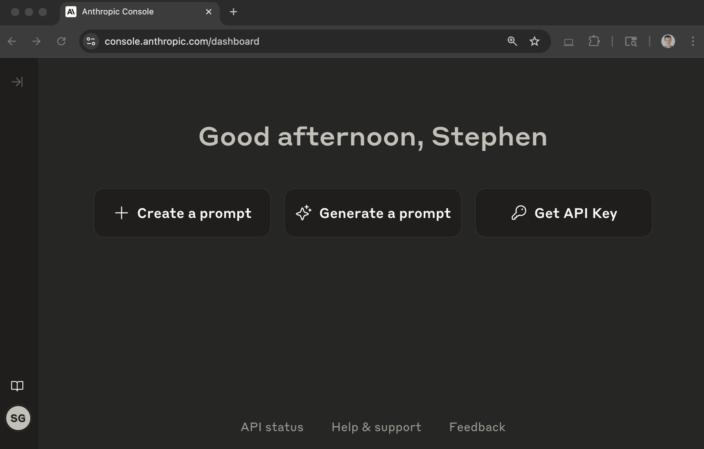
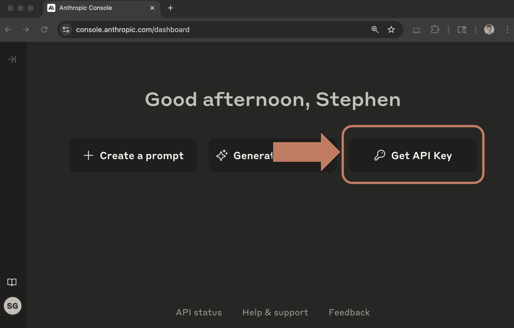
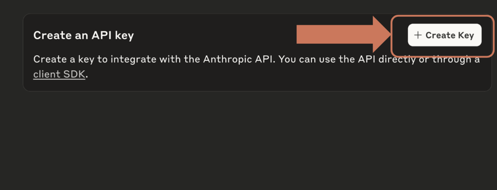
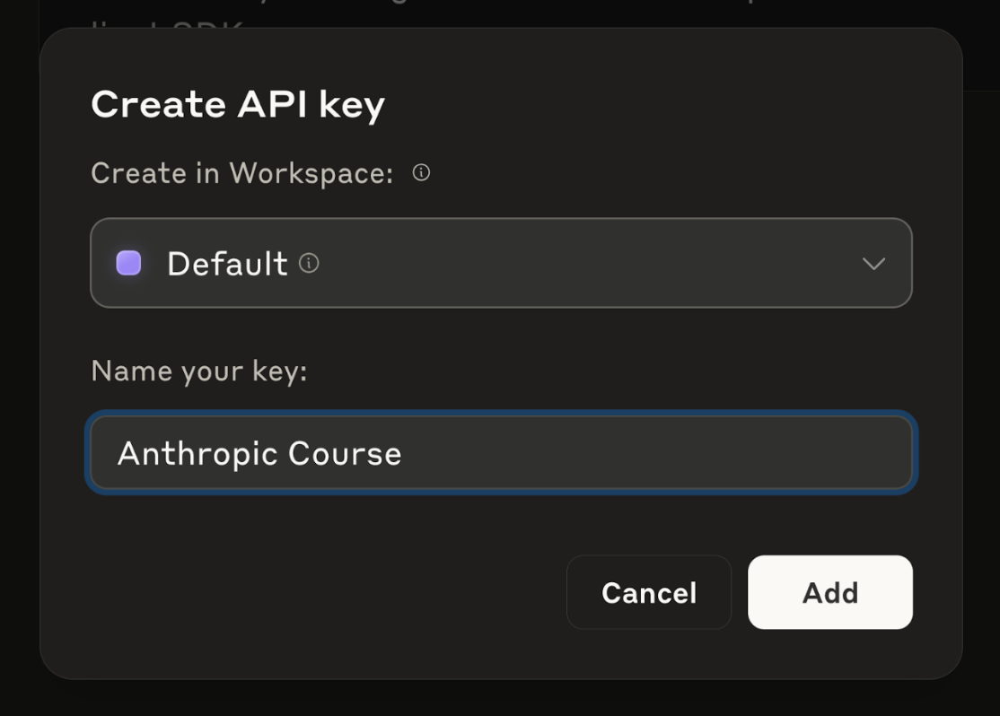

# Getting an API key

> Source: https://anthropic.skilljar.com/claude-with-the-anthropic-api/296766

In the next video we will be making a request to the Anthropic API. To do so, you will need a secret API key. This guide will walk you through the process of creating an API key.

### Step One: Navigate to the Anthropic API Console

In your browser, navigate to [https://console.anthropic.com/](https://console.anthropic.com/) and log in to your Anthropic account. You'll then see a page like this:

### Step Two: Click the 'Get API Keys' button

This button can be found towards the top right of the main dashboard page.

### Step Three: Click the 'Create Key' button

At the top right of the page, find the 'Create Key' button and click it.

### Step Four: Enter a workspace and name for your key

Create the key in workspace 'Default' and enter a name for your key. This name is used to help you identify the keys you generate. Let's use a name of 'Anthropic Course'.

### Step Five: Copy the Key

Your API key will then be displayed in a pop up window. Copy this key and hold onto it - we will use it in the next video. This key will only be displayed once, so make sure you copy it!

If you accidentally close the window, delete the old key and generate it again.