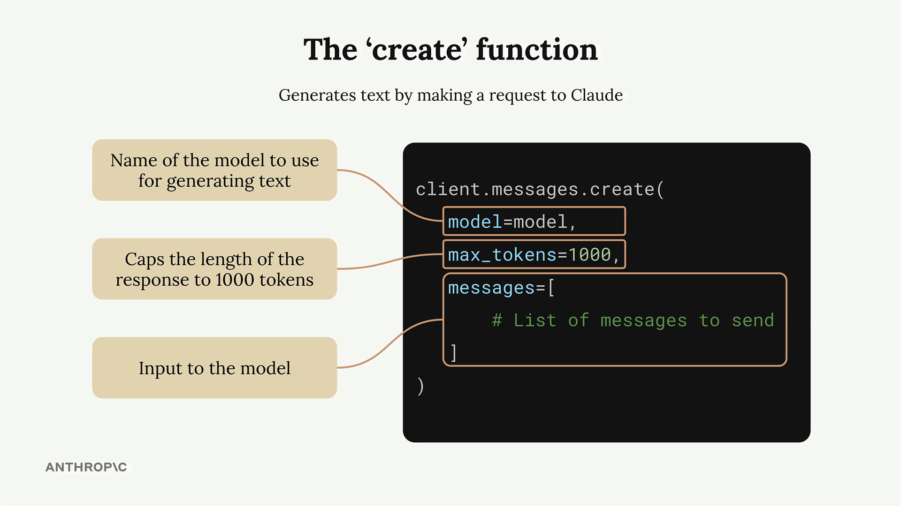
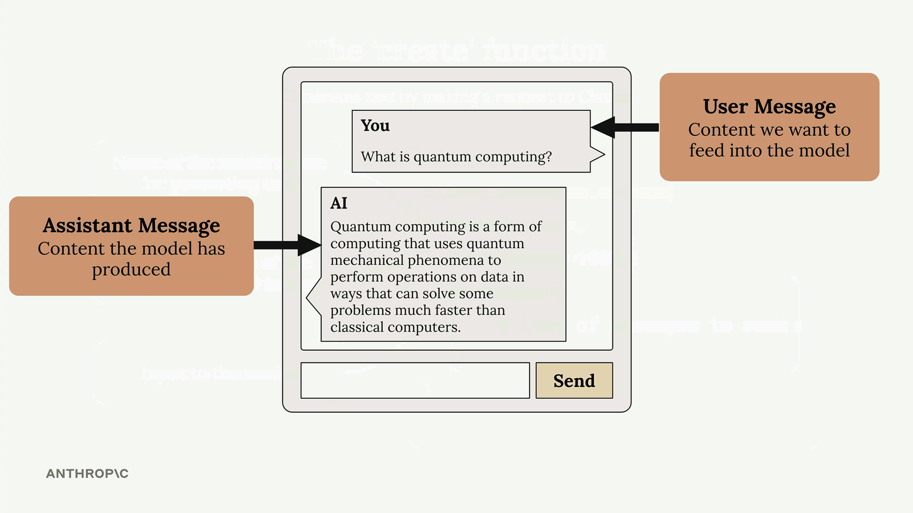

# Making a request

> Source: https://anthropic.skilljar.com/claude-with-the-anthropic-api/287725

#### Summary


                            
                                

Making your first request to the Anthropic API is straightforward once you understand the basic setup and structure. This guide walks through the essential steps to get Claude responding to your prompts using Python.


## Setting Up Your Environment


Before making any API calls, you need to install the required packages and configure your API key securely.


First, install the necessary dependencies in your Jupyter notebook:


```
%pip install anthropic python-dotenv
```


Next, create a `.env` file in the same directory as your notebook to store your API key securely:


```
ANTHROPIC_API_KEY="your-api-key-here"
```


This approach keeps your API key out of your code and prevents accidentally committing it to version control. Always add `.env` to your `.gitignore` file.


Load the environment variables and create your API client:


```
from dotenv import load_dotenv
load_dotenv()

from anthropic import Anthropic

client = Anthropic()
model = "claude-sonnet-4-0"
```


## The Create Function


The core of making API requests is the `client.messages.create()` function. This function requires three key parameters:





- **model** - The name of the Claude model you want to use

- **max_tokens** - A safety limit on response length (not a target)

- **messages** - The conversation history you're sending to Claude


The `max_tokens` parameter acts as a safety mechanism. If you set it to 1000, Claude will stop generating after 1000 tokens even if it has more to say. Claude doesn't try to reach this limit - it just writes what it thinks is appropriate and stops if it hits the maximum.


## Understanding Messages


Messages represent the conversation between you and Claude, similar to a chat application. There are two types of messages:





- **User messages** - Content you want to send to Claude (written by humans)

- **Assistant messages** - Responses that Claude has generated


Each message is a dictionary with a `role` (either "user" or "assistant") and `content` (the actual text).


## Making Your First Request


Here's a complete example of making a request to Claude:


```
message = client.messages.create(
    model=model,
    max_tokens=1000,
    messages=[
        {
            "role": "user",
            "content": "What is quantum computing? Answer in one sentence"
        }
    ]
)
```


When you run this code, Claude will process your request and return a response object containing the generated text along with metadata about the request.


## Extracting the Response


The response object contains a lot of information, but you usually just want the generated text. Access it using:


```
message.content[0].text
```


This gives you clean, readable output like: "Quantum computing is a type of computation that leverages quantum mechanics principles like superposition and entanglement to process information using quantum bits (qubits), potentially solving certain complex problems exponentially faster than classical computers."


With these basics in place, you can start experimenting with different prompts and building more complex interactions with Claude.