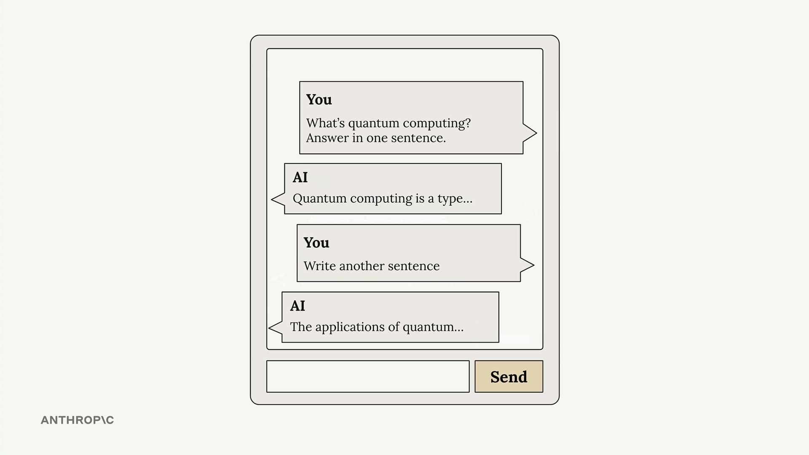
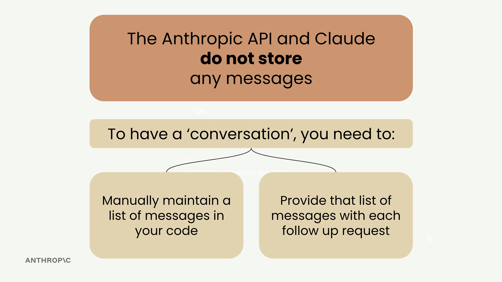
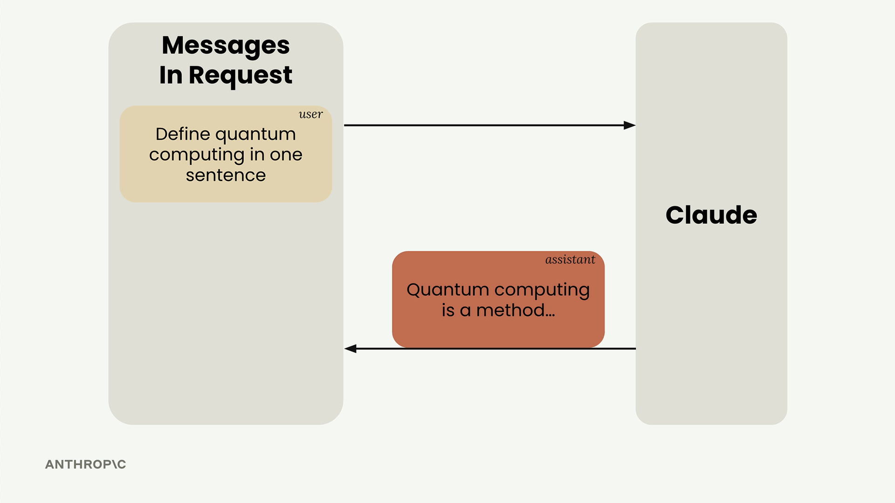
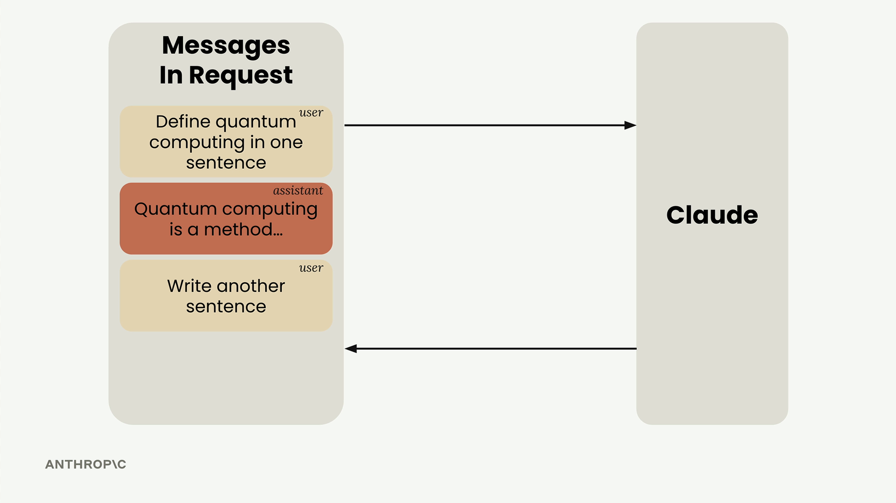

# Multi-Turn conversations

> Source: https://anthropic.skilljar.com/claude-with-the-anthropic-api/287735

#### Summary


                            
                                

When working with the Anthropic API and Claude, there's a crucial concept you need to understand: **Claude doesn't store any of your conversation history**. Each request you make is completely independent, with no memory of previous exchanges.





This means if you want to have a multi-turn conversation where Claude remembers context from earlier messages, you need to handle the conversation state yourself.


## The Problem with Stateless Conversations


Let's say you ask Claude "What is quantum computing?" and get a good response. Then you follow up with "Write another sentence" - Claude has no idea what you're referring to. It will write a sentence about something completely random because it has no memory of the quantum computing discussion.





## How Multi-Turn Conversations Work


To maintain conversation context, you need to do two things:


- Manually maintain a list of all messages in your code

- Send the complete message history with every request





Here's the flow that actually works:


1. Send your initial user message to Claude

1. Take Claude's response and add it to your message list as an assistant message

1. Add your follow-up question as another user message

1. Send the entire conversation history to Claude





## Building Helper Functions


To make conversation management easier, you can create three helper functions:


```
def add_user_message(messages, text):
    user_message = {"role": "user", "content": text}
    messages.append(user_message)

def add_assistant_message(messages, text):
    assistant_message = {"role": "assistant", "content": text}
    messages.append(assistant_message)

def chat(messages):
    message = client.messages.create(
        model=model,
        max_tokens=1000,
        messages=messages,
    )
    return message.content[0].text
```


## Putting It All Together


Here's how you use these functions to maintain a conversation:


```
# Start with an empty message list
messages = []

# Add the initial user question
add_user_message(messages, "Define quantum computing in one sentence")

# Get Claude's response
answer = chat(messages)

# Add Claude's response to the conversation history
add_assistant_message(messages, answer)

# Add a follow-up question
add_user_message(messages, "Write another sentence")

# Get the follow-up response with full context
final_answer = chat(messages)
```


Now Claude will understand that "Write another sentence" refers to expanding on the quantum computing definition, because you've provided the complete conversation context.


These helper functions will be useful throughout your work with Claude, making it much easier to build applications that can maintain meaningful conversations over multiple exchanges.