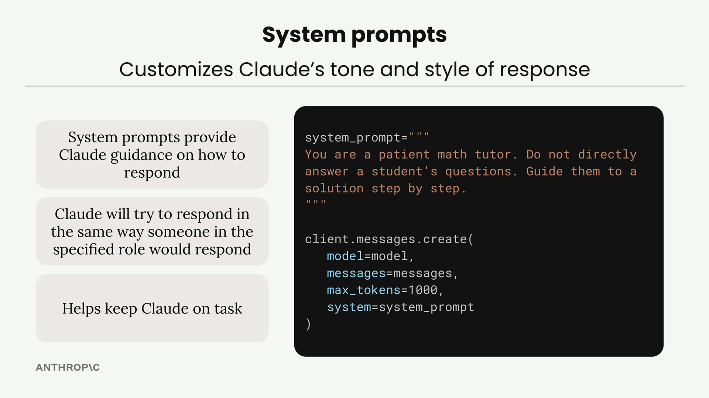

# System prompts

> Source: https://anthropic.skilljar.com/claude-with-the-anthropic-api/287733

#### Summary


                            
                                

System prompts are a powerful way to customize how Claude responds to user input. Instead of getting generic answers, you can shape Claude's tone, style, and approach to match your specific use case.


## Why System Prompts Matter


Consider building a math tutor chatbot. When a student asks "How do I solve 5x + 2 = 3 for x?", you want Claude to act like a real tutor, not just spit out the answer. A good math tutor should:


- Initially give hints rather than complete solutions

- Patiently walk students through problems step by step

- Show solutions for similar problems as examples


You definitely don't want Claude to:


- Immediately give direct answers

- Tell students to just use a calculator


## How System Prompts Work





System prompts provide Claude with guidance on how to respond. You define them as plain strings and pass them into the create function call. The key benefits are:


- System prompts provide Claude guidance on how to respond

- Claude will try to respond in the same way someone in the specified role would respond

- Helps keep Claude on task


Here's the basic structure:


```
system_prompt = """
You are a patient math tutor.
Do not directly answer a student's questions.
Guide them to a solution step by step.
"""

client.messages.create(
    model=model,
    messages=messages,
    max_tokens=1000,
    system=system_prompt
)
```


## Seeing the Difference


Without a system prompt, Claude gives a complete step-by-step solution immediately. This might be helpful, but it doesn't encourage the student to think through the problem themselves.


With the math tutor system prompt, Claude's response changes dramatically. Instead of providing the full solution, Claude asks guiding questions like "What do you think would be a good first step to isolate x? Consider what operation we might need to perform on both sides to start moving terms around."


## Building a Flexible Chat Function


Rather than hard-coding system prompts, you can make your chat function more reusable by accepting system prompts as parameters:


```
def chat(messages, system=None):
    params = {
        "model": model,
        "max_tokens": 1000,
        "messages": messages,
    }
    
    if system:
        params["system"] = system
    
    message = client.messages.create(**params)
    return message.content[0].text
```


This approach handles an important detail: Claude's API doesn't accept `system=None`, so you need to conditionally include the system parameter only when it's provided.


Now you can call your chat function with or without a system prompt:


```
# Without system prompt
answer = chat(messages)

# With system prompt
system = """
You are a patient math tutor.
Do not directly answer a student's questions.
Guide them to a solution step by step.
"""
answer = chat(messages, system=system)
```


System prompts are essential for creating AI applications that behave consistently and appropriately for their intended purpose. They transform generic AI responses into specialized, role-appropriate interactions.