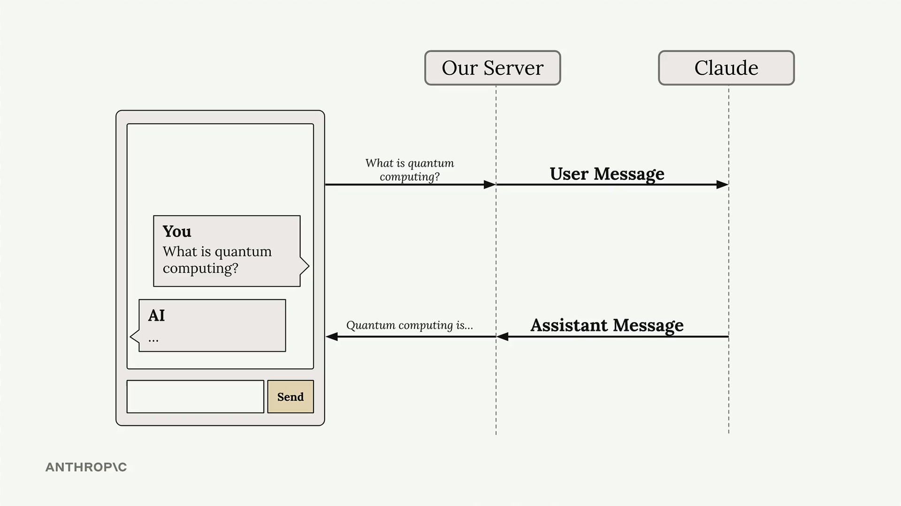
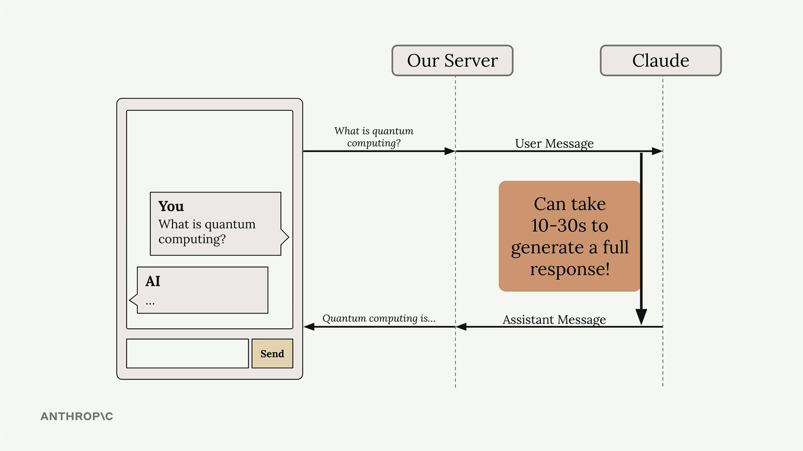
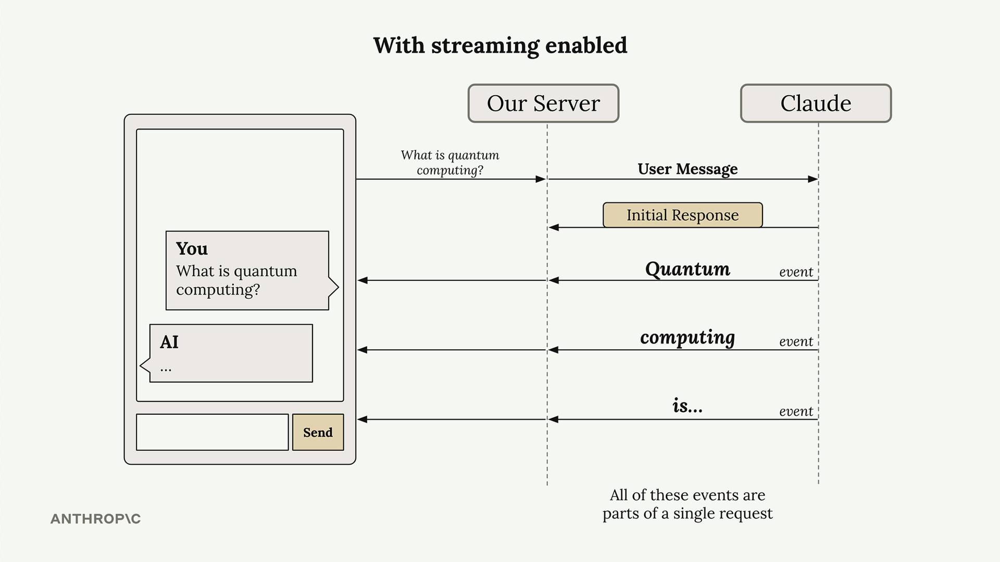
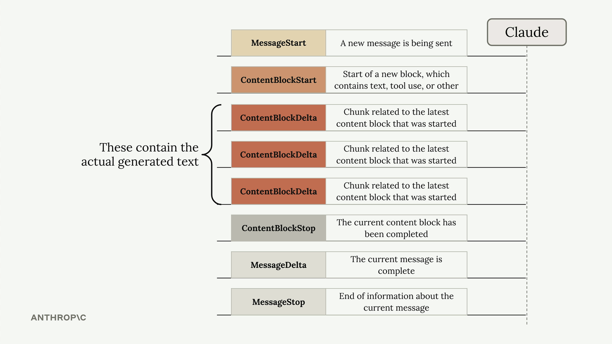
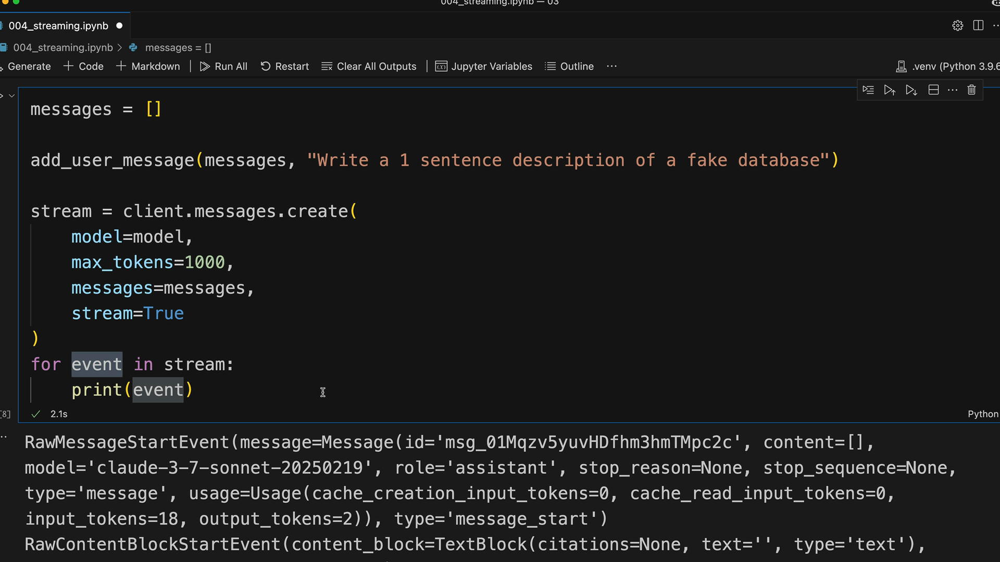

# Response streaming

> Source: https://anthropic.skilljar.com/claude-with-the-anthropic-api/287734

#### Summary


                            
                                

When building chat applications with Claude, there's a significant user experience challenge: responses can take 10-30 seconds to generate, leaving users staring at a loading spinner. The solution is response streaming, which lets users see text appear chunk by chunk as Claude generates it, creating a much more responsive feel.





## The Problem with Standard Responses


In a typical chat setup, your server sends a user message to Claude and waits for the complete response before sending anything back to the client. This creates an awkward delay where users have no feedback that anything is happening.





## How Streaming Works


With streaming enabled, Claude immediately sends back an initial response indicating it has received your request and is starting to generate text. Then you receive a series of events, each containing a small piece of the overall response.


Your server can forward these text chunks to your client application as they arrive, allowing users to see the response building up word by word. All of these events are part of a single request to Claude.





## Understanding Stream Events


When you enable streaming, Claude sends back several types of events:


- **MessageStart** - A new message is being sent

- **ContentBlockStart** - Start of a new block containing text, tool use, or other content

- **ContentBlockDelta** - Chunks of the actual generated text

- **ContentBlockStop** - The current content block has been completed

- **MessageDelta** - The current message is complete

- **MessageStop** - End of information about the current message





The `ContentBlockDelta` events contain the actual generated text that you'll want to display to users.


## Basic Streaming Implementation


To enable streaming, add `stream=True` to your messages.create call:


```
messages = []
add_user_message(messages, "Write a 1 sentence description of a fake database")

stream = client.messages.create(
    model=model,
    max_tokens=1000,
    messages=messages,
    stream=True
)

for event in stream:
    print(event)
```





## Simplified Text Streaming


Rather than manually parsing events, you can use the SDK's simplified streaming interface that extracts just the text content:


```
with client.messages.stream(
    model=model,
    max_tokens=1000,
    messages=messages
) as stream:
    for text in stream.text_stream:
        print(text, end="")
```


This approach automatically filters out everything except the actual text content, which is usually what you need for displaying responses to users.


## Getting the Complete Message


While streaming individual chunks is great for user experience, you often need the complete message for storage or further processing. After streaming completes, you can get the assembled final message:


```
with client.messages.stream(
    model=model,
    max_tokens=1000,
    messages=messages
) as stream:
    for text in stream.text_stream:
        # Send each chunk to your client
        pass
    
    # Get the complete message for database storage
    final_message = stream.get_final_message()
```


This gives you the best of both worlds: real-time streaming for users and a complete message object for your application logic.