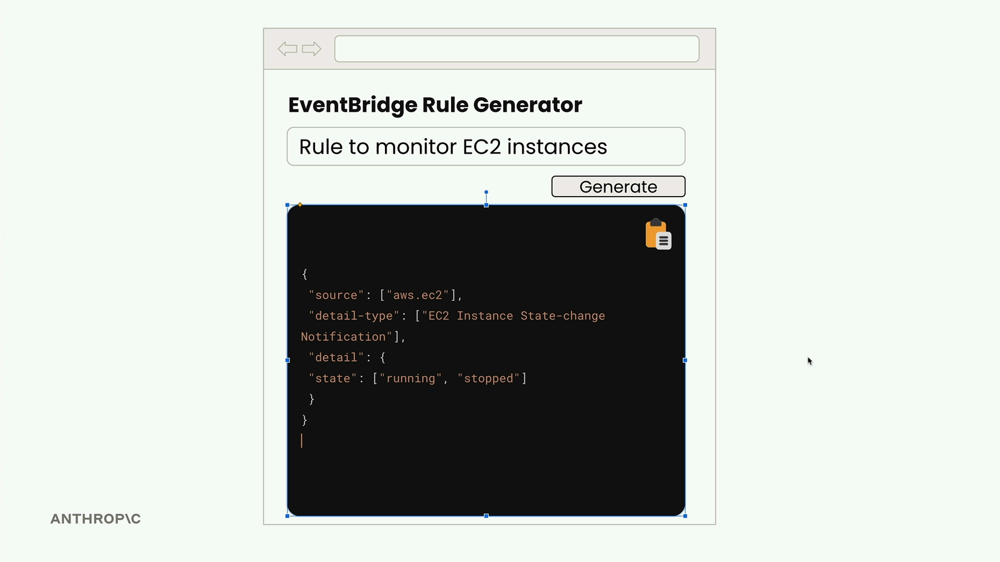
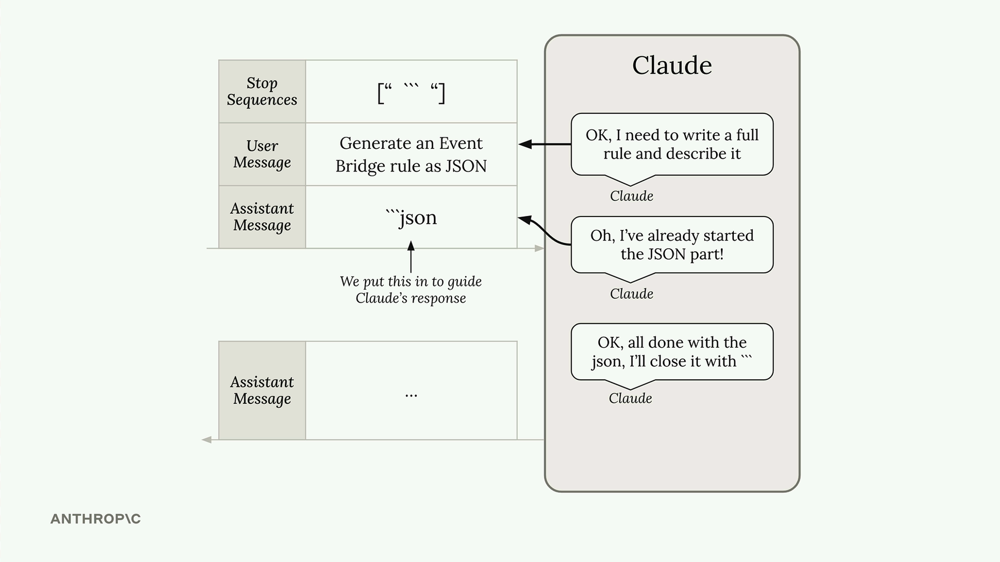

# Structured data

> Source: https://anthropic.skilljar.com/claude-with-the-anthropic-api/287732

#### Summary


                            
                                

When you need Claude to generate structured data like JSON, Python code, or bulleted lists, you'll often run into a common problem: Claude wants to be helpful and add explanatory text around your content. While this is usually great, sometimes you need just the raw data with nothing else.


Consider building a web app that generates AWS EventBridge rules. Users enter a description, click generate, and expect to see clean JSON they can immediately copy and use. If Claude returns the JSON wrapped in markdown code blocks with explanatory text, users can't simply copy the entire response - they have to manually select just the JSON portion.





## The Problem with Default Responses


By default, when you ask Claude to generate JSON, you might get something like this:


```
```json
{
  "source": ["aws.ec2"],
  "detail-type": ["EC2 Instance State-change Notification"],
  "detail": {
    "state": ["running"]
  }
}
```

This rule captures EC2 instance state changes when instances start running.
```


The JSON is correct, but it's wrapped in markdown formatting and includes explanatory text. For a web app where users need to copy the raw JSON, this creates friction in the user experience.


## The Solution: Assistant Message Prefilling + Stop Sequences


You can combine assistant message prefilling with stop sequences to get exactly the content you want. Here's how it works:


```
messages = []

add_user_message(messages, "Generate a very short event bridge rule as json")
add_assistant_message(messages, "```json")

text = chat(messages, stop_sequences=["```"])
```


This technique works by:


1. The user message tells Claude what to generate

1. The prefilled assistant message makes Claude think it already started a markdown code block

1. Claude continues by writing just the JSON content

1. When Claude tries to close the code block with `````, the stop sequence immediately ends generation





The result is clean JSON with no extra formatting:


```
{
  "source": ["aws.ec2"],
  "detail-type": ["EC2 Instance State-change Notification"],
  "detail": {
    "state": ["running"]
  }
}
```


## Processing the Response


You might notice some extra newline characters in the response. These are easy to handle:


```
import json

# Clean up and parse the JSON
clean_json = json.loads(text.strip())
```


## Beyond JSON


This technique isn't limited to JSON generation. Use it anytime you need structured data without commentary:


- Python code snippets

- Bulleted lists

- CSV data

- Any formatted content where you want just the content, not explanations


The key is identifying what Claude naturally wants to wrap your content in, then using that as your prefill and stop sequence. For code, it's usually markdown code blocks. For lists, it might be different formatting markers.


This approach gives you precise control over Claude's output format, making it much easier to integrate AI-generated content into applications where clean, structured data is essential.