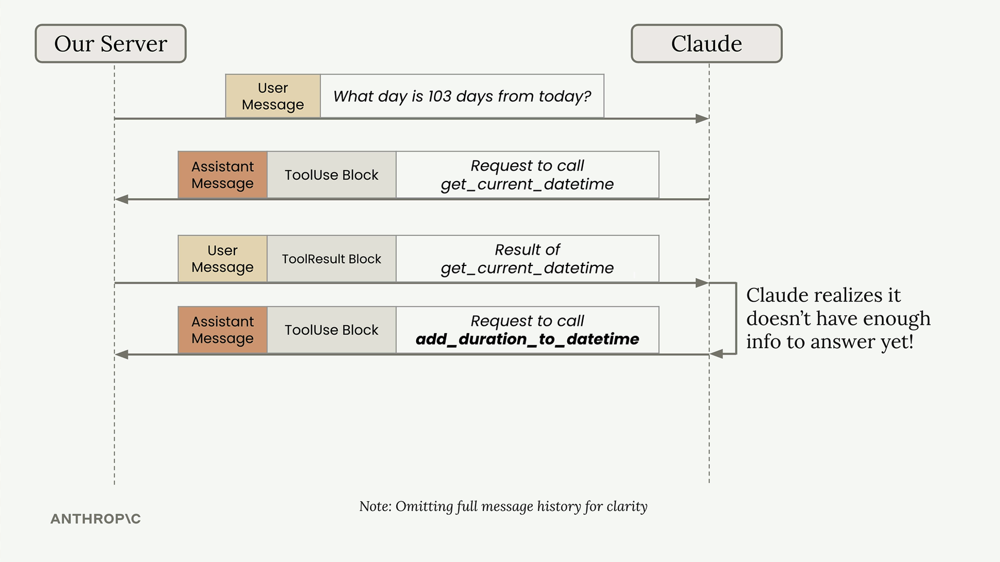
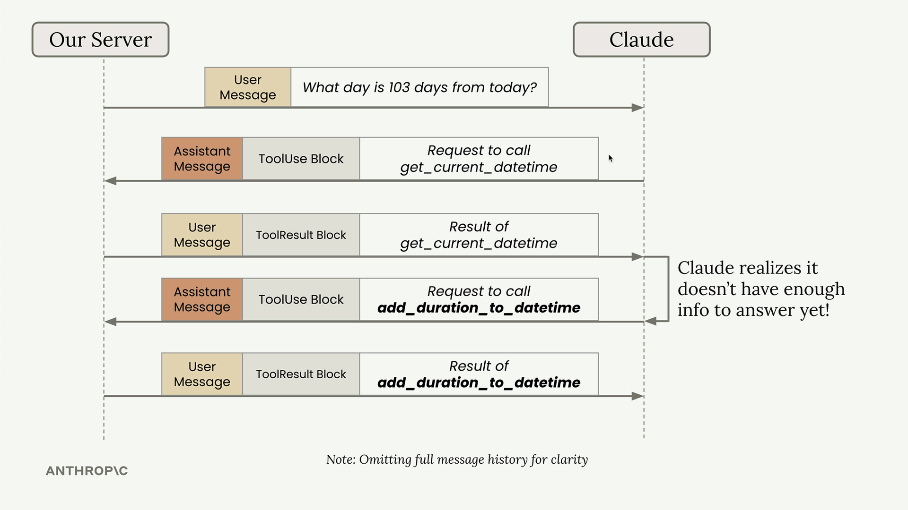
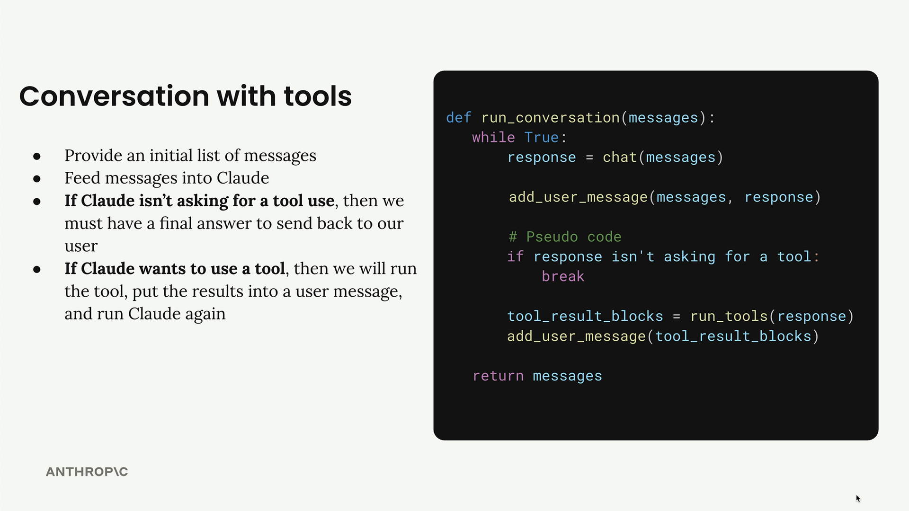

# Multi-turn conversations with tools

> Source: https://anthropic.skilljar.com/claude-with-the-anthropic-api/287750

#### Summary


                            
                                

When building applications with multiple tools, you need to handle scenarios where Claude might need to call several tools in sequence to answer a single user question. For example, if a user asks "What day is 103 days from today?", Claude needs to first get the current date, then add 103 days to it.





This creates a multi-turn conversation pattern where Claude makes multiple tool requests before providing a final answer. Your application needs to handle this automatically.


## The Multi-Turn Tool Pattern


Here's what happens behind the scenes when Claude needs multiple tools:


1. User asks: "What day is 103 days from today?"

1. Claude responds with a tool use block requesting `get_current_datetime`

1. Your server calls the function and returns the result

1. Claude realizes it needs more information and requests `add_duration_to_datetime`

1. Your server calls that function and returns the result

1. Claude now has enough information to provide the final answer





## Building a Conversation Loop


To handle this pattern, you need a conversation loop that continues until Claude stops requesting tools:


```
def run_conversation(messages):
    while True:
        response = chat(messages)
        
        add_user_message(messages, response)
        
        # Pseudo code
        if response isn't asking for a tool:
            break
            
        tool_result_blocks = run_tools(response)
        add_user_message(tool_result_blocks)
        
    return messages
```





## Refactoring Helper Functions


Before implementing the conversation loop, you need to update your helper functions to handle multiple message blocks properly.


### Updating Message Handlers


Your `add_user_message` and `add_assistant_message` functions currently assume you're always working with plain text. Update them to handle full message objects:


```
from anthropic.types import Message

def add_user_message(messages, message):
    user_message = {
        "role": "user",
        "content": message.content if isinstance(message, Message) else message
    }
    messages.append(user_message)
```


This allows you to pass in either a string, a list of blocks, or a complete message object.


### Updating the Chat Function


Modify your chat function to accept a list of tools and return the full message instead of just text:


```
def chat(messages, system=None, temperature=1.0, stop_sequences=[], tools=None):
    params = {
        "model": model,
        "max_tokens": 1000,
        "messages": messages,
        "temperature": temperature,
        "stop_sequences": stop_sequences,
    }
    
    if tools:
        params["tools"] = tools
        
    if system:
        params["system"] = system
        
    message = client.messages.create(**params)
    return message
```


### Extracting Text from Messages


Since you're now returning full message objects, create a helper to extract text when needed:


```
def text_from_message(message):
    return "\n".join(
        [block.text for block in message.content if block.type == "text"]
    )
```


This function finds all text blocks in a message and joins them together, which is useful when you need to display the final response to users.


## Key Improvements


These refactoring steps prepare your code for robust tool handling:


- **Flexible message handling** - Your helper functions can now work with different message formats

- **Tool support in chat** - The chat function can receive and pass through tool schemas

- **Full message returns** - You get complete message objects instead of just text, preserving all blocks

- **Text extraction utility** - Easy way to get readable text from complex messages


With these foundations in place, you're ready to implement the conversation loop that handles multiple tool calls automatically, creating a seamless experience where Claude can use as many tools as needed to answer user questions.


                            
                        
                    

                    
                        
                            

#### Downloads


                            


                                
                                    
                                        - [**001_tools_007.ipynb](https://cc.sj-cdn.net/instructor/4hdejjwplbrm-anthropic/assets/1762978180/001_tools_007.ipynb?response-content-disposition=attachment&Expires=1774882020&Signature=cu~T9skQbDGVbIHIJS-kwywoopuvlZM1EU0R9liMMEcn0oY7PVV~qY3J5PDP1G5LgWVz7R6ZVFlP4-J28mHaFde~ChuPjDgNIQmkRTe9FB-eC~V6TXTmoS-6~FofaPRK3b5v73zXcb7lOEvfWIu59eZTJrYJQ9dycyrHFyXcCFasvOSt2WBlLSh6vPSpJKcBwev48nWY5gbDo9aZQY2GU6d~wwSHmbm4zKkWNxbhDCKdvKujPEpAReO0fG8HRYAX4fAjwGxjBCGu8UEe7QOD-WqFPcZIYBi5eYI1ER9saYjq7n5ghx4nyo4vU8bfRAj3Q3qgkIEaWep1e5yAIrLp7g__&Key-Pair-Id=APKAI3B7HFD2VYJQK4MQ)