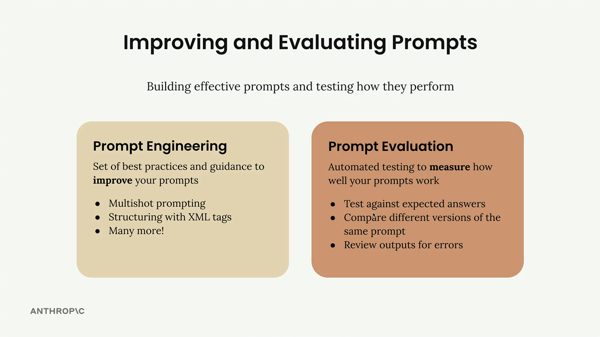
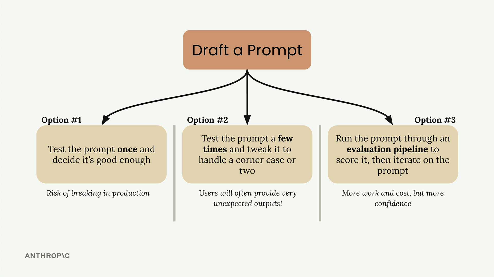

# Prompt evaluation

> Source: https://anthropic.skilljar.com/claude-with-the-anthropic-api/287731

#### Summary

                            
                                

When working with Claude, writing a good prompt is just the beginning. To build reliable AI applications, you need to understand two critical concepts: prompt engineering and prompt evaluation. Prompt engineering gives you techniques for writing better prompts, while prompt evaluation helps you measure how well those prompts actually work.

## Prompt Engineering vs Prompt Evaluation

Prompt engineering is your toolkit for crafting effective prompts. It includes techniques like:

- Multishot prompting

- Structuring with XML tags

- Many other best practices

These techniques help Claude understand exactly what you're asking for and how you want it to respond.

Prompt evaluation takes a different approach. Instead of focusing on how to write prompts, it's about measuring their effectiveness through automated testing. You can:

- Test against expected answers

- Compare different versions of the same prompt

- Review outputs for errors

## Three Paths After Writing a Prompt

Once you've drafted a prompt, you typically face three options for what to do next:

**Option 1:** Test the prompt once and decide it's good enough. This carries a significant risk of breaking in production when users provide unexpected inputs.

**Option 2:** Test the prompt a few times and tweak it to handle a corner case or two. While better than option 1, users will often provide very unexpected outputs that you haven't considered.

**Option 3:** Run the prompt through an evaluation pipeline to score it, then iterate on the prompt based on objective metrics. This approach requires more work and cost, but gives you much more confidence in your prompt's reliability.

## Why Most Engineers Fall Into Testing Traps

Options 1 and 2 are common traps that all engineers fall into, myself included. It's natural to write a prompt for a serious application and not test it thoroughly enough. We tend to underestimate how many edge cases real users will encounter.

The reality is that when you deploy a prompt to production, users will interact with it in ways you never anticipated. What seemed like a solid prompt during your limited testing can quickly break down when faced with the full variety of real-world inputs.

## The Evaluation-First Approach

Option 3 represents a more systematic approach to prompt development. By running your prompt through an evaluation pipeline, you get objective metrics about its performance across a broader range of test cases. This data-driven approach lets you:

- Identify weaknesses before they become production issues

- Compare different prompt versions objectively

- Iterate with confidence based on measurable improvements

- Build more reliable AI applications

While this approach requires more upfront investment in time and testing infrastructure, it pays dividends in the reliability and robustness of your final application. The goal is to catch problems during development rather than after your users encounter them.