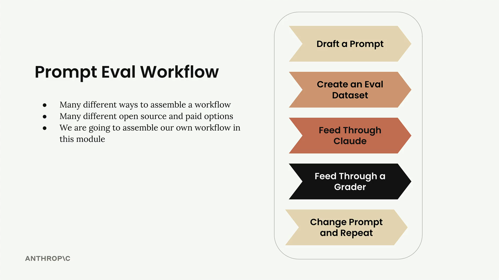
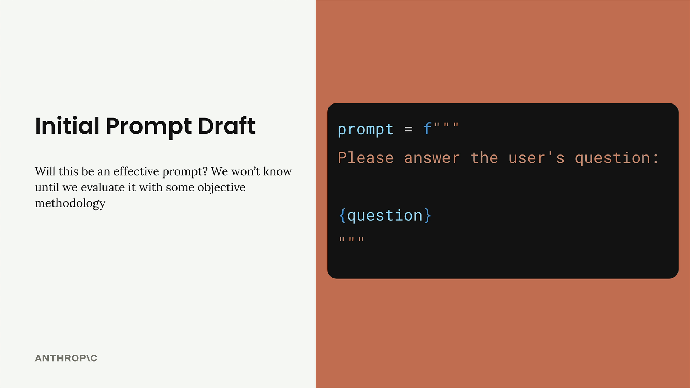
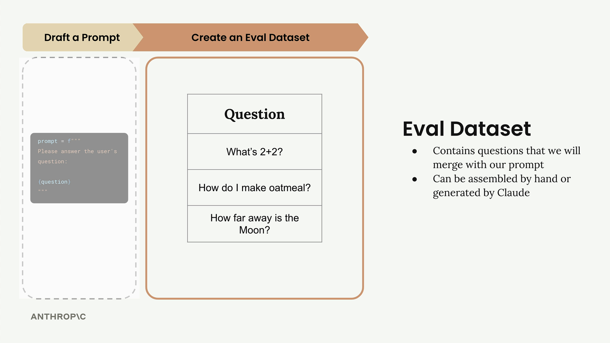
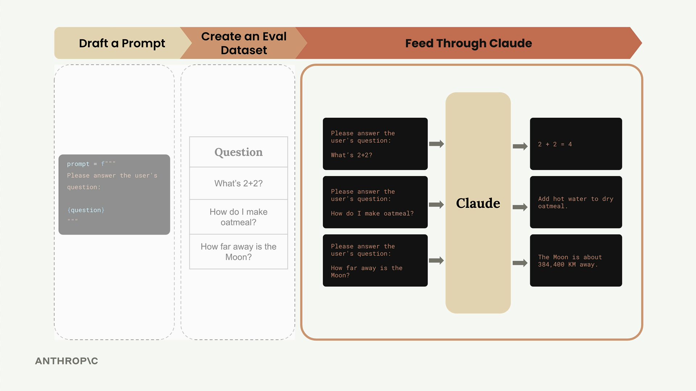
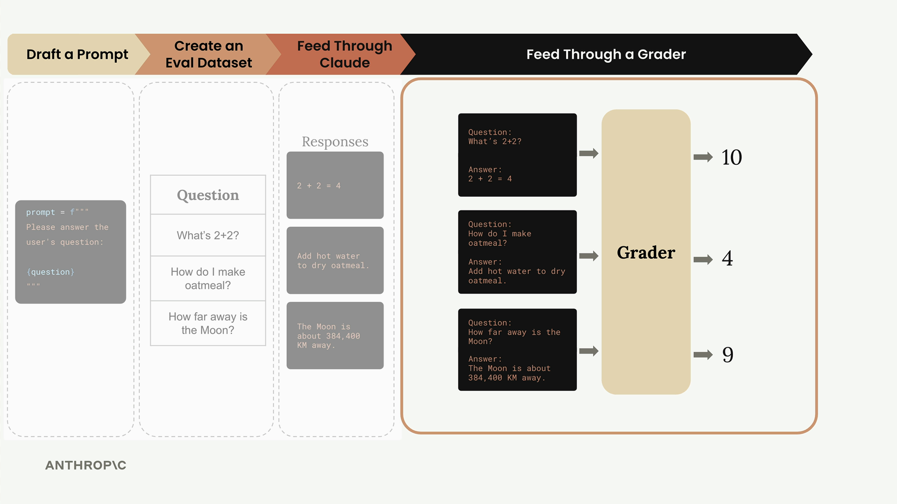
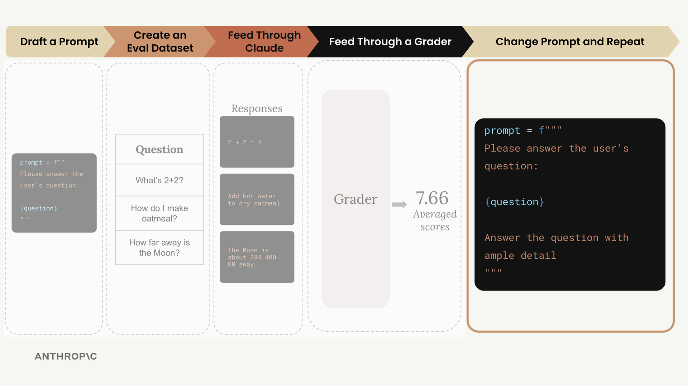
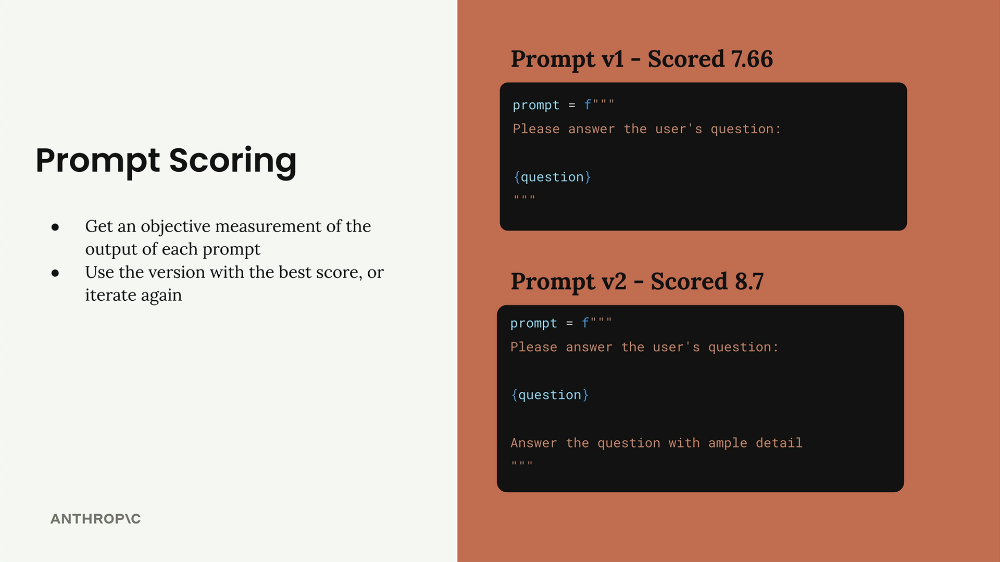

# A typical eval workflow

> Source: https://anthropic.skilljar.com/claude-with-the-anthropic-api/287736

#### Summary


                            
                                

A typical prompt evaluation workflow follows five key steps that help you systematically improve your prompts through objective measurement. While there are many different ways to assemble these workflows and various open source and paid tools available, understanding the core process helps you start small and scale up as needed.





## Step 1: Draft a Prompt


Start by writing an initial prompt that you want to improve. For this example, we'll use a simple prompt:


```
prompt = f"""
Please answer the user's question:

{question}
"""
```





This basic prompt will serve as our baseline for testing and improvement.


## Step 2: Create an Eval Dataset


Your evaluation dataset contains sample inputs that represent the types of questions or requests your prompt will handle in production. The dataset should include questions that will be interpolated into your prompt template.





For this example, our dataset includes three questions:


- "What's 2+2?"

- "How do I make oatmeal?"

- "How far away is the Moon?"


In real-world evaluations, you might have tens, hundreds, or even thousands of records. You can assemble these datasets by hand or use Claude to generate them for you.


## Step 3: Feed Through Claude


Take each question from your dataset and merge it with your prompt template to create complete prompts. Then send each one to Claude to get responses.





For example, the first question becomes:


```
Please answer the user's question:
What's 2+2?
```


Claude might respond with "2 + 2 = 4" for the math question, provide oatmeal cooking instructions for the second question, and give the distance to the Moon for the third.


## Step 4: Feed Through a Grader


The grader evaluates the quality of Claude's responses by examining both the original question and Claude's answer. This step provides objective scoring, typically on a scale from 1 to 10, where 10 represents a perfect answer and lower scores indicate room for improvement.





In our example, the grader might assign:


- Math question: 10 (perfect answer)

- Oatmeal question: 4 (needs improvement)

- Moon question: 9 (very good answer)


The average score across all questions gives you an objective measurement: (10 + 4 + 9) ÷ 3 = 7.66


## Step 5: Change Prompt and Repeat


Now that you have a baseline score, you can modify your prompt and run the entire process again to see if your changes improve performance.





For example, you might add more guidance to your prompt:


```
prompt = f"""
Please answer the user's question:

{question}

Answer the question with ample detail
"""
```


After running this improved prompt through the same evaluation process, you might get a higher average score of 8.7, indicating that the additional instruction helped Claude provide better responses.


## Prompt Scoring


The key benefit of this workflow is getting objective measurements of prompt performance. You can:


- Compare different prompt versions numerically

- Use the version with the best score

- Continue iterating to find even better approaches





This systematic approach removes guesswork from prompt engineering and gives you confidence that your changes are actually improvements rather than just different variations.