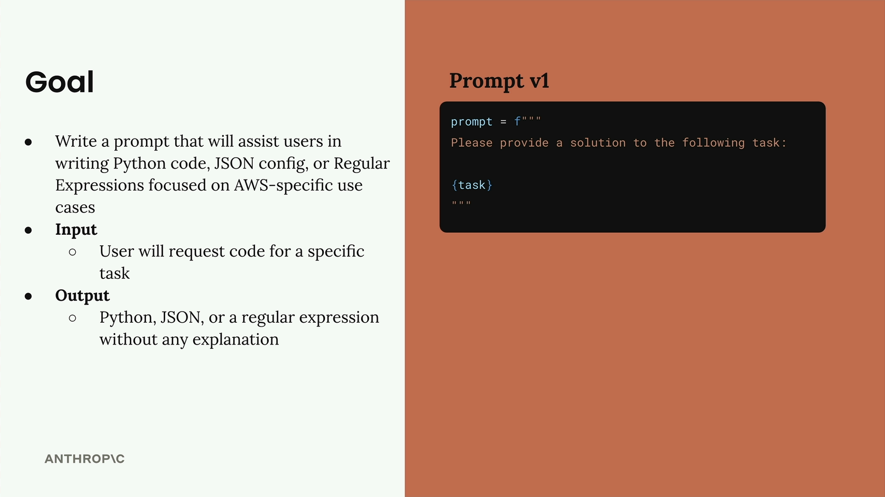
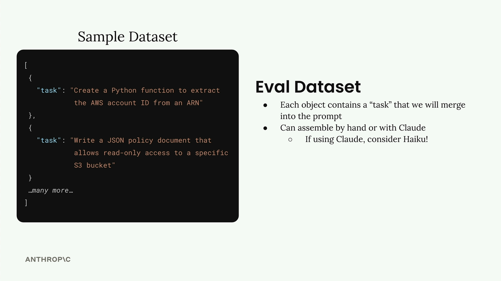

# Generating test datasets

> Source: https://anthropic.skilljar.com/claude-with-the-anthropic-api/287739

#### Summary


                            
                                

Building a custom prompt evaluation workflow starts with creating a solid prompt and then generating test data to see how well it performs. Let's walk through setting up an evaluation system for a prompt that helps users write AWS-specific code.


## Setting Up the Goal


Our prompt needs to assist users in writing three specific types of output for AWS use cases:


- Python code

- JSON configuration files

- Regular expressions


The key requirement is that when a user requests help with a task, we return clean output in one of these formats without any extra explanations, headers, or footers.





Here's our starting prompt (version 1):


```
prompt = f"""
Please provide a solution to the following task:
{task}
"""
```


## Creating an Evaluation Dataset


An evaluation dataset contains inputs that we'll feed into our prompt. For each combination of prompt and input, we'll run the prompt and analyze the results.


Our dataset will be an array of JSON objects, where each object contains a "task" property describing what we want Claude to accomplish. We can either create this dataset by hand or generate it automatically using Claude.





Since we're generating test data, this is a perfect opportunity to use a faster model like Haiku instead of the full Claude model.


## Generating Test Data with Code


Let's create a function that automatically generates our test dataset. First, we'll need our helper functions for working with Claude:


```
def add_user_message(messages, text):
    user_message = {"role": "user", "content": text}
    messages.append(user_message)

def add_assistant_message(messages, text):
    assistant_message = {"role": "assistant", "content": text}
    messages.append(assistant_message)

def chat(messages, system=None, temperature=1.0, stop_sequences=[]):
    params = {
        "model": model,
        "max_tokens": 1000,
        "messages": messages,
        "temperature": temperature
    }
    if system:
        params["system"] = system
    if stop_sequences:
        params["stop_sequences"] = stop_sequences
    
    response = client.messages.create(**params)
    return response.content[0].text
```


Now we'll create our dataset generation function:


```
def generate_dataset():
    prompt = """
Generate an evaluation dataset for a prompt evaluation. The dataset will be used to evaluate prompts that generate Python, JSON, or Regex specifically for AWS-related tasks. Generate an array of JSON objects, each representing task that requires Python, JSON, or a Regex to complete.

Example output:
```json
[
  {
    "task": "Description of task",
  },
  ...additional
]
```

* Focus on tasks that can be solved by writing a single Python function, a single JSON object, or a single regex
* Focus on tasks that do not require writing much code

Please generate 3 objects.
"""
```


To properly parse the JSON response, we'll use prefilling and stop sequences:


```
messages = []
    add_user_message(messages, prompt)
    add_assistant_message(messages, "```json")
    text = chat(messages, stop_sequences=["```"])
    return json.loads(text)
```


## Testing the Dataset Generation


Let's run our function and see what kind of test cases we get:


```
dataset = generate_dataset()
print(dataset)
```


This should return three different test cases covering our target outputs - Python functions, JSON configurations, and regular expressions for AWS-specific tasks.


## Saving the Dataset


Once we have our dataset, we'll save it to a file so we can easily load it later during evaluation:


```
with open('dataset.json', 'w') as f:
    json.dump(dataset, f, indent=2)
```


This creates a `dataset.json` file in the same directory as your notebook, containing your list of tasks ready for prompt evaluation.


With this foundation in place, you now have a systematic way to generate test data for evaluating how well your prompts perform across different types of AWS-related coding tasks.


                            
                        
                    

                    
                        
                            

#### Downloads


                            


                                
                                    
                                        - [**001_prompt_evals.ipynb](https://cc.sj-cdn.net/instructor/4hdejjwplbrm-anthropic/assets/1762977284/001_prompt_evals.ipynb?response-content-disposition=attachment&Expires=1774881924&Signature=mEutKDCU8XSesmhMQlh5hj7vAVTT76~paWkUrtYTFeqcLAd7kdwBxlxtBzJMgRYzigbveDZ3zhtnxDd7OTVVcjxBUO8hvnjiykwWGtCDOrltlTZgZV9TxpGQqLqSSJmAx~QCTB8uyHKob2O2e1LsDg-DYfj4pCL79El0zCavdy9EOJAU~kcqN30oW4gCpCsw6lc-rBiyVVkgxI8rAQeCBbVaDgDsegbZiGUK9Yy1F1WFYxdc4m5~o38ChsX8ea4O46aDpxga1dT9hDJGTl6cSzHm8qwTAw3oIhAc2YxjeXKAWHiWy3lE04LJtOyVx9PfWUJa1R7oRIKxiYua2fC2rg__&Key-Pair-Id=APKAI3B7HFD2VYJQK4MQ)