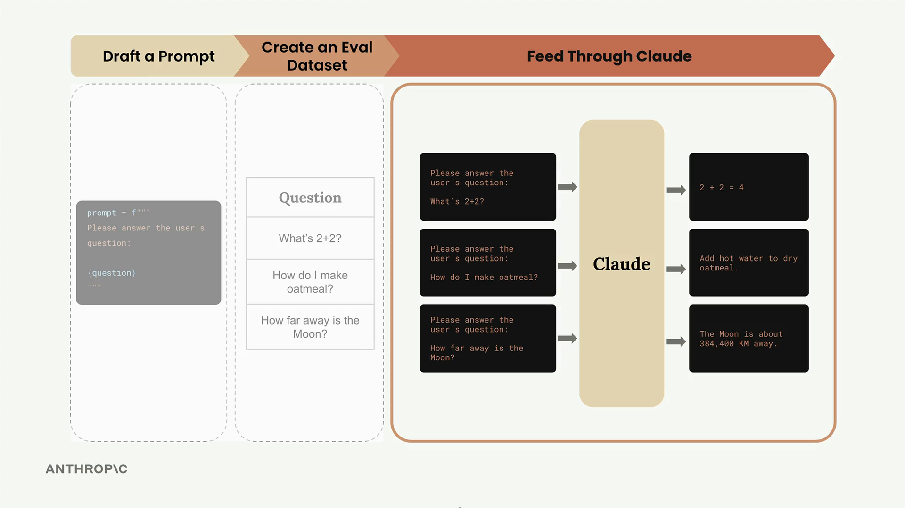
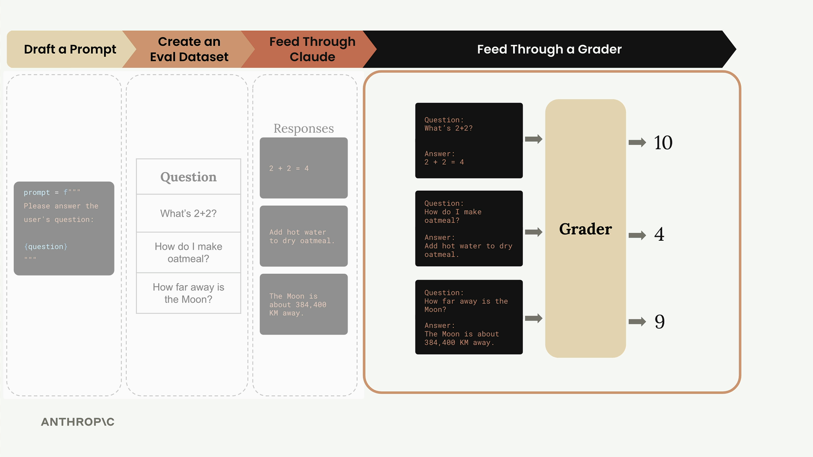

# Running the eval

> Source: https://anthropic.skilljar.com/claude-with-the-anthropic-api/287743

#### Summary


                            
                                

Now that we have our evaluation dataset ready, it's time to build the core evaluation pipeline. This involves taking each test case, merging it with our prompt, feeding it to Claude, and then grading the results.





The evaluation process follows a clear workflow: we take our dataset of test cases, combine each one with our prompt template, send it to Claude for processing, and then evaluate the output using a grader system.


## Building the Core Functions


The evaluation pipeline consists of three main functions, each with a specific responsibility. Let's start with the simplest one - the function that handles individual prompts.


## The run_prompt Function


This function takes a test case and merges it with our prompt template:


```
def run_prompt(test_case):
    """Merges the prompt and test case input, then returns the result"""
    prompt = f"""
Please solve the following task:

{test_case["task"]}
"""
    
    messages = []
    add_user_message(messages, prompt)
    output = chat(messages)
    return output
```


Right now, we're keeping the prompt extremely simple. We're not including any formatting instructions, so Claude will likely return more verbose output than we need. We'll refine this later as we iterate on our prompt design.


## The run_test_case Function


This function orchestrates running a single test case and grading the result:


```
def run_test_case(test_case):
    """Calls run_prompt, then grades the result"""
    output = run_prompt(test_case)
    
    # TODO - Grading
    score = 10
    
    return {
        "output": output,
        "test_case": test_case,
        "score": score
    }
```


For now, we're using a hardcoded score of 10. The grading logic is where we'll spend significant time in upcoming sections, but this placeholder lets us test the overall pipeline.


## The run_eval Function


This function coordinates the entire evaluation process:


```
def run_eval(dataset):
    """Loads the dataset and calls run_test_case with each case"""
    results = []
    
    for test_case in dataset:
        result = run_test_case(test_case)
        results.append(result)
    
    return results
```


This function processes every test case in our dataset and collects all the results into a single list.


## Running the Evaluation


To execute our evaluation pipeline, we load our dataset and run it through our functions:


```
with open("dataset.json", "r") as f:
    dataset = json.load(f)

results = run_eval(dataset)
```


The first time you run this, expect it to take some time - even with Claude Haiku, it can take around 30 seconds to process a full dataset. We'll cover optimization techniques later.


## Examining the Results


The evaluation returns a structured JSON array where each object represents one test case result:


```
print(json.dumps(results, indent=2))
```


Each result contains three key pieces of information:


- **output**: The complete response from Claude

- **test_case**: The original test case that was processed

- **score**: The evaluation score (currently hardcoded)


As you can see in the output, Claude generates quite verbose responses since we haven't provided specific formatting instructions yet. This is exactly the kind of issue we'll address as we refine our prompts.





## What We've Accomplished


At this point, we've successfully built the core evaluation pipeline. We can take our dataset, process it through Claude, and collect structured results. The major missing piece is the grading system - that hardcoded score of 10 needs to be replaced with actual evaluation logic.


This pipeline represents the foundation of most AI evaluation systems. While it may seem simple, you've just built the majority of what an eval pipeline actually does. The complexity comes in the details - better prompts, sophisticated grading, and performance optimizations.


Next, we'll dive into the critical topic of graders, which will transform our hardcoded scores into meaningful evaluations of Claude's performance.