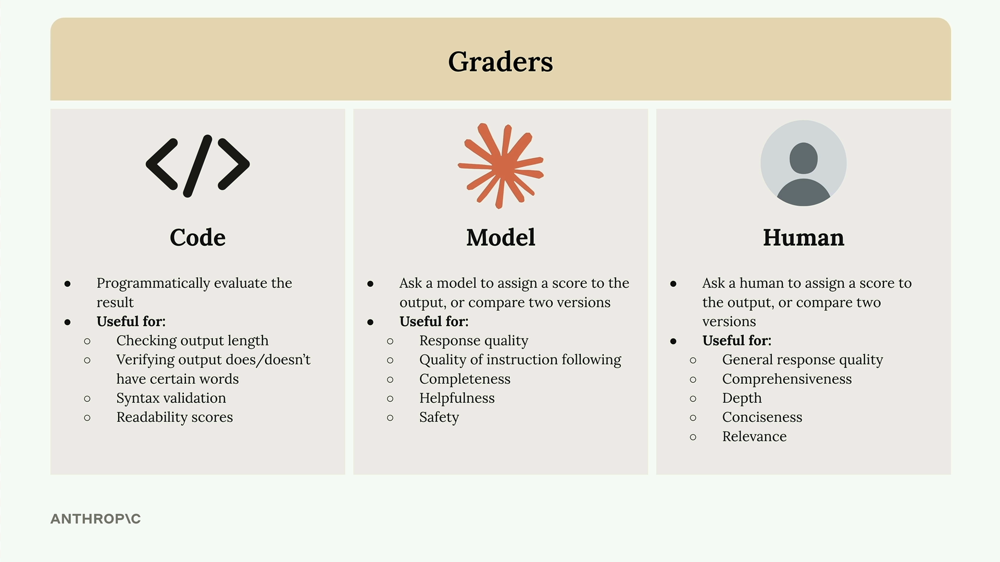
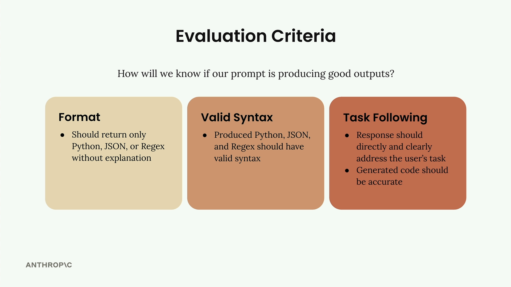
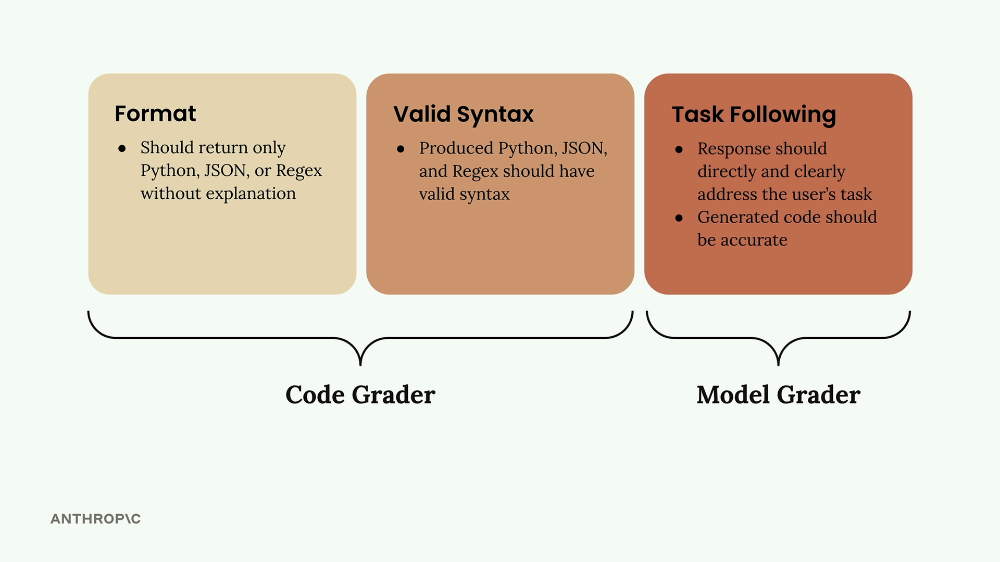

# Model based grading

> Source: https://anthropic.skilljar.com/claude-with-the-anthropic-api/287742

#### Summary


                            
                                

When building prompt evaluation workflows, grading systems provide objective signals about output quality. A grader takes model output and returns some kind of measurable feedback - typically a number between 1 and 10, where 10 represents high quality and 1 represents poor quality.


## Types of Graders





There are three main approaches to grading model outputs:


- **Code graders** - Programmatically evaluate outputs using custom logic

- **Model graders** - Use another AI model to assess the quality

- **Human graders** - Have people manually review and score outputs


### Code Graders


Code graders let you implement any programmatic check you can imagine. Common uses include:


- Checking output length

- Verifying output does/doesn't have certain words

- Syntax validation for JSON, Python, or regex

- Readability scores


The only requirement is that your code returns some usable signal - usually a number between 1 and 10.


### Model Graders


Model graders feed your original output into another API call for evaluation. This approach offers tremendous flexibility for assessing:


- Response quality

- Quality of instruction following

- Completeness

- Helpfulness

- Safety


### Human Graders


Human graders provide the most flexibility but are time-consuming and tedious. They're useful for evaluating:


- General response quality

- Comprehensiveness

- Depth

- Conciseness

- Relevance


## Defining Evaluation Criteria





Before implementing any grader, you need clear evaluation criteria. For a code generation prompt, you might focus on:


- **Format** - Should return only Python, JSON, or Regex without explanation

- **Valid Syntax** - Produced code should have valid syntax

- **Task Following** - Response should directly address the user's task with accurate code





The first two criteria work well with code graders, while task following is better suited for model graders due to their flexibility.


## Implementing a Model Grader


Here's how to build a model grader function:


```
def grade_by_model(test_case, output):
    # Create evaluation prompt
    eval_prompt = """
    You are an expert code reviewer. Evaluate this AI-generated solution.
    
    Task: {task}
    Solution: {solution}
    
    Provide your evaluation as a structured JSON object with:
    - "strengths": An array of 1-3 key strengths
    - "weaknesses": An array of 1-3 key areas for improvement  
    - "reasoning": A concise explanation of your assessment
    - "score": A number between 1-10
    """
    
    messages = []
    add_user_message(messages, eval_prompt)
    add_assistant_message(messages, "```json")
    
    eval_text = chat(messages, stop_sequences=["```"])
    return json.loads(eval_text)
```

`The key insight is asking for strengths, weaknesses, and reasoning alongside the score. Without this context, models tend to default to middling scores around 6.


## Integrating Grading into Your Workflow


Update your test case runner to call the grader:


```
def run_test_case(test_case):
    output = run_prompt(test_case)
    
    # Grade the output
    model_grade = grade_by_model(test_case, output)
    score = model_grade["score"]
    reasoning = model_grade["reasoning"]
    
    return {
        "output": output, 
        "test_case": test_case, 
        "score": score,
        "reasoning": reasoning
    }
```

`Finally, calculate an average score across all test cases:


```
from statistics import mean

def run_eval(dataset):
    results = []
    
    for test_case in dataset:
        result = run_test_case(test_case)
        results.append(result)
    
    average_score = mean([result["score"] for result in results])
    print(f"Average score: {average_score}")
    
    return results
```

`This gives you an objective metric to track as you iterate on your prompt. While model graders can be somewhat capricious, they provide a consistent baseline for measuring improvements.````````````#### Downloads


                            


                                
                                    
                                        - [**001_prompt_evals_grader.ipynb](https://cc.sj-cdn.net/instructor/4hdejjwplbrm-anthropic/assets/1762977624/001_prompt_evals_grader.ipynb?response-content-disposition=attachment&Expires=1774881934&Signature=GlpLcNy4HiEn610wf4dHcZ~GXZeuSPvJYgOloksdo9lb2ZLKfCSoWBOpmozJuyHWFoxvqKFHfcCtDTZ7TeXmDzXtpMyJ8cAwPmt1jRsLq~MOoyF0Xa5siRLoq9xRfUZlpqvnXffS9f4c3K81QJblKVd4lmm5BwLV~YHAP6dd5eXQ9UtWdSylbnBKOM8iOXn1OK4QeFAlP037EUotIH6yaaywu~EwubXRBFC3G7AxdKdU-oBlL8x3DmtCuAqzQ5ehhs0-81CWh~jlo86KmMhvf7YfTzFBXD6bzp6o8Kytz9pEJijvGLdXrBmxjE~rpw16jo4gN11nWcXDM19jSu0uUg__&Key-Pair-Id=APKAI3B7HFD2VYJQK4MQ)`````````