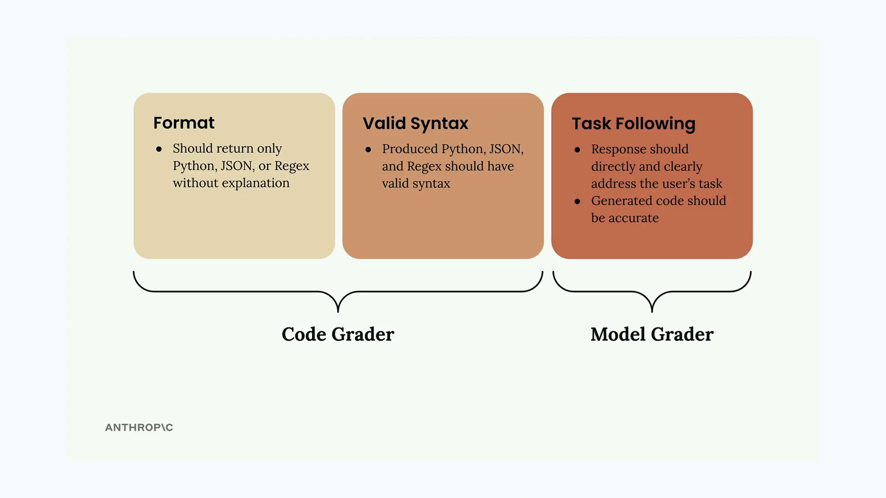
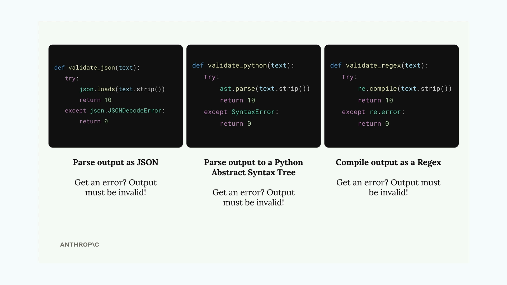

# Code based grading

> Source: https://anthropic.skilljar.com/claude-with-the-anthropic-api/287737

#### Summary


                            
                                

When evaluating AI models that generate code, you need more than just checking if the response makes sense. You also need to verify that the generated code actually has valid syntax and follows the correct format. This is where code-based grading comes in.


## How Code Grading Works


Code grading validates two key aspects of AI-generated responses:





- **Format** - The response should return only the requested code type (Python, JSON, or Regex) without explanations

- **Valid Syntax** - The generated code should actually parse correctly as the intended language

- **Task Following** - The response should directly address what was asked and be accurate


The first two criteria are handled by the code grader, while task following is evaluated by the model grader. Together, they provide a comprehensive evaluation.


## Syntax Validation Functions


To check if generated code has valid syntax, you can create three helper functions that attempt to parse the output:





```
def validate_json(text):
    try:
        json.loads(text.strip())
        return 10
    except json.JSONDecodeError:
        return 0

def validate_python(text):
    try:
        ast.parse(text.strip())
        return 10
    except SyntaxError:
        return 0

def validate_regex(text):
    try:
        re.compile(text.strip())
        return 10
    except re.error:
        return 0
```


Each function tries to parse the text as its respective format. If parsing succeeds, it returns a perfect score of 10. If it fails with an error, the syntax is invalid and returns 0.


## Dataset Format Requirements


For the code grader to know which validator to use, your test cases need to specify the expected output format:


```
{
    "task": "Create a Python function to validate an AWS IAM username",
    "format": "python"
}
```


You can update your dataset generation prompt to automatically include this format field by adding it to the example output structure.


## Improving Prompt Clarity


To get better results from your AI model, make your prompt instructions more specific about the expected output format:


```
* Respond only with Python, JSON, or a plain Regex
* Do not add any comments or commentary or explanation
```


You can also use a pre-filled assistant message with code blocks to encourage the model to return just the raw code:


```
add_assistant_message(messages, "```code")
```


This tells Claude to start generating code content without having to specify whether it's Python, JSON, or Regex ahead of time.


## Combining Scores


The final step is merging the model grader score with the code grader score. A simple approach is to take the average:


```
model_grade = grade_by_model(test_case, output)
model_score = model_grade["score"]
syntax_score = grade_syntax(output, test_case)

score = (model_score + syntax_score) / 2
```


This gives equal weight to both content quality and technical correctness. You might adjust these weights based on what matters more for your specific use case.


## Testing Your Implementation


Once you've implemented code grading, run your evaluation to get a baseline score. The score itself isn't inherently good or bad - what matters is whether you can improve it by refining your prompts. This gives you a quantitative way to measure prompt engineering progress rather than relying on subjective assessment.


                            
                        
                    

                    
                        
                            

#### Downloads


                            


                                
                                    
                                        - [**001_prompt_evals_fns.ipynb](https://cc.sj-cdn.net/instructor/4hdejjwplbrm-anthropic/assets/1762977673/001_prompt_evals_fns.ipynb?response-content-disposition=attachment&Expires=1774881939&Signature=upFInbdzi7N-DjfP4bPXjybk1x4H~dwGJ-hIgZPQxz5TCx-UhcPI69183F3~Ogo2EnhHnHHPEa6lqdx4dOgoikII8LvpTad5GyCz83bKs4ssPR6lcHHAug1IUq3JBC5UktuFYwCBQqsisHymB0yPjX4M3IVEP6Ix5aWvANRcyixWmW1MUc1nMh~d2zvpA3YBBQXCeUhzjjc03zpjqHeC1TsB1ABCQCvDvYfC1evufh1SXt5iyAmuSFvfJ0~8er3ipykYRTwH9bpiFFoGRmA5dkxZi8i5mMnDYKEbWR1Rkxrqo7LCeNh6b-cpnGiDElUw1gH3sBrKO3GI-CJ1nJNfrA__&Key-Pair-Id=APKAI3B7HFD2VYJQK4MQ)