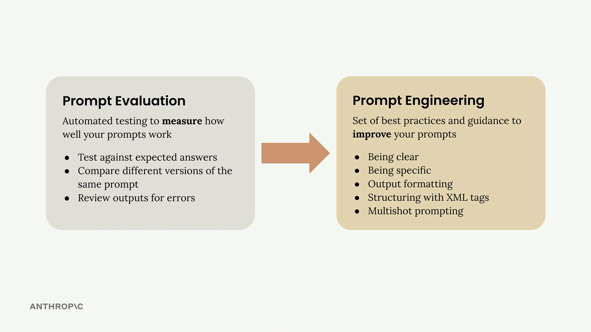
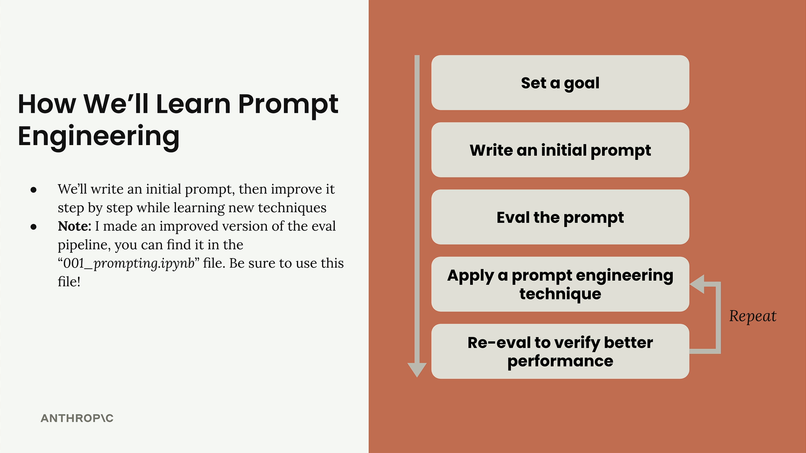
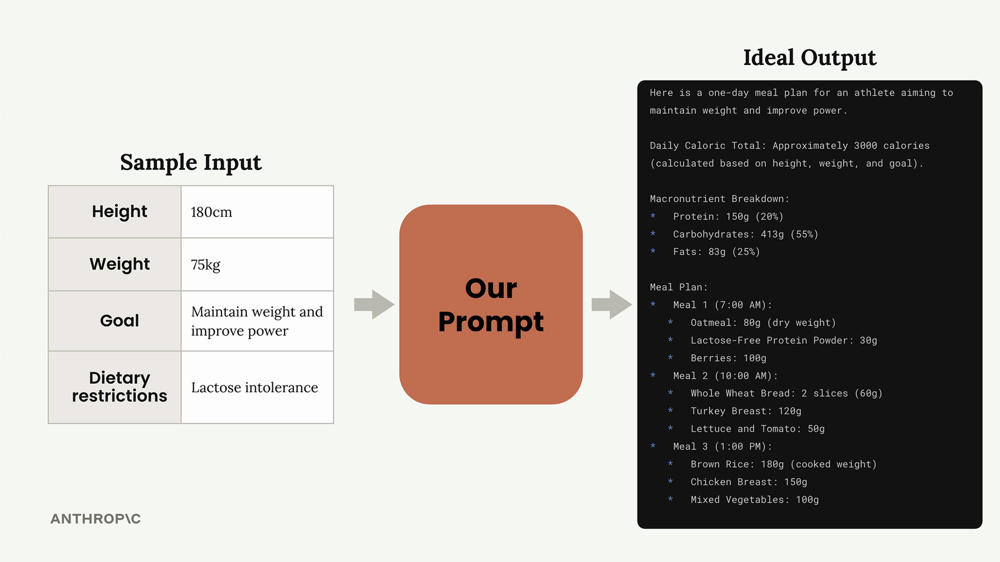
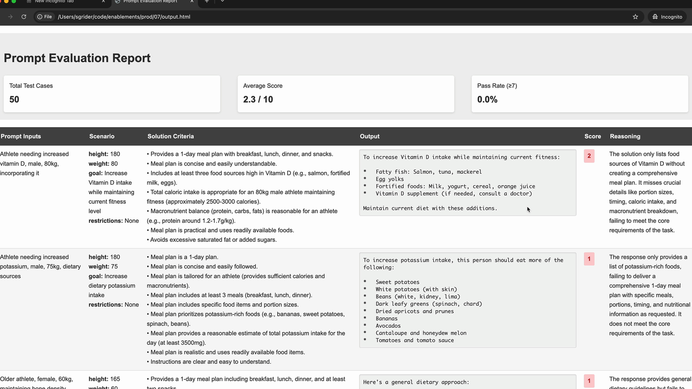

# Prompt engineering

> Source: https://anthropic.skilljar.com/claude-with-the-anthropic-api/287745

#### Summary


                            
                                

Prompt engineering is about taking a prompt you've written and improving it to get more reliable, higher-quality outputs. This process involves iterative refinement - starting with a basic prompt, evaluating its performance, then systematically applying engineering techniques to improve it.





## The Iterative Improvement Process


The approach follows a clear cycle that you can repeat until you achieve your desired results:





1. **Set a goal** - Define what you want your prompt to accomplish

1. **Write an initial prompt** - Create a basic first attempt

1. **Evaluate the prompt** - Test it against your criteria

1. **Apply prompt engineering techniques** - Use specific methods to improve performance

1. **Re-evaluate** - Verify that your changes actually improved the results


You repeat the last two steps until you're satisfied with the performance. Each iteration should show measurable improvement in your evaluation scores.


## Setting Up Your Evaluation Pipeline


To demonstrate this process, we'll work with a practical example: creating a prompt that generates one-day meal plans for athletes. The prompt needs to take into account an athlete's height, weight, goals, and dietary restrictions, then produce a comprehensive meal plan.





The evaluation setup uses a `PromptEvaluator` class that handles dataset generation and model grading. When creating your evaluator instance, you can control concurrency with the `max_concurrent_tasks` parameter:


```
evaluator = PromptEvaluator(max_concurrent_tasks=5)
```


Start with a low concurrency value (like 3) to avoid rate limit errors. You can increase it if your API quota allows for faster processing.


## Generating Test Data


The evaluation system can automatically generate test cases based on your prompt requirements. You define what inputs your prompt needs:


```
dataset = evaluator.generate_dataset(
    task_description="Write a compact, concise 1 day meal plan for a single athlete",
    prompt_inputs_spec={
        "height": "Athlete's height in cm",
        "weight": "Athlete's weight in kg", 
        "goal": "Goal of the athlete",
        "restrictions": "Dietary restrictions of the athlete"
    },
    output_file="dataset.json",
    num_cases=3
)
```


Keep the number of test cases low (2-3) during development to speed up your iteration cycle. You can increase this for final validation.


## Writing Your Initial Prompt


Start with a simple, naive prompt to establish a baseline. Here's an example of a deliberately basic first attempt:


```
def run_prompt(prompt_inputs):
    prompt = f"""
What should this person eat?

- Height: {prompt_inputs["height"]}
- Weight: {prompt_inputs["weight"]}
- Goal: {prompt_inputs["goal"]}
- Dietary restrictions: {prompt_inputs["restrictions"]}
"""
    
    messages = []
    add_user_message(messages, prompt)
    return chat(messages)
```


This basic prompt will likely produce poor results, but it gives you a starting point to measure improvement against.


## Adding Evaluation Criteria


When running your evaluation, you can specify additional criteria that the grading model should consider:


```
results = evaluator.run_evaluation(
    run_prompt_function=run_prompt,
    dataset_file="dataset.json",
    extra_criteria="""
The output should include:
- Daily caloric total
- Macronutrient breakdown  
- Meals with exact foods, portions, and timing
"""
)
```


This helps ensure your prompt is evaluated against the specific requirements that matter for your use case.


## Analyzing Results


After running an evaluation, you'll get both a numerical score and a detailed HTML report. The report shows you exactly how each test case performed, including the model's reasoning for each score.


Don't be discouraged by low initial scores - a score of 2.3 out of 10 is typical for a first attempt. The goal is to see consistent improvement as you apply engineering techniques.





The detailed evaluation report helps you understand exactly where your prompt is failing and what improvements are needed. Use this feedback to guide your next iteration.


## Next Steps


With your baseline established, you're ready to start applying specific prompt engineering techniques. Each technique you learn should result in measurable improvement in your evaluation scores, gradually transforming your basic prompt into a reliable, high-performing tool.


Remember that prompt engineering is an iterative process. The key is to make one change at a time, evaluate the impact, and build on what works. This systematic approach ensures you understand which techniques provide the most value for your specific use case.


                            
                        
                    

                    
                        
                            

#### Downloads


                            


                                
                                    
                                        - [**001_prompting.ipynb](https://cc.sj-cdn.net/instructor/4hdejjwplbrm-anthropic/assets/1762977962/001_prompting.ipynb?response-content-disposition=attachment&Expires=1774881954&Signature=RYTN7Co2z86UDHBn~~VROojtJnCCwKEdh2tIksM68uL927avhnprjevgcDmVAnVf20F1rBZZYyFkgtot8jnOmhfJr4XLCgYf8vKBSDLRwSYZ7H8bc1KEX84FwNDORunzJZOLCbytX0oOBVAtszhWVLXtPAs9A3fxUh5Y3x2hd4KJPkMhOg51~5iVElK9Z9GgdRCndVcm~tpDiIzimO9zcxEcJzlxYLLSGG3i4AKmzq3ioRCWq1BlWD6Vpm80VfiR8R6P7os3HST6gSd3vMI5TwTPWk8WVmikwyuR5pkDOP7Z-riqew05y~IQLutgZzamrVYqYesaQXS1OYFGZN0uSg__&Key-Pair-Id=APKAI3B7HFD2VYJQK4MQ)

                                    
                                
                                    
                                        - [**002_prompting_completed.ipynb](https://cc.sj-cdn.net/instructor/4hdejjwplbrm-anthropic/assets/1762977962/002_prompting_completed.ipynb?response-content-disposition=attachment&Expires=1774881954&Signature=iUOmPBjNgMEDlOF2X9DfNK~QOLx2ocCVzMRui1-YiVp6lPK4v2m9kVRue9npcPzRBZVtmzB3nprNjLuu3dPf0sfQaruopxZ5eoW9oyRibuOmo1d5P4QPWtNT98haPWWHUSqXehtT88LX87T9eS2X7~XbdkfyD~bQnAMwRmO3D56IpCvAXV0urBlmewlnU48LdG5i2YkcB4SB8CO1p5Z8wMLp1JZiCstVd-OKmPZdgGpv3d8RsiL-LRI12JrfTMQuH6lv1FNYoqqhI6EdT3QOxq~0nsuCCIy4a9JwA4lZYmfd2-7Lru4eLhKLjOFhAyUOdPakDJbaN8WQuNsryYMRTA__&Key-Pair-Id=APKAI3B7HFD2VYJQK4MQ)