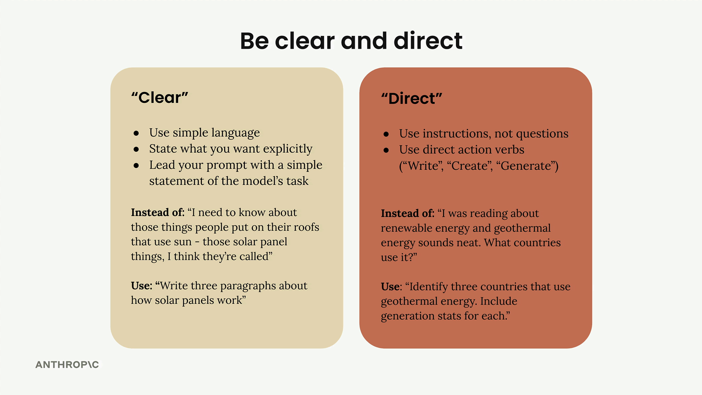

# Being clear and direct

> Source: https://anthropic.skilljar.com/claude-with-the-anthropic-api/287744

#### Summary

                            
                                

The first line of your prompt is the most important part of your entire request. This is where you set the stage for everything that follows, and getting it right can dramatically improve your results.

## Being Clear and Direct

When crafting that crucial first line, you want to focus on two key principles: clarity and directness. This means using simple language that leaves no room for ambiguity about what you want Claude to do.

## Clear Communication

Being "clear" means:

- Use simple language that anyone can understand

- State exactly what you want without beating around the bush

- Lead with a straightforward statement of Claude's task

Instead of writing something vague like "I need to know about those things people put on their roofs that use sun - those solar panel things, I think they're called," be direct and write: "Write three paragraphs about how solar panels work."

## Direct Instructions

Being "direct" focuses on how you structure your request:

- Use instructions, not questions

- Start with direct action verbs like "Write," "Create," or "Generate"

Rather than asking "I was reading about renewable energy and geothermal energy sounds neat. What countries use it?" try: "Identify three countries that use geothermal energy. Include generation stats for each."

## Putting It Into Practice

Let's see this technique in action. Starting with a weak prompt that simply asked "What should this person eat?" we can apply our clear and direct approach.

The improved version becomes: `Generate a one-day meal plan for an athlete that meets their dietary restrictions.`

This revision immediately tells Claude:

- What action to take (generate)

- What to create (a meal plan)

- Key constraints (one day, for an athlete, meeting dietary restrictions)

## Results Matter

This simple change can have a significant impact on performance. In our example, the evaluation score jumped from 2.32 to 3.92 - a substantial improvement from just restructuring that opening line.

The key takeaway is that Claude responds best when you treat it like a capable assistant who needs clear direction rather than someone who has to guess what you want. Start strong with a direct action verb, be specific about the task, and you'll see better results right away.