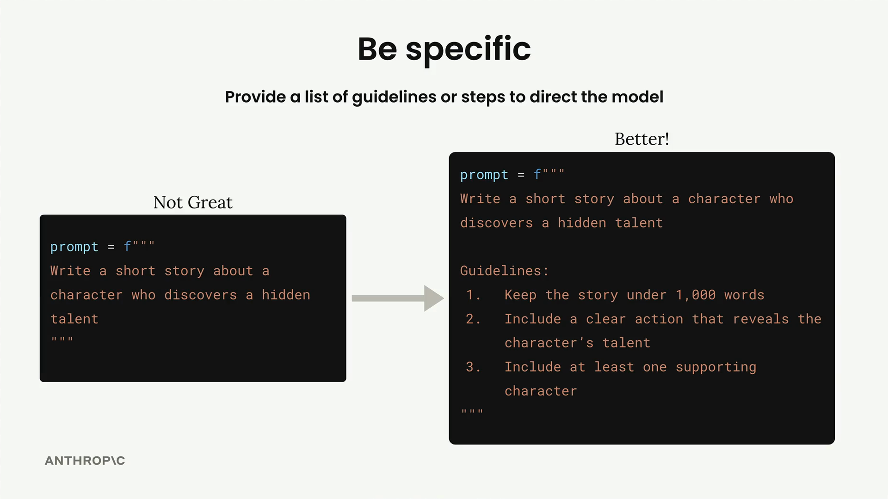
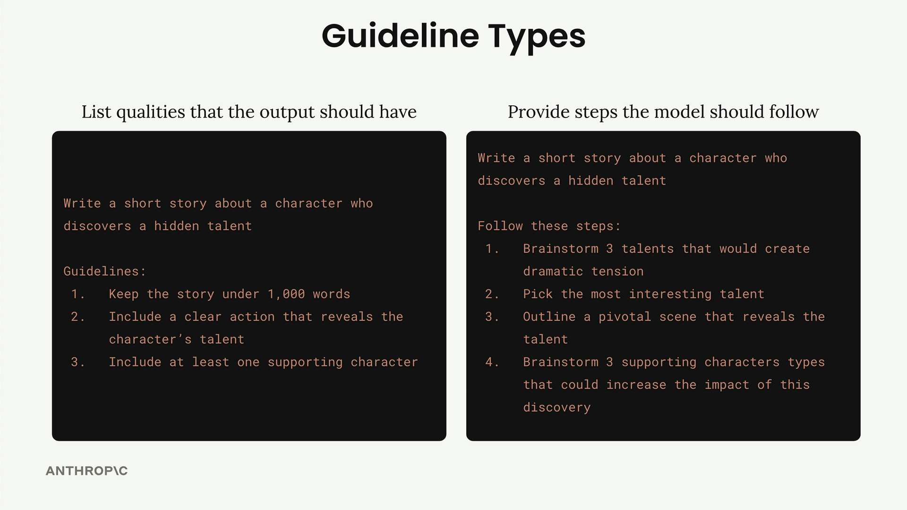
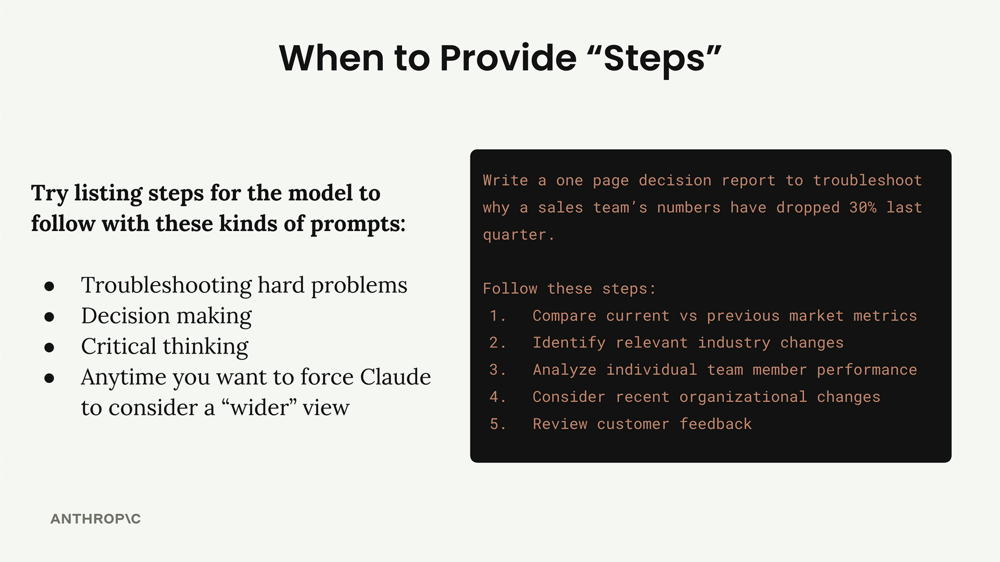

# Being specific

> Source: https://anthropic.skilljar.com/claude-with-the-anthropic-api/287740

#### Summary


                            
                                

When working with Claude, one of the most effective ways to improve your results is to be specific about what you want. Instead of leaving everything up to the model's interpretation, you can provide clear guidelines or steps that direct Claude toward the kind of output you're looking for.


Think about it this way: if you ask Claude to "write a short story about a character who discovers a hidden talent," Claude could go in countless directions. The story might be 200 words or 2,000 words. It might have one character or five. It could focus on any type of talent discovery scenario.





By adding specific guidelines, you give Claude a clearer target to aim for. This dramatically improves both the consistency and quality of the output.


## Two Types of Guidelines


There are two main approaches to being specific in your prompts, and you'll often see them used together in professional applications.





### Output Quality Guidelines


The first type focuses on listing qualities that your output should have. These guidelines help you control:


- Length of the response

- Structure and format

- Specific attributes or elements to include

- Tone or style requirements


For example, you might specify that a story should be under 1,000 words, include a clear action that reveals the character's talent, and feature at least one supporting character.


### Process Steps


The second type provides specific steps for Claude to follow. This approach is particularly useful when you want Claude to think through a problem systematically or consider multiple perspectives before arriving at a final answer.


Instead of jumping straight to writing, you might ask Claude to:


1. Brainstorm three talents that would create dramatic tension

1. Pick the most interesting talent

1. Outline a pivotal scene that reveals the talent

1. Brainstorm supporting character types that could increase the impact


## Real-World Impact


The difference that specificity makes is dramatic. In testing a meal planning prompt, adding guidelines improved the evaluation score from 3.92 to 7.86 - more than doubling the quality of the output simply by telling Claude exactly what elements to include.


```
Guidelines:
1. Include accurate daily calorie amount
2. Show protein, fat, and carb amounts  
3. Specify when to eat each meal
4. Use only foods that fit restrictions
5. List all portion sizes in grams
6. Keep budget-friendly if mentioned
```


## When to Use Each Approach


Here's a practical guide for when to use each type of specificity:


### Always Use Output Guidelines


You should include quality guidelines in almost every prompt you write. They're your safety net for getting consistent, useful results.


### Use Process Steps For Complex Problems


Add step-by-step instructions when you're dealing with:


- Troubleshooting complex problems

- Decision-making scenarios

- Critical thinking tasks

- Any situation where you want Claude to consider multiple angles





For instance, if you're asking Claude to analyze why a sales team's performance dropped, you'd want to guide it through examining market metrics, industry changes, individual performance, organizational changes, and customer feedback - rather than letting it focus on just one potential cause.


## Combining Both Approaches


In professional prompting, you'll often see both techniques used together. You might have guidelines that control the format and content of your output, plus steps that ensure Claude thinks through the problem thoroughly before responding.


This combination gives you both consistency in your results and confidence that Claude has considered all the important factors in reaching its conclusion.