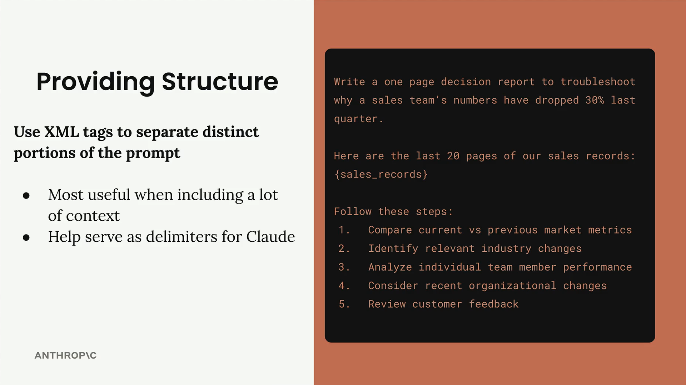
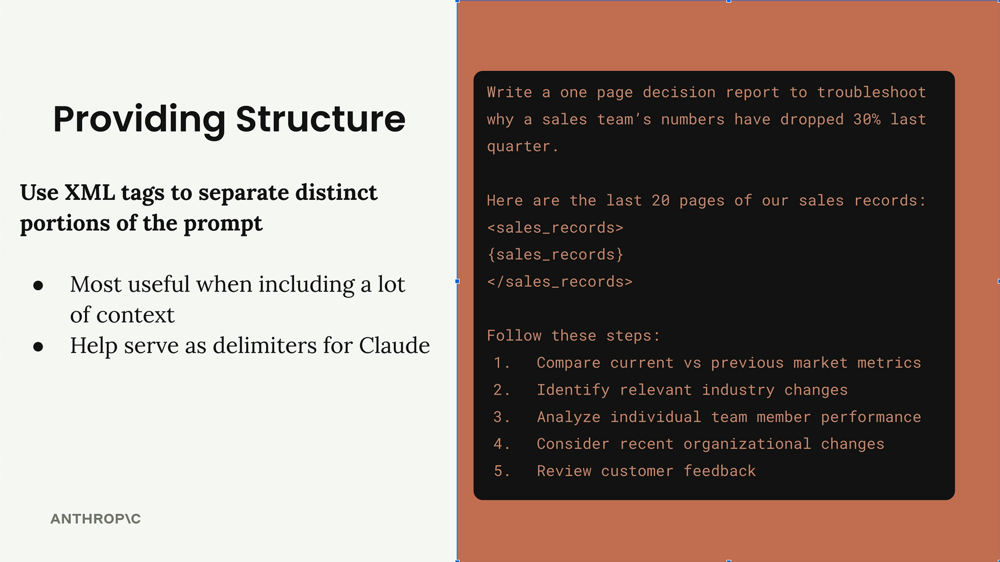
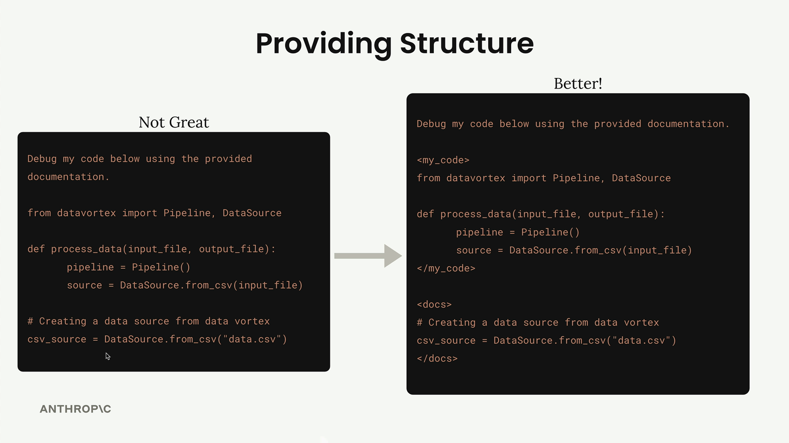

# Structure with XML tags

> Source: https://anthropic.skilljar.com/claude-with-the-anthropic-api/287741

#### Summary


                            
                                

When you're building prompts that include a lot of content, Claude can sometimes struggle to understand which pieces of text belong together or what different sections are supposed to represent. XML tags provide a simple way to add structure and clarity to your prompts, especially when you're interpolating large amounts of data.


## Why Structure Matters


Consider a prompt where you need to analyze 20 pages of sales records. Without clear boundaries, Claude might have trouble distinguishing between your instructions and the actual data you want analyzed.





The example above shows how unclear boundaries can make it difficult for Claude to parse your intent. By wrapping the sales records in XML tags like `<sales_records>` and `</sales_records>`, you create clear delimiters that help Claude understand the structure of your prompt.





## Practical Example: Code and Documentation


Here's a more dramatic example of why XML tags matter. If you ask Claude to debug code using provided documentation, mixing everything together creates confusion:





The "Not Great" version makes it nearly impossible to tell what's code versus documentation. The "Better" version uses `<my_code>` and `<docs>` tags to create clear boundaries.


## Custom Tag Names


You don't need to use official XML tags. Create descriptive names that make sense for your content:


- `<sales_records>` is better than `<data>`

- `<athlete_information>` clearly identifies user details

- `<my_code>` and `<docs>` separate different types of content


The more specific and descriptive your tag names, the better Claude can understand the purpose of each section.


## When to Use XML Tags


XML tags are most useful when:


- Including large amounts of context or data

- Mixing different types of content (code, documentation, data)

- You want to be extra clear about content boundaries

- Working with complex prompts that interpolate multiple variables


Even for shorter content, XML tags can help serve as delimiters that make your prompt structure more obvious to Claude.


## Real-World Application


In practice, you might structure a prompt like this:


```
<athlete_information>
- Height: 6'2"
- Weight: 180 lbs
- Goal: Build muscle
- Dietary restrictions: Vegetarian
</athlete_information>

Generate a meal plan based on the athlete information above.
```


This makes it crystal clear that the height, weight, goal, and restrictions are all related athlete data that should be considered together when generating the meal plan.


While you might not see dramatic improvements with simple prompts, XML tags become increasingly valuable as your prompts grow more complex and include larger amounts of varied content.