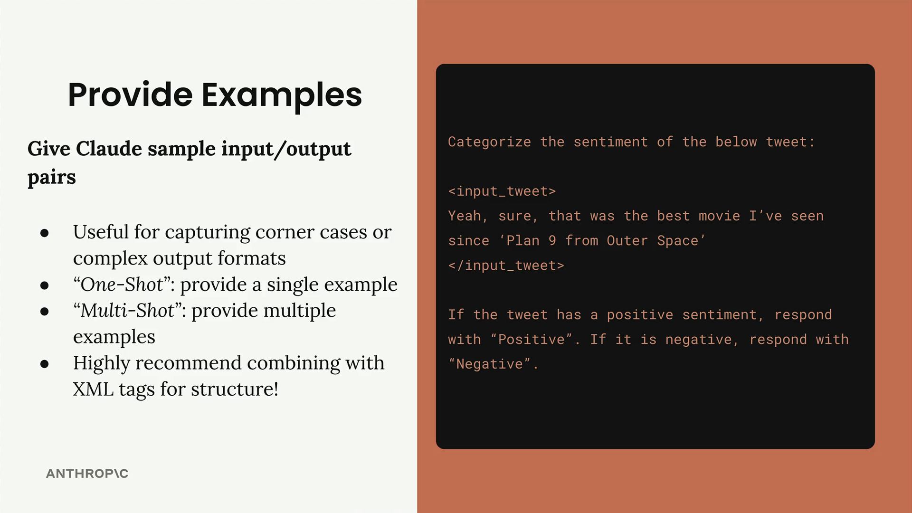
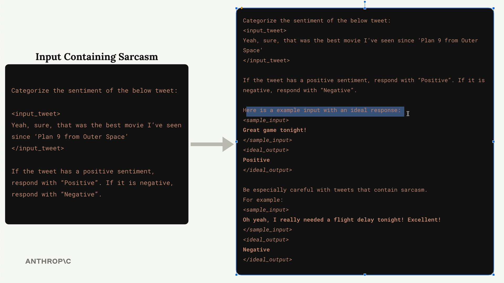
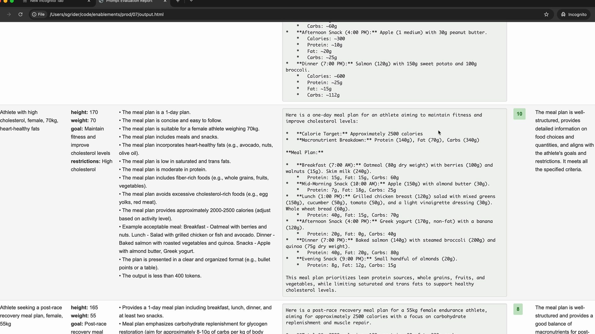

# Providing examples

> Source: https://anthropic.skilljar.com/claude-with-the-anthropic-api/287746

#### Summary


                            
                                

Providing examples in your prompts is one of the most effective prompt engineering techniques you'll use. This approach, known as "one-shot" or "multi-shot" prompting, involves giving Claude sample input/output pairs to guide its responses.


## How Examples Work


Let's look at a sentiment analysis example. Say you want Claude to categorize whether a tweet is positive or negative:





The challenge here is sarcasm. A tweet like "Yeah, sure, that was the best movie I've seen since 'Plan 9 from Outer Space'" appears positive on the surface, but it's actually sarcastic and negative (Plan 9 is famously one of the worst movies ever made).


## Adding Examples to Handle Corner Cases


To solve this, you can add examples that show Claude how to handle tricky cases:





The improved prompt includes:


- A clear positive example: "Great game tonight!" → "Positive"

- A sarcastic example: "Oh yeah, I really needed a flight delay tonight! Excellent!" → "Negative"

- Context explaining why sarcasm should be treated carefully


Notice how the examples are wrapped in XML tags like `<sample_input>` and `<ideal_output>`. This structure makes it crystal clear to Claude what each part represents.


## When to Use Examples


Examples are particularly useful for:


- Capturing corner cases or edge scenarios

- Defining complex output formats (like specific JSON structures)

- Showing the exact style or tone you want

- Demonstrating how to handle ambiguous inputs


## One-Shot vs Multi-Shot


**One-Shot**: Provide a single example to establish the pattern


**Multi-Shot**: Provide multiple examples to cover different scenarios


Use multi-shot when you need to handle various edge cases or want to show different types of valid responses.


## Finding Good Examples from Evaluations


When running prompt evaluations, look for your highest-scoring outputs to use as examples:





Find responses that scored 10 (or your highest available score) and use those input/output pairs as examples in your prompt. This helps Claude understand what "perfect" output looks like for your specific use case.


## Adding Context to Examples


Don't just provide the input/output pair - explain why the output is good:


```
<ideal_output>
[Your example output here]
</ideal_output>

This example is well-structured, provides detailed information 
on food choices and quantities, and aligns with the athlete's 
goals and restrictions.
```


This additional context helps Claude understand the reasoning behind good responses, not just the format.


## Best Practices


- Always use XML tags to structure your examples clearly

- Be explicit about what you're showing: "Here is an example input with an ideal response"

- Include examples that address your most common failure cases

- Explain why your example outputs are considered ideal

- Keep examples relevant to your specific task


Examples are especially powerful because they show rather than tell. Instead of trying to describe exactly what you want in words, you demonstrate it directly. This makes your prompts much more reliable and helps Claude understand subtle requirements that might be hard to express in instructions alone.