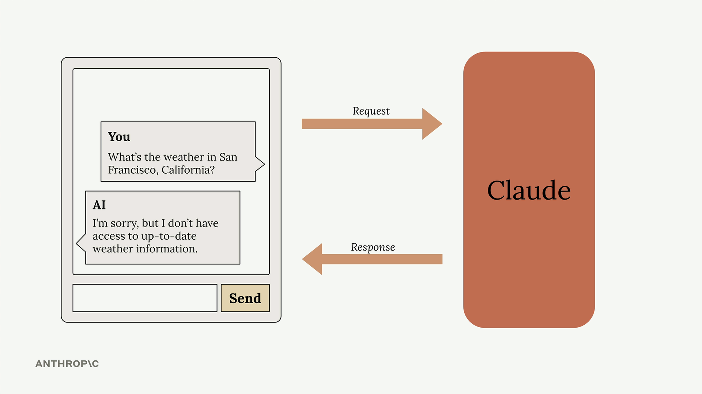
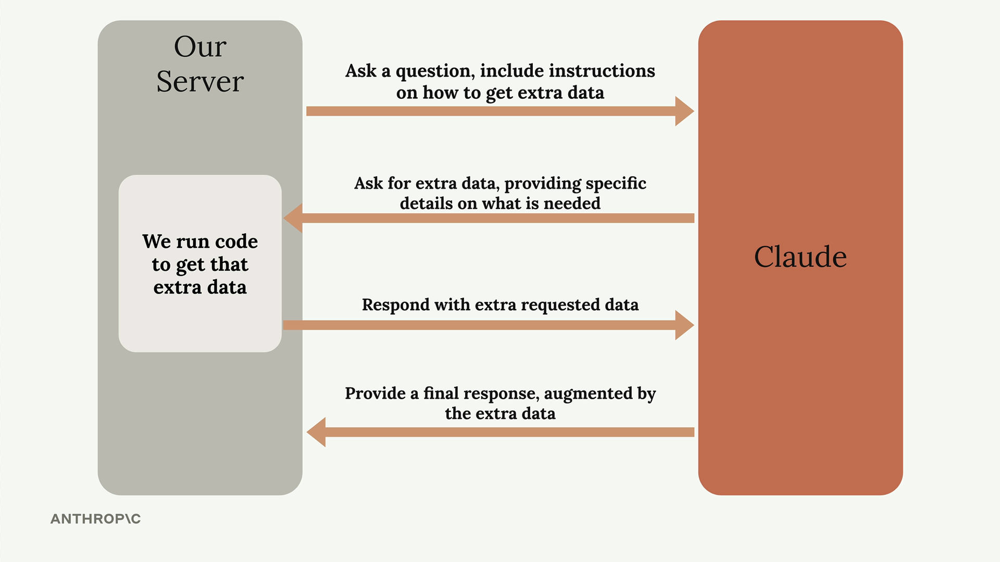
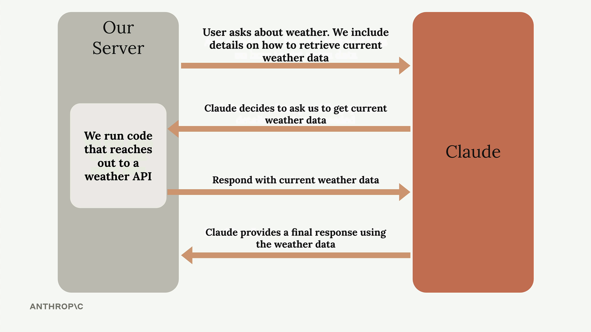

# Introducing tool use

> Source: https://anthropic.skilljar.com/claude-with-the-anthropic-api/287747

#### Summary

                            
                                

Tools allow Claude to access information from the outside world, extending its capabilities beyond what it learned during training. By default, Claude only knows information from its training data and can't access current events, real-time data, or external systems. Tool use solves this limitation by creating a structured way for Claude to request and receive fresh information.

## The Problem Without Tools

When users ask Claude for current information, it hits a wall. For example, if someone asks "What's the weather in San Francisco, California?" Claude has to respond with something like "I'm sorry, but I don't have access to up-to-date weather information."

This creates a frustrating user experience when people need real-time data that Claude could theoretically help with if it just had access to current information.

## How Tool Use Works

Tool use follows a specific back-and-forth pattern between your application and Claude. Here's the complete flow:

1. **Initial Request:** You send Claude a question along with instructions on how to get extra data from external sources

1. **Tool Request:** Claude analyzes the question and decides it needs additional information, then asks for specific details about what data it needs

1. **Data Retrieval:** Your server runs code to fetch the requested information from external APIs or databases

1. **Final Response:** You send the retrieved data back to Claude, which then generates a complete response using both the original question and the fresh data

## Weather Example in Practice

Let's see how this works with the weather question. The process becomes much more specific:

When a user asks about current weather, you include instructions in your prompt about how to retrieve weather data. Claude recognizes it needs current information and requests weather data for the specific location. Your server then calls a weather API to get real-time conditions and sends that data back to Claude. Finally, Claude combines the fresh weather data with the user's question to provide an accurate, current response.

## Key Benefits

- **Real-time Information:** Access current data that wasn't available during Claude's training

- **External System Integration:** Connect Claude to databases, APIs, and other services

- **Dynamic Responses:** Provide answers based on the latest available information

- **Structured Interaction:** Claude knows exactly what information it needs and how to ask for it

Tool use transforms Claude from a static knowledge base into a dynamic assistant that can work with live data. This opens up possibilities for building applications that need current information, whether that's weather data, stock prices, database queries, or any other real-time information your users might need.