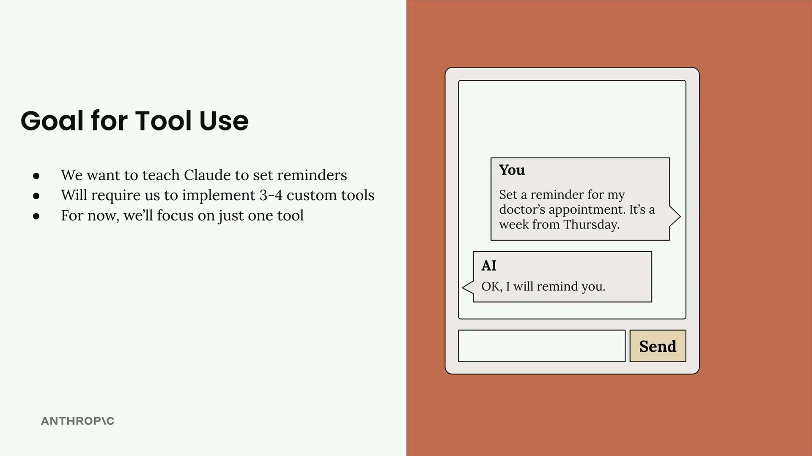
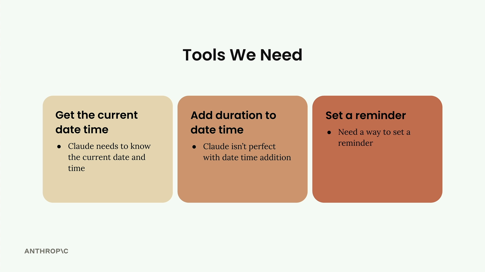

# Project overview

> Source: https://anthropic.skilljar.com/claude-with-the-anthropic-api/287751

#### Summary

                            
                                

We're going to build a practical project that teaches Claude how to set reminders for future dates. This might sound simple at first, but it reveals several interesting challenges that we'll solve using custom tools.

The goal is straightforward: we want to be able to tell Claude "Set a reminder for my doctor's appointment. It's a week from Thursday" and have Claude respond with "OK, I will remind you." But to make this work, we need to address some limitations in how Claude handles time and reminders.

## Why This Is Challenging

While Claude knows the current date, there are three specific problems we need to solve:

- **Limited time awareness:** Claude might know the current date, but not the exact time

- **Date calculation issues:** Claude doesn't always handle time-based addition well, especially when looking many days into the future

- **No reminder capability:** Claude doesn't know how to set a reminder - it has no built-in mechanism for this

Each of these limitations represents a gap between what Claude can do naturally and what we need for our reminder system. Tools are how we bridge these gaps.

## Tools We Need

We'll create three separate tools to handle each challenge:

- **Get the current date time:** Claude needs to know the current date and time precisely

- **Add duration to date time:** Claude isn't perfect with date time addition, so we'll give it a reliable tool for this

- **Set a reminder:** We need a way to actually set a reminder in the system

We'll implement these tools one at a time, starting with the simplest one. This approach lets us understand how tool calling works before building more complex functionality. By the end, Claude will be able to handle natural language requests like "remind me in a week" by combining these tools to calculate the exact time and set the reminder.

This project demonstrates a key principle of working with AI: when the model has limitations, we extend its capabilities through tools rather than trying to work around those limitations in our prompts.