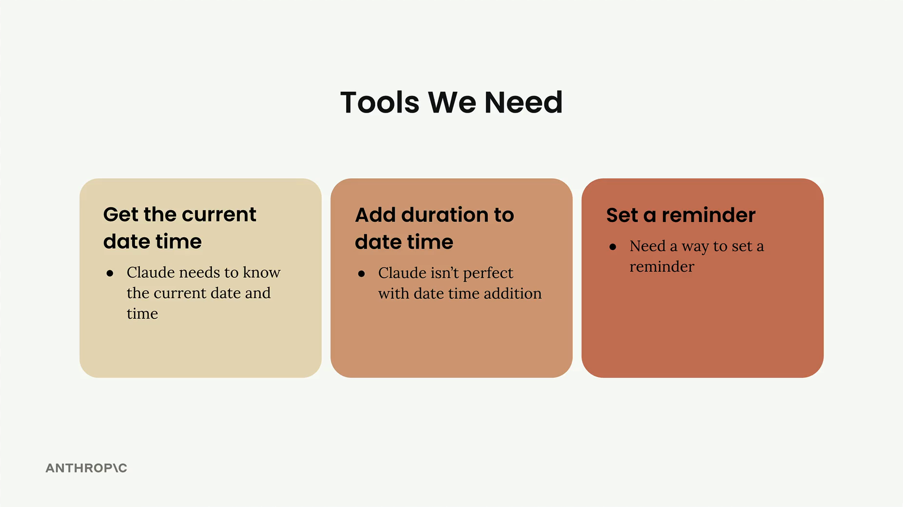
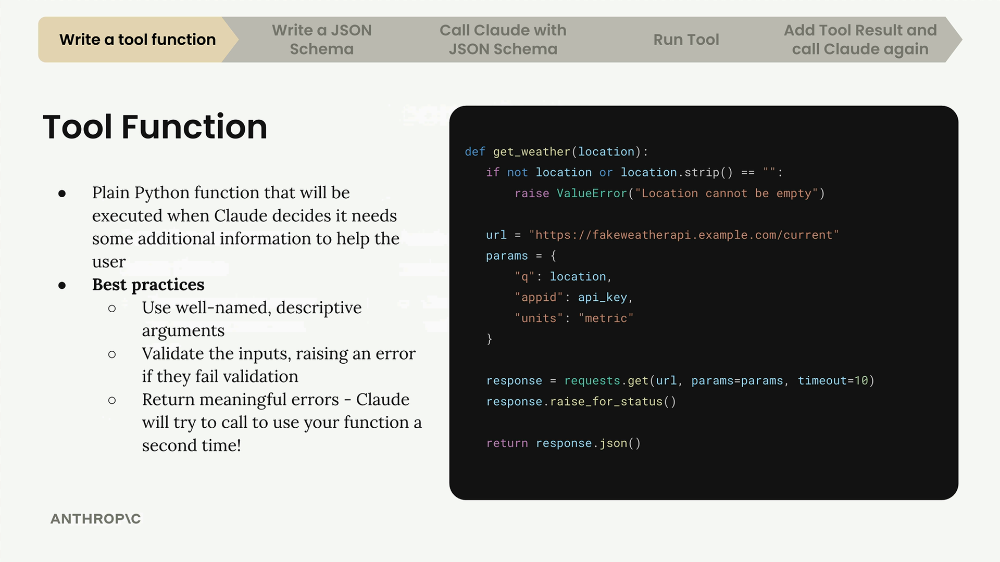

# Tool functions

> Source: https://anthropic.skilljar.com/claude-with-the-anthropic-api/287756

#### Summary


                            
                                

When building AI applications with Claude, you'll often need to give it access to real-time information or the ability to perform actions. This is where tool functions come in - they're Python functions that Claude can call when it needs additional data to help users.





The image above shows three essential tools we'll be implementing: getting the current date/time, adding duration to dates, and setting reminders. Let's start with the first one.


## What Are Tool Functions?


A tool function is a plain Python function that gets executed automatically when Claude decides it needs extra information to help a user. For example, if someone asks "What time is it?", Claude would call your date/time tool to get the current time.





Here's an example of a weather tool function. Notice how it validates inputs and provides clear error messages - these are important best practices.


## Best Practices for Tool Functions


When writing tool functions, follow these guidelines:


- **Use descriptive names:** Both your function name and parameter names should clearly indicate their purpose

- **Validate inputs:** Check that required parameters aren't empty or invalid, and raise errors when they are

- **Provide meaningful error messages:** Claude can see error messages and might retry the function call with corrected parameters


The validation is particularly important because Claude learns from errors. If you raise a clear error like "Location cannot be empty", Claude might try calling the function again with a proper location value.


## Building Your First Tool Function


Let's create a function to get the current date and time. This function will accept a date format parameter so Claude can request the time in different formats:


```
def get_current_datetime(date_format="%Y-%m-%d %H:%M:%S"):
    if not date_format:
        raise ValueError("date_format cannot be empty")
    return datetime.now().strftime(date_format)
```


This function uses Python's datetime module to get the current time and format it according to the provided format string. The default format gives us year-month-day hour:minute:second.


You can test it with different formats:


```
# Default format: "2024-01-15 14:30:25"
get_current_datetime()

# Just hour and minute: "14:30"
get_current_datetime("%H:%M")
```


The validation check ensures Claude can't pass an empty string for the date format. While this specific error is unlikely, it demonstrates the pattern of validating inputs and providing helpful error messages that Claude can learn from.


## Next Steps


Creating the function is just the first step. Next, you'll need to write a JSON schema that describes the function to Claude, then integrate it into your chat system. This tool function approach gives Claude powerful capabilities while keeping your code organized and maintainable.


                            
                        
                    

                    
                        
                            

#### Downloads


                            


                                
                                    
                                        - [**001_tools.ipynb](https://cc.sj-cdn.net/instructor/4hdejjwplbrm-anthropic/assets/1762978090/001_tools.ipynb?response-content-disposition=attachment&Expires=1774881998&Signature=poIZdXe-gMbHbnNDqUO7C8c4bJMKwxde6yLWjH3fWEwpyeL7zJKNOj2BHQJfGH635aYXcnWmHY961EUWAgz99u-RT1NHBzZWK8SSB3R4MlLIx4Anvi3izFFWknIe0CSSHCmQYU58XE1X3zGzoGtm3g0lqUqAjmpDj72K0ZpM~T-PmgqaoVQ6achf91~gxAezy7UQOKxWADuxYMGLGts-w92B1DIkFZPTjYGICFvL6OHCOYrZo6EZuAkax2j84UltiqxBjLYQR8P3ETw1EpYFTkoazrAQ1oHLVeXIaRZUexwNrD35agGL~7cOgtpjFAjvNlViimO6Ff4c-YeB701khg__&Key-Pair-Id=APKAI3B7HFD2VYJQK4MQ)