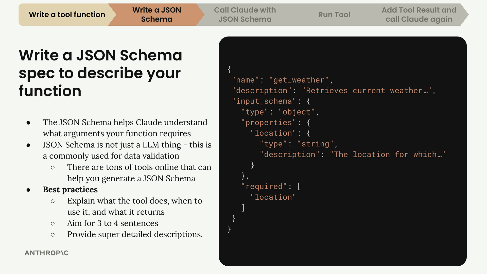
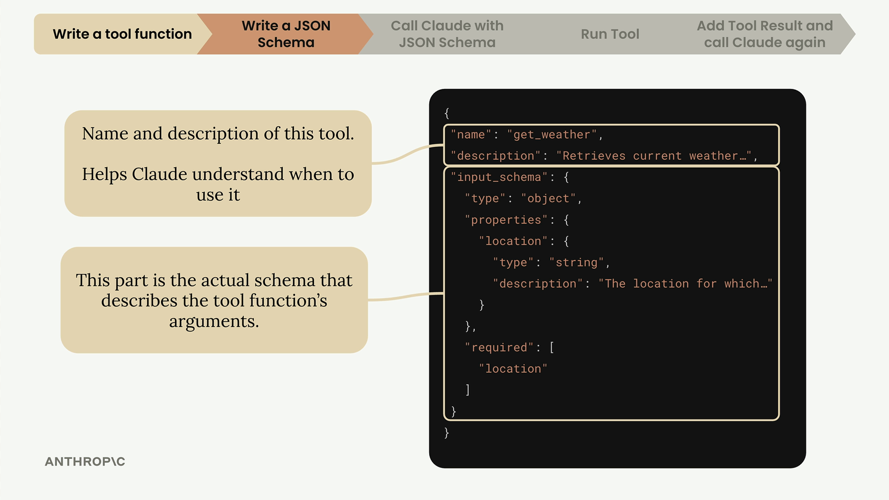
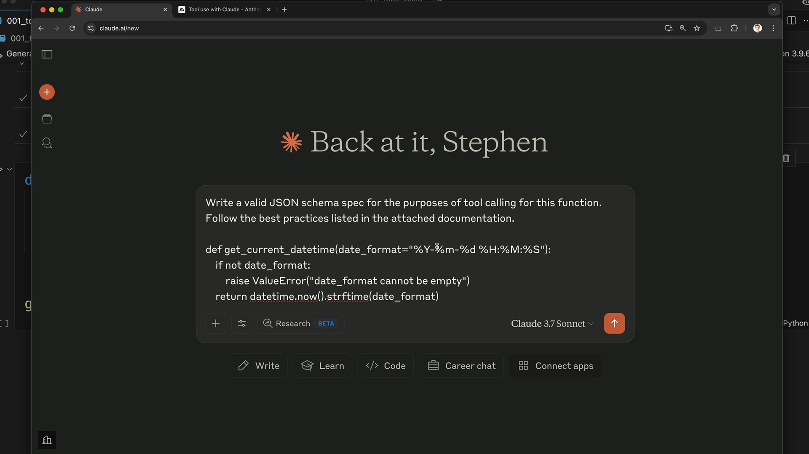

# Tool schemas

> Source: https://anthropic.skilljar.com/claude-with-the-anthropic-api/287753

#### Summary


                            
                                

After writing your tool function, the next step is creating a JSON schema that tells Claude what arguments your function expects and how to use it. This schema acts as documentation that Claude reads to understand when and how to call your tools.


## Understanding JSON Schema


JSON Schema isn't specific to AI or tool calling - it's a widely-used data validation specification that's been around for years. The AI community adopted it because it's a convenient way to describe function parameters and validate data.





The complete tool specification has three main parts:


- **name** - A clear, descriptive name for your tool (like "get_weather")

- **description** - What the tool does, when to use it, and what it returns

- **input_schema** - The actual JSON schema describing the function's arguments


## Writing Effective Descriptions


Your tool description is crucial for helping Claude understand when to use your function. Best practices include:


- Aim for 3-4 sentences explaining what the tool does

- Describe when Claude should use it

- Explain what kind of data it returns

- Provide detailed descriptions for each argument





## The Easy Way to Generate Schemas


Instead of writing JSON schemas from scratch, you can use Claude itself to generate them. Here's the process:


1. Copy your tool function code

1. Go to Claude and ask it to write a JSON schema for tool calling

1. Include the Anthropic documentation on tool use as context

1. Let Claude generate a properly formatted schema following best practices


The prompt should be something like: "Write a valid JSON schema spec for the purposes of tool calling for this function. Follow the best practices listed in the attached documentation."





## Implementing the Schema in Code


Once Claude generates your schema, copy it into your code file. Here's a good naming pattern to follow:


```
def get_current_datetime(date_format="%Y-%m-%d %H:%M:%S"):
    if not date_format:
        raise ValueError("date_format cannot be empty")
    return datetime.now().strftime(date_format)

get_current_datetime_schema = {
    "name": "get_current_datetime",
    "description": "Returns the current date and time formatted according to the specified format",
    "input_schema": {
        "type": "object",
        "properties": {
            "date_format": {
                "type": "string",
                "description": "A string specifying the format of the returned datetime. Uses Python's strftime format codes.",
                "default": "%Y-%m-%d %H:%M:%S"
            }
        },
        "required": []
    }
}
```


Use the pattern of `function_name` followed by `function_name_schema` to keep your schemas organized and easy to match with their corresponding functions.


## Adding Type Safety


For better type checking, import and use the `ToolParam` type from the Anthropic library:


```
from anthropic.types import ToolParam

get_current_datetime_schema = ToolParam({
    "name": "get_current_datetime",
    "description": "Returns the current date and time formatted according to the specified format",
    # ... rest of schema
})
```


While not strictly necessary for functionality, this prevents type errors when you use the schema with Claude's API and makes your code more robust.