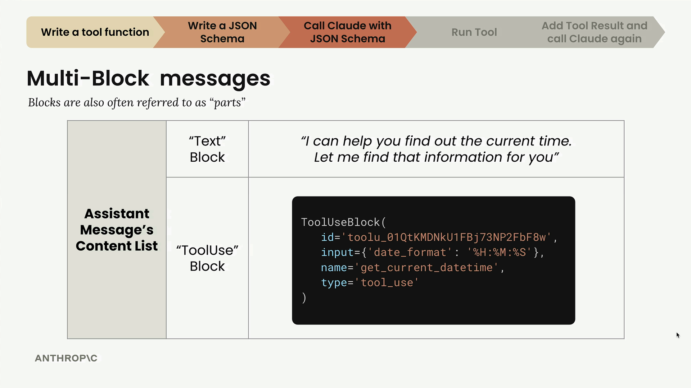
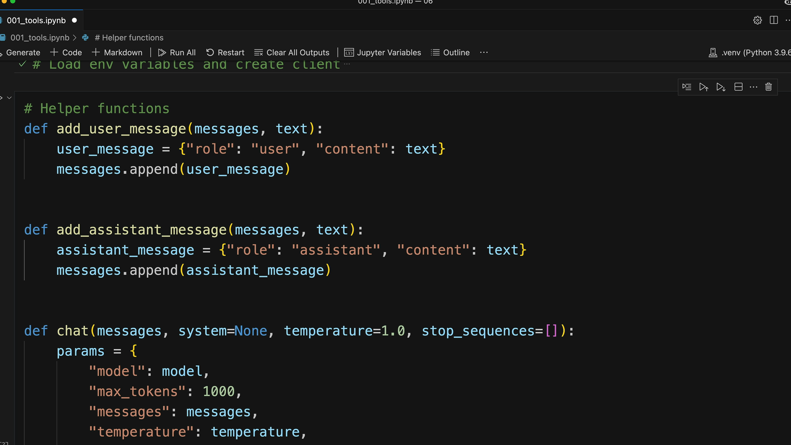

# Handling message blocks

> Source: https://anthropic.skilljar.com/claude-with-the-anthropic-api/287757

#### Summary


                            
                                

When working with Claude's tool functionality, you'll encounter a new type of response structure that's different from the simple text responses you've seen before. Instead of just getting back a single text block, Claude can now return multi-block messages that contain both text and tool usage information.


## Making Tool-Enabled API Calls


To enable Claude to use tools, you need to include a `tools` parameter in your API call. Here's how to structure the request:


```
messages = []
messages.append({
    "role": "user",
    "content": "What is the exact time, formatted as HH:MM:SS?"
})

response = client.messages.create(
    model=model,
    max_tokens=1000,
    messages=messages,
    tools=[get_current_datetime_schema],
)
```


The `tools` parameter takes a list of JSON schemas that describe the available functions Claude can call.


## Understanding Multi-Block Messages


When Claude decides to use a tool, it returns an assistant message with multiple blocks in the content list. This is a significant change from the simple text-only responses you've worked with before.





A multi-block message typically contains:


- **Text Block** - Human-readable text explaining what Claude is doing (like "I can help you find out the current time. Let me find that information for you")

- **ToolUse Block** - Instructions for your code about which tool to call and what parameters to use


The ToolUse block includes:


- An ID for tracking the tool call

- The name of the function to call (like "get_current_datetime")

- Input parameters formatted as a dictionary

- The type designation "tool_use"


## Managing Conversation History with Multi-Block Messages


Remember that Claude doesn't store conversation history - you need to manage it manually. When working with tool responses, you must preserve the entire content structure, including all blocks.


Here's how to properly append a multi-block assistant message to your conversation history:


```
messages.append({
    "role": "assistant",
    "content": response.content
})
```


This preserves both the text block and the tool use block, which is crucial for maintaining the conversation context when you make subsequent API calls.


## The Complete Tool Usage Flow





The tool usage process follows this pattern:


1. Send user message with tool schema to Claude

1. Receive assistant message with text block and tool use block

1. Extract tool information and execute the actual function

1. Send tool result back to Claude along with complete conversation history

1. Receive final response from Claude


Each step requires careful handling of the message structure to ensure Claude has the full context it needs to provide accurate responses.


## Updating Helper Functions


If you've been using helper functions like `add_user_message()` and `add_assistant_message()`, you'll need to update them to handle multi-block content. The current versions likely only support single text blocks, but now they need to accommodate the more complex content structures that include tool use blocks.


This multi-block message handling is essential for building robust applications that can seamlessly integrate Claude's tool capabilities while maintaining proper conversation flow.