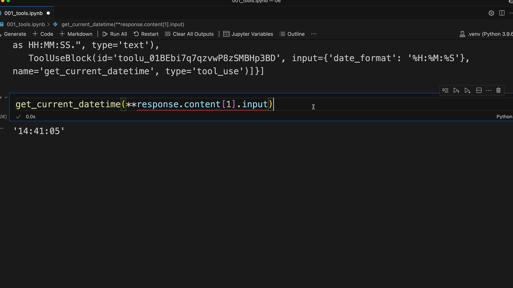
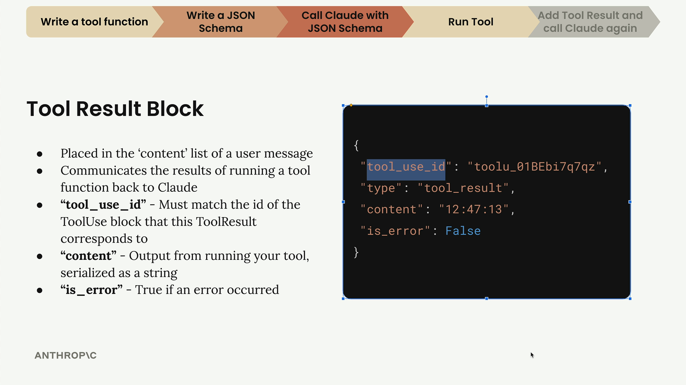
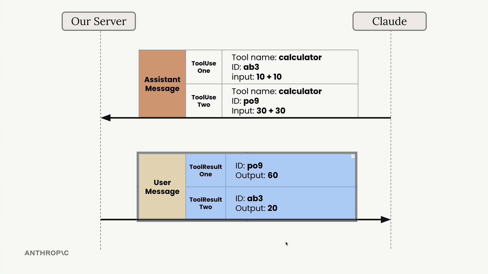
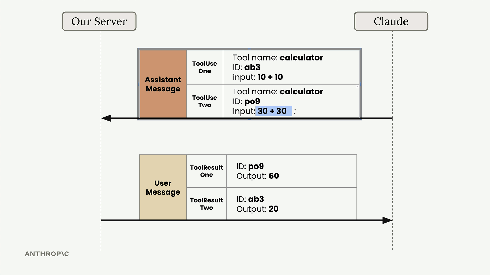
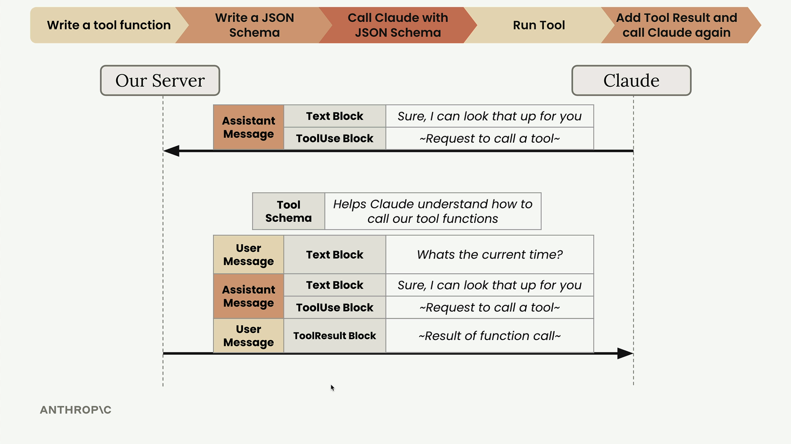

# Sending tool results

> Source: https://anthropic.skilljar.com/claude-with-the-anthropic-api/287752

#### Summary


                            
                                

After Claude requests a tool call, you need to execute the function and send the results back. This completes the tool use workflow by providing Claude with the information it requested.


## Running the Tool Function


When Claude responds with a tool use block, you extract the input parameters and call your function. Here's how to access the tool parameters:


```
response.content[1].input
```


This gives you a dictionary of the arguments Claude wants to pass to your function. Since your function expects keyword arguments rather than a dictionary, you use Python's unpacking syntax:


```
get_current_datetime(**response.content[1].input)
```





## Tool Result Block


After running the tool function, you need to send the results back to Claude using a tool result block. This block goes inside a user message and tells Claude what happened when you executed the tool.





The tool result block has several important properties:


- **tool_use_id** - Must match the id of the ToolUse block that this ToolResult corresponds to

- **content** - Output from running your tool, serialized as a string

- **is_error** - True if an error occurred


## Handling Multiple Tool Calls


Claude can request multiple tool calls in a single response. For example, if a user asks "What's 10 + 10 and what's 30 + 30?", Claude might respond with two separate ToolUse blocks.





Each tool call gets a unique ID, and you must match these IDs when sending back results. This ensures Claude knows which result corresponds to which request, even if the results arrive in a different order.





## Building the Follow-up Request


Your follow-up request to Claude must include the complete conversation history plus the new tool result. Here's the structure:


```
messages.append({
    "role": "user",
    "content": [{
        "type": "tool_result",
        "tool_use_id": response.content[1].id,
        "content": "15:04:22",
        "is_error": False
    }]
})
```


The complete message history now contains:


- Original user message

- Assistant message with tool use block

- User message with tool result block


## Making the Final Request


When sending the follow-up request, you must still include the tool schema even though you're not expecting Claude to make another tool call. Claude needs the schema to understand the tool references in your conversation history.


```
client.messages.create(
    model=model,
    max_tokens=1000,
    messages=messages,
    tools=[get_current_datetime_schema]
)
```





Claude will then respond with a final message that incorporates the tool results into a natural response for the user. The tool use workflow is now complete - you've successfully enabled Claude to access real-time information through your custom function.