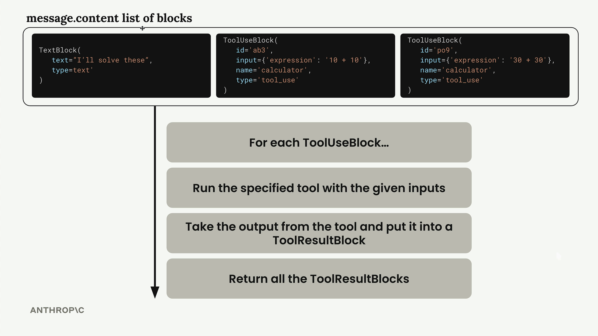
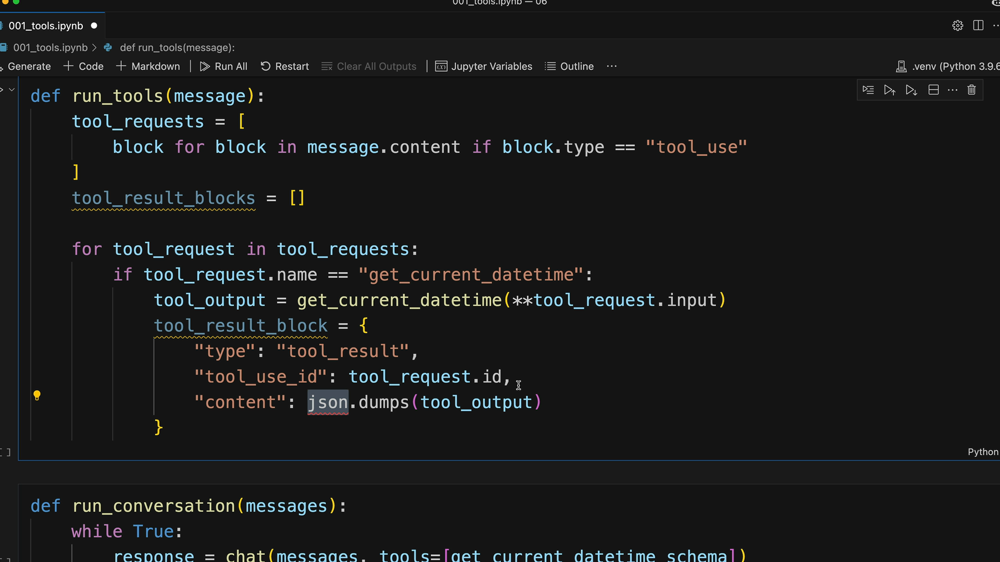

# Implementing multiple turns

> Source: https://anthropic.skilljar.com/claude-with-the-anthropic-api/287758

#### Summary


                            
                                

Building a conversation system with tools requires implementing a loop that keeps calling Claude until it stops requesting tool usage. When Claude no longer asks for tools, that signals it has a final response ready for the user.


## Detecting Tool Requests


The key to knowing whether Claude wants to use a tool lies in the `stop_reason` field of the response message. When Claude decides it needs to call a tool, this field gets set to `"tool_use"`. This gives us a clean way to check if we need to continue the conversation loop:


```
if response.stop_reason != "tool_use":
    break  # Claude is done, no more tools needed
```


## The Conversation Loop


The main conversation function follows a simple pattern:


```
def run_conversation(messages):
    while True:
        response = chat(messages, tools=[get_current_datetime_schema])
        add_assistant_message(messages, response)
        print(text_from_message(response))
        
        if response.stop_reason != "tool_use":
            break
            
        tool_results = run_tools(response)
        add_user_message(messages, tool_results)
    
    return messages
```


This loop continues until Claude provides a final answer without requesting any tools.


## Handling Multiple Tool Calls


Claude can request multiple tools in a single response. The message content contains a list of blocks, and we need to process each tool use block separately:





The `run_tools` function handles this by filtering for tool use blocks and processing each one:


```
def run_tools(message):
    tool_requests = [
        block for block in message.content if block.type == "tool_use"
    ]
    tool_result_blocks = []
    
    for tool_request in tool_requests:
        # Process each tool request...
```


## Tool Result Blocks


Each tool use block must be answered with a corresponding tool result block. The connection between them is maintained through matching IDs:





The tool result block structure includes:


```
tool_result_block = {
    "type": "tool_result",
    "tool_use_id": tool_request.id,
    "content": json.dumps(tool_output),
    "is_error": False
}
```


## Error Handling


Robust tool execution requires handling potential errors. When a tool fails, we still need to provide a result block to Claude:


```
try:
    tool_output = run_tool(tool_request.name, tool_request.input)
    tool_result_block = {
        "type": "tool_result",
        "tool_use_id": tool_request.id,
        "content": json.dumps(tool_output),
        "is_error": False
    }
except Exception as e:
    tool_result_block = {
        "type": "tool_result", 
        "tool_use_id": tool_request.id,
        "content": f"Error: {e}",
        "is_error": True
    }
```


## Scalable Tool Routing


To support multiple tools, create a routing function that maps tool names to their implementations:


```
def run_tool(tool_name, tool_input):
    if tool_name == "get_current_datetime":
        return get_current_datetime(**tool_input)
    elif tool_name == "another_tool":
        return another_tool(**tool_input)
    # Add more tools as needed
```


This approach makes it easy to add new tools without modifying the core conversation logic.


## Complete Workflow


The complete multi-turn conversation works like this:


- Send user message to Claude with available tools

- Claude responds with text and/or tool requests

- Execute all requested tools and create result blocks

- Send tool results back as a user message

- Repeat until Claude provides a final answer


This creates a seamless experience where Claude can use multiple tools across several turns to fully answer complex user requests. The conversation history maintains the complete context, allowing Claude to build upon previous tool results to provide comprehensive responses.


                            
                        
                    

                    
                        
                            

#### Downloads


                            


                                
                                    
                                        - [**001_tools_008.ipynb](https://cc.sj-cdn.net/instructor/4hdejjwplbrm-anthropic/assets/1762978310/001_tools_008.ipynb?response-content-disposition=attachment&Expires=1774882025&Signature=o7fzpDLeYT6W1bOY5wjZp-QNXB25yI-5028MGTJw-wabf2US-pjqNlUd5Y~nqmMtDPfliO0ZdELEO96aGnLvIT-CqG-DwPNNAOoOE2O-S4v2Dkv9hxUs7CLvi7Hsnq7B1k~sYDyR5LwNE1yuJlp2GUq7vzbB~Wsth55IkCOKIEL0f8E939g1b8hwTPfULIPTgUsryuea6yfgiYO5yDwAwL4vDUYoG43CRDwe4lJE3DZo8G7eD3WHUNY05dlb-19qZTgdQ9b0AFyhtZwriS57Y6tO--EYNgAn-OTr0JVGoKrfsZOy-KSpaXeijb-2uZozEo982g6Kysy0NOofCg9qbw__&Key-Pair-Id=APKAI3B7HFD2VYJQK4MQ)