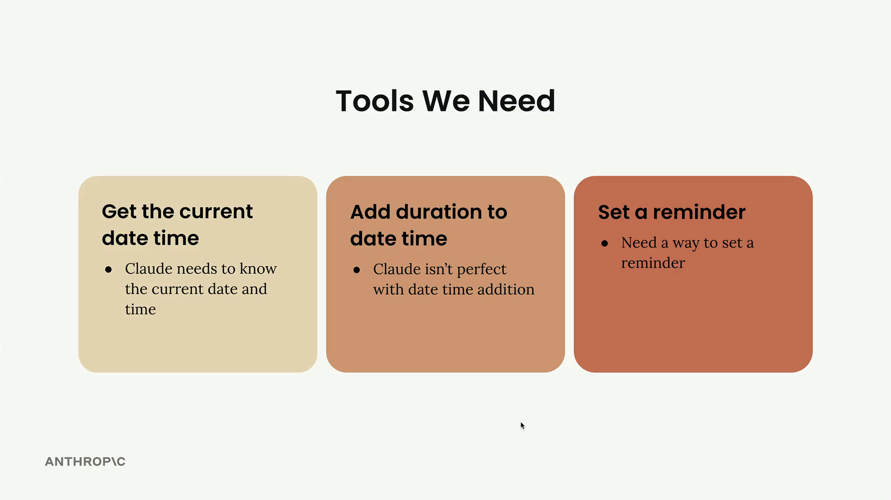
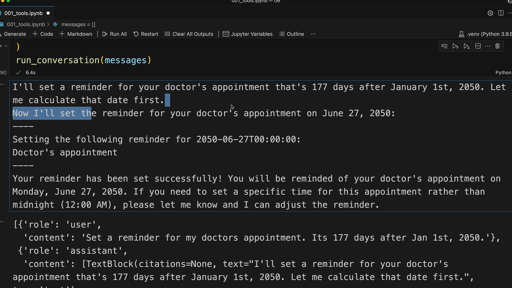
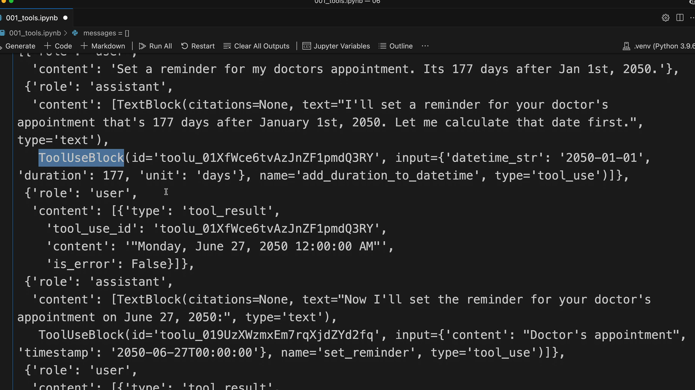

# Using multiple tools

> Source: https://anthropic.skilljar.com/claude-with-the-anthropic-api/287749

#### Summary


                            
                                

Adding multiple tools to your Claude implementation becomes straightforward once you have the core tool-handling infrastructure in place. This tutorial shows how to integrate additional tools by following a simple pattern.





## The Tools We're Adding


We need three main capabilities for our reminder system:


- **Get current date time** - Claude needs to know the current date and time

- **Add duration to date time** - Claude isn't perfect with date time addition

- **Set a reminder** - Need a way to set a reminder


The good news is that most of the implementation work is already done. The `add_duration_to_datetime` function and `set_reminder` function are provided, along with their corresponding schemas.


## Adding Tools to the Conversation


First, update the `run_conversation` function to include the new tool schemas in the tools list:


```
response = chat(messages, tools=[
    get_current_datetime_schema,
    add_duration_to_datetime_schema,
    set_reminder_schema
])
```


This tells Claude about all three available tools it can use during the conversation.


## Updating the Tool Router


Next, modify the `run_tool` function to handle the new tool calls. Add elif cases for each new tool:


```
def run_tool(tool_name, tool_input):
    if tool_name == "get_current_datetime":
        return get_current_datetime(**tool_input)
    elif tool_name == "add_duration_to_datetime":
        return add_duration_to_datetime(**tool_input)
    elif tool_name == "set_reminder":
        return set_reminder(**tool_input)
```


The pattern is simple: check the tool name, call the corresponding function with the provided input, and return the result.


## Testing Multiple Tool Usage


To test the system, try a request that requires multiple tools: "Set a reminder for my doctors appointment. Its 177 days after Jan 1st, 2050."


This request forces Claude to:


1. Calculate the date (using `add_duration_to_datetime`)

1. Set the reminder (using `set_reminder`)





Claude handles this by first explaining what it needs to do, then making the appropriate tool calls in sequence. The conversation shows Claude calculating June 27, 2050 as the target date, then setting the reminder for that date.


## Understanding the Message Flow


When you examine the conversation history, you'll see the complete message structure:


- User message with the request

- Assistant message containing both text and tool use blocks

- Tool result messages

- Follow-up assistant messages





This demonstrates how Claude can include multiple blocks in a single message - combining explanatory text with tool usage requests.


## The Simple Pattern for Adding Tools


Once you have the core tool infrastructure, adding new tools follows this pattern:


1. Create the tool function implementation

1. Define the tool schema

1. Add the schema to the tools list in `run_conversation`

1. Add a case for the tool in `run_tool`


This modular approach makes it easy to expand your AI assistant's capabilities without restructuring existing code. Each new tool integrates seamlessly with the existing conversation flow and tool-handling logic.


                            
                        
                    

                    
                        
                            

#### Downloads


                            


                                
                                    
                                        - [**001_tools_009.ipynb](https://cc.sj-cdn.net/instructor/4hdejjwplbrm-anthropic/assets/1762978354/001_tools_009.ipynb?response-content-disposition=attachment&Expires=1774882030&Signature=elMgMRmZBIN0BxOwKVK~YNF~t1UMShDWV8uSDjn3W9lB6YgxphyignqnWebQplrGhZlh19KFBxv-s~tH1H~Xg3N1eGGDRnWNXY487QikahamT6cvUxvef~Q5CDxfT1E-oRFbYUOPBrP74Su6NY-euH24UBQ0Xd2yYcjcTmC6pSDQ4i9MsoiR2yzdEtD5ayQWfPWpdBY5YmrpiBNvvhliA-rQFAT8tAwvYr58oAs5hhomXHSuu5NFqNNu3y6xVZD8S107QYea3tTNIxZWdA4rJZagNP3JLxEZrih-XPY0z9gnUAbY8k09LOlt-p~Au5H4yNCJv~q~qxI1uwZPfJzCyQ__&Key-Pair-Id=APKAI3B7HFD2VYJQK4MQ)