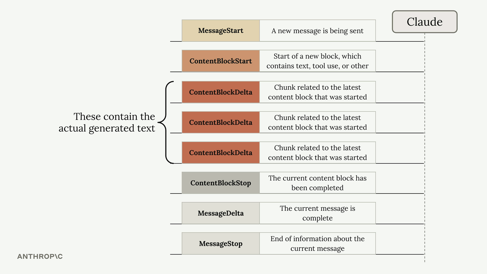
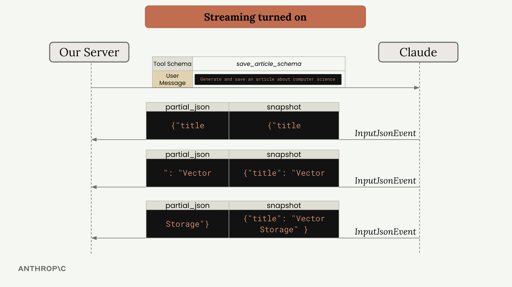
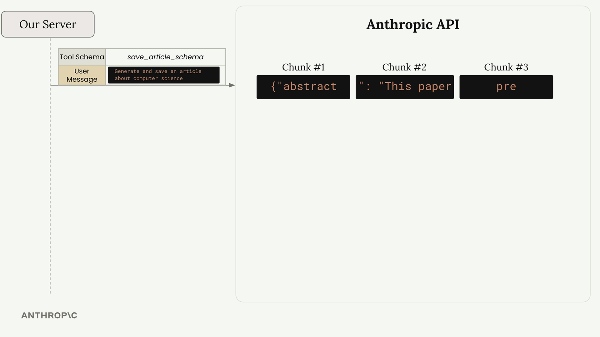
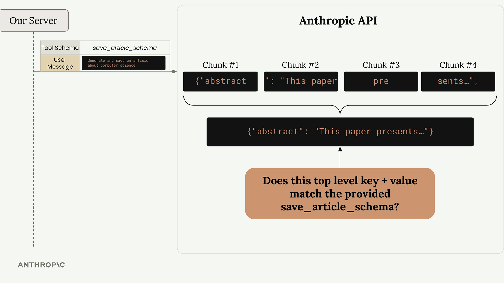
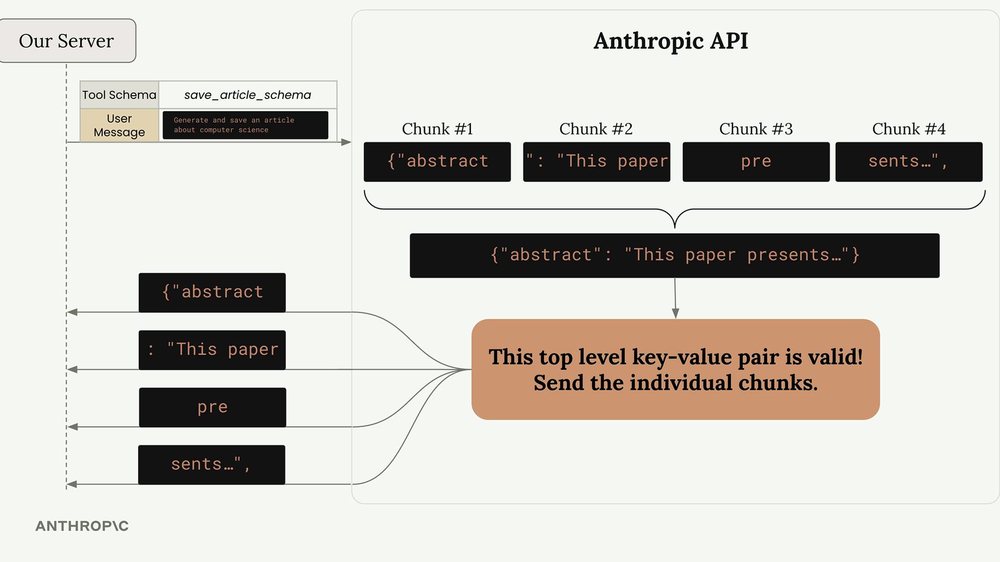
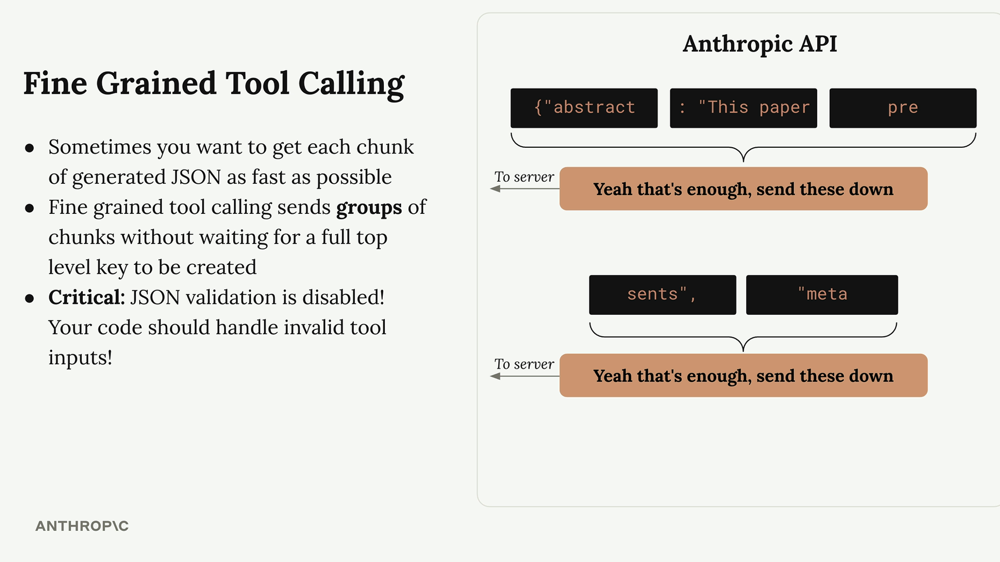

# Fine grained tool calling

> Source: https://anthropic.skilljar.com/claude-with-the-anthropic-api/313160

#### Summary


                            
                                

When you combine tool use with streaming in Claude, you get real-time updates as the AI generates tool arguments. This creates a more responsive user experience, but there are some important details to understand about how it works behind the scenes.


## Basic Tool Streaming


With streaming enabled, Claude sends back different types of events as it processes your request. You're already familiar with events like `ContentBlockDelta` for regular text generation. For tool use, you'll also need to handle a new event type called `InputJsonEvent`.





Each `InputJsonEvent` contains two key properties:


- **partial_json** - A chunk of JSON representing part of the tool arguments

- **snapshot** - The cumulative JSON built up from all chunks received so far


Here's how you handle these events in your streaming pipeline:


```
for chunk in stream:
    if chunk.type == "input_json":
        # Process the partial JSON chunk
        print(chunk.partial_json)
        # Or use the complete snapshot so far
        current_args = chunk.snapshot
```





## How JSON Validation Works


Here's where things get interesting. The Anthropic API doesn't immediately send you every chunk as Claude generates it. Instead, it buffers chunks and validates them first.





The API waits for complete top-level key-value pairs before sending anything. For example, if your tool expects this structure:


```
{
  "abstract": "This paper presents a novel...",
  "meta": {
    "word_count": 847,
    "review": "This paper introduces QuanNet..."
  }
}
```


The API will:


1. Wait until the entire `abstract` value is complete

1. Validate that key-value pair against your schema

1. Send all the buffered chunks for `abstract` at once

1. Repeat the process for the `meta` object





This validation process explains why you see delays followed by bursts of text, even with streaming enabled. The chunks are being held back until a complete, valid top-level key-value pair is ready.





## Fine-Grained Tool Calling


If you need faster, more granular streaming - perhaps to show users immediate updates or start processing partial results quickly - you can enable fine-grained tool calling.





Fine-grained tool calling does one main thing: it disables JSON validation on the API side. This means:


- You get chunks as soon as Claude generates them

- No buffering delays between top-level keys

- More traditional streaming behavior

- **Critical:** JSON validation is disabled - your code must handle invalid JSON


Enable it by adding `fine_grained=True` to your API call:


```
run_conversation(
    messages, 
    tools=[save_article_schema], 
    fine_grained=True
)
```


With fine-grained tool calling, you might receive a `word_count` value much earlier in the stream, without waiting for the entire `meta` object to be completed.


## Handling Invalid JSON


When using fine-grained tool calling, Claude might generate invalid JSON like `"word_count": undefined` instead of a proper number. Your application needs to handle these cases gracefully:


```
try:
    parsed_args = json.loads(chunk.snapshot)
except json.JSONDecodeError:
    # Handle invalid JSON appropriately
    print("Received invalid JSON, continuing...")
```


Without fine-grained tool calling, the API's validation would catch this error and potentially wrap problematic values in strings, which might not match your expected schema.


## When to Use Fine-Grained Tool Calling


Consider enabling fine-grained tool calling when:


- You need to show users real-time progress on tool argument generation

- You want to start processing partial tool results as quickly as possible

- The buffering delays negatively impact your user experience

- You're comfortable implementing robust JSON error handling


For most applications, the default behavior with validation is perfectly adequate. But when you need that extra responsiveness, fine-grained tool calling gives you the control to get chunks as fast as Claude can generate them.


                            
                        
                    

                    
                        
                            

#### Downloads


                            


                                
                                    
                                        - [**003_tool_streaming.ipynb](https://cc.sj-cdn.net/instructor/4hdejjwplbrm-anthropic/assets/1762979649/003_tool_streaming.ipynb?response-content-disposition=attachment&Expires=1774882036&Signature=qnll~cBtffFiyDa34Nmf4kg5HYLEgmoRWtLBag2-LMTcrZs4XjC44iDWQqvaA6Lx2hDQ2tqYHoW9ZabNyA4EUAT20sRgH-qzJNXEVeSZ~3hkaeSSUcALh6UxGCNiSGomjs13dybCHXoT1iRWIFOTLhHLQY0o~FHgL0yoaTNt6kbmcZ4aR4j8S8tseeOVLZQECWRbGkUug-6XwR~nyFwJfnuYx3OF4tWZTSnCEW4N8jqkcYCNNa8Zm2NlL0vtdFyGoTIB7u~CoiHR5YSqSPWquoi6xnwBv5HTp-fsKf1gCDf7gA24L6R6Bd2XbotZBdCp8mCy9VV2bNr6745-p2AE1w__&Key-Pair-Id=APKAI3B7HFD2VYJQK4MQ)

                                    
                                
                                    
                                        - [**003_tool_streaming_completed.ipynb](https://cc.sj-cdn.net/instructor/4hdejjwplbrm-anthropic/assets/1762979649/003_tool_streaming_completed.ipynb?response-content-disposition=attachment&Expires=1774882036&Signature=CEe9ePHSkkqNgAy~tEf3tivFctBiBfFLSu8Xnjgz2XPs1CJJXoTCopkLLbw1hoVBT~FvWsSn5wnAtQvRT09-7xTyVUdeFVxWHAZ8F-tzL~B9LjzjsIsuwcXi~N1eqLDEKLQY2EQQUs7Bq~wZGa-rVLN4N73JlpE3glBfsDAkZst50Soi3wPHeQ2Gr4RJ2QA~CeRKQE2fXchGr8lD06Rc96cJw2uf~-FvVugvs6pu~k1GEaE6aLvXLyuj4B4dC-iypHFEIL4MOJi0NEDboqPG5ftR1p0205kFlggNOFPvW46GBG1hrPKwPGwiyglchSVL9E6YuHzaU2f4N1fR1VHqNg__&Key-Pair-Id=APKAI3B7HFD2VYJQK4MQ)