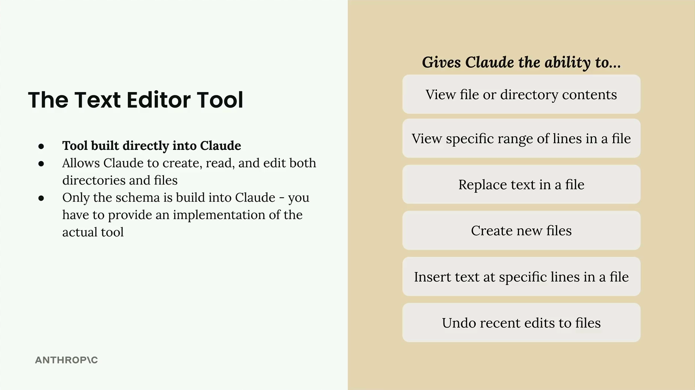
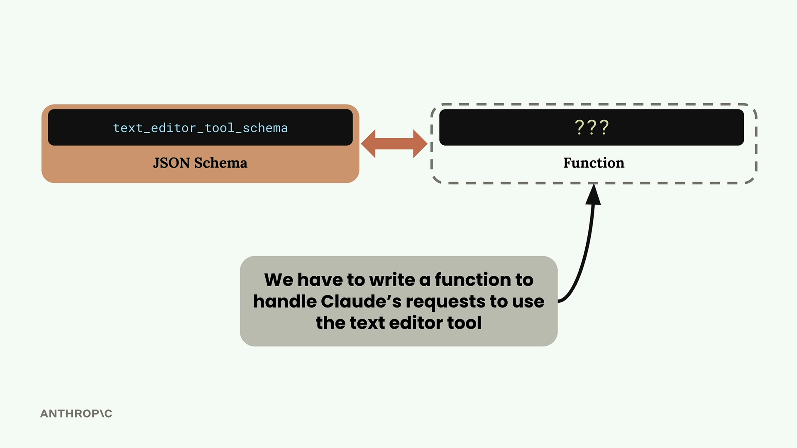

# The text edit tool

> Source: https://anthropic.skilljar.com/claude-with-the-anthropic-api/287760

#### Summary


                            
                                

**Important Note: Tool version strings can for all model versions can be found here: [https://docs.anthropic.com/en/docs/agents-and-tools/tool-use/text-editor-tool](https://docs.anthropic.com/en/docs/agents-and-tools/tool-use/text-editor-tool)**


Claude comes with one built-in tool that you don't need to create from scratch: the text editor tool. This tool gives Claude the ability to work with files and directories just like you would in a standard text editor.


## What the Text Editor Tool Can Do


The text editor tool provides Claude with a comprehensive set of file manipulation capabilities:


- View file or directory contents

- View specific ranges of lines in a file

- Replace text in a file

- Create new files

- Insert text at specific lines in a file

- Undo recent edits to files





This dramatically expands Claude's abilities and essentially gives it the power to act as a software engineer right out of the gate.


## Understanding the Implementation Requirements


Here's where things get a bit confusing: while the tool schema is built into Claude, you still need to provide the actual implementation. Think of it this way - Claude knows how to ask for file operations, but you need to write the code that actually performs those operations.





When you use other tools, you write both the JSON schema and the function implementation. With the text editor tool, Claude provides the schema knowledge, but you must write functions to handle Claude's requests to create files, read directories, replace text, and so on.


## Schema Versions


While the main schema is built into Claude, you do need to include a small schema stub when making requests. The exact schema depends on which Claude model you're using:


```
def get_text_edit_schema(model):
    if model.startswith("claude-3-7-sonnet"):
        return {
            "type": "text_editor_20250124",
            "name": "str_replace_editor",
        }
    elif model.startswith("claude-3-5-sonnet"):
        return {
            "type": "text_editor_20241022", 
            "name": "str_replace_editor",
        }
```


Claude sees this small schema and automatically expands it into the full text editor tool specification behind the scenes.


## Practical Example


Let's see the text editor tool in action. When you ask Claude to work with files, it will use the tool to read, modify, and create files as needed.


For example, if you ask Claude to "Open the ./main.py file and summarize its contents", Claude will:


1. Use the text editor tool to view the file

1. Read the contents

1. Provide you with a summary


You can take this further by asking Claude to modify files. For instance: "Open the ./main.py file and write out a function to calculate pi to the 5th digit. Then create a ./test.py file to test your implementation."


Claude will:


1. View the existing main.py file

1. Replace its contents with a new implementation including the pi calculation function

1. Create a new test.py file with appropriate unit tests


## Why Use the Text Editor Tool?


You might wonder why this tool exists when modern code editors already have AI assistants built in. The text editor tool becomes valuable in scenarios where:


- You're building applications that need to programmatically edit files

- You're working in environments without access to full-featured code editors

- You want to integrate file editing capabilities directly into your Claude-powered applications


Essentially, the text editor tool lets you replicate much of the functionality of a fancy AI-powered code editor within your own applications, giving you fine-grained control over how Claude interacts with your file system.


                            
                        
                    

                    
                        
                            

#### Downloads


                            


                                
                                    
                                        - [**005_text_editor_tool.ipynb](https://cc.sj-cdn.net/instructor/4hdejjwplbrm-anthropic/assets/1762979892/005_text_editor_tool.ipynb?response-content-disposition=attachment&Expires=1774882041&Signature=V6w5i9pmdQg3iSrT~IHrchluJhL6m0oMUKE4-mVh7ZNet6uT0M6w~153-CrqPLOSM0rWFYucMayj9mfyTIyT1ZI7JkHdUo6n~NFJAwSEXzAbD2lMb3R4Q8Iun-TVnles1OMPWf-z7af1vRkq-cOChsIVGO~eczaN94Vq~fzKhhChXfZlHyp8VzjmxOprAbwo8VyhxWMSAXLFXQGBMaaPmVHq2dHYbwg96UXsi9BJD9h~Inz1EZ0QC8WY7U6UM0Fg3uqja8P6mdAVDJY~oCtHMxXa1~4OY-HIZccgOy6jEDcEjLamv5sEg0bTIQVE29DS-DHsLk9LDVEuZg~uqQIa0g__&Key-Pair-Id=APKAI3B7HFD2VYJQK4MQ)