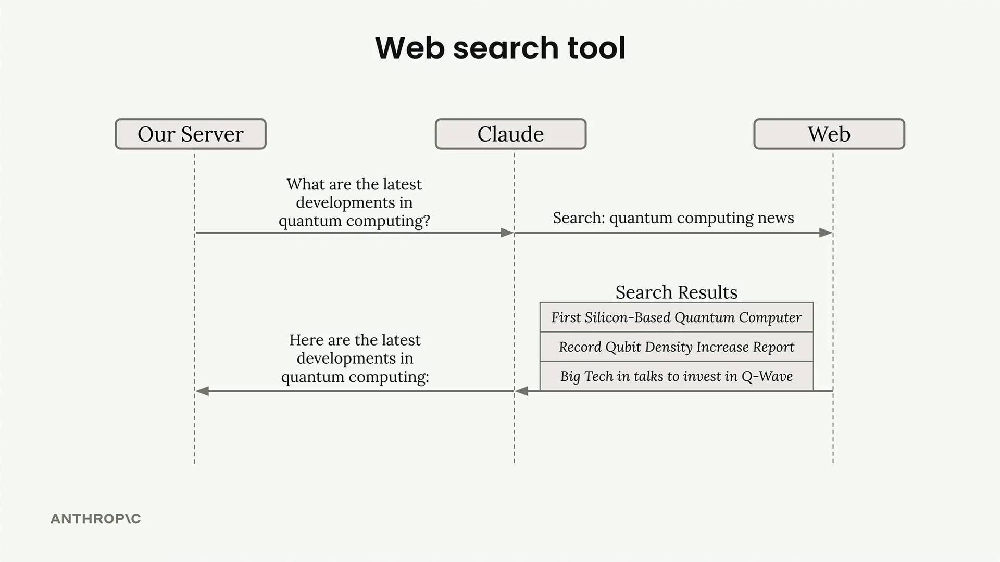
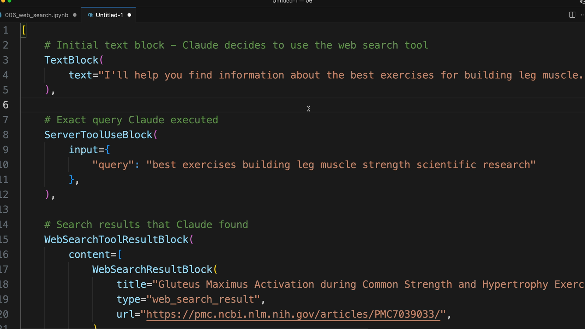
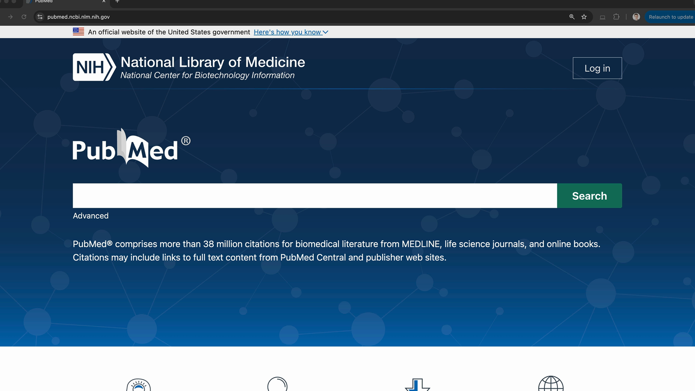
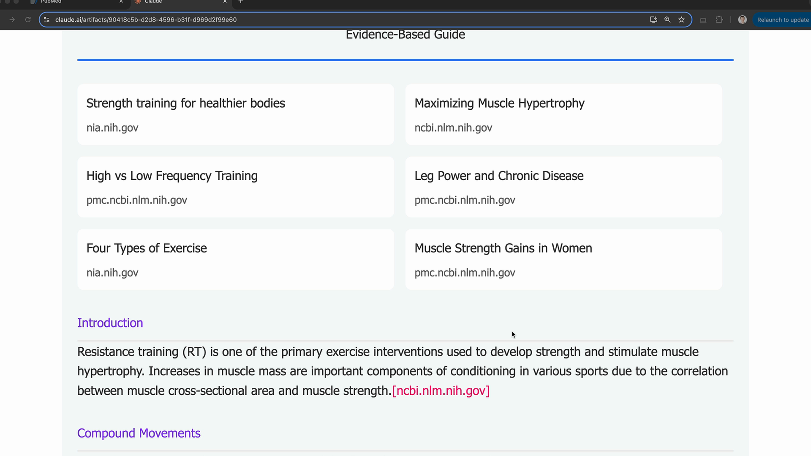

# The web search tool

> Source: https://anthropic.skilljar.com/claude-with-the-anthropic-api/287755

#### Summary


                            
                                

**Important note:**Your organization must enable the Web Search tool in the settings console before using it. You can find this setting here: [https://console.anthropic.com/settings/privacy](https://console.anthropic.com/settings/privacy)


Claude includes a built-in web search tool that lets it search the internet for current or specialized information to answer user questions. Unlike other tools where you need to provide the implementation, Claude handles the entire search process automatically - you just need to provide a simple schema to enable it.





## Setting Up the Web Search Tool


To use the web search tool, you create a schema object with these required fields:


```
web_search_schema = {
    "type": "web_search_20250305",
    "name": "web_search", 
    "max_uses": 5
}
```


The `max_uses` field limits how many searches Claude can perform. Claude might do follow-up searches based on initial results, so this prevents excessive API calls. A single search returns multiple results, but Claude may decide additional searches are needed.


## How the Response Works


When Claude uses the web search tool, the response contains several types of blocks:


- **Text blocks** - Claude's explanation of what it's doing

- **ServerToolUseBlock** - Shows the exact search query Claude used

- **WebSearchToolResultBlock** - Contains the search results

- **WebSearchResultBlock** - Individual search results with titles and URLs

- **Citation blocks** - Text that supports Claude's statements





The response structure lets you see exactly what Claude searched for and which sources it found. Citations include the specific text Claude used to support its answers, along with the source URLs.


## Restricting Search Domains


You can limit searches to specific domains using the `allowed_domains` field. This is particularly useful when you want reliable, authoritative sources:


```
web_search_schema = {
    "type": "web_search_20250305",
    "name": "web_search",
    "max_uses": 5,
    "allowed_domains": ["nih.gov"]
}
```


For example, when asking about medical or exercise advice, restricting to domains like PubMed (nih.gov) ensures you get evidence-based information rather than random blog content.





## Rendering Search Results


The different block types in the response are designed for specific UI rendering:


- Render text blocks as regular content

- Display web search results as a list of sources at the top

- Show citations inline with the text, including the source domain, page title, URL, and quoted text





This structure helps users understand how Claude arrived at its answers and provides transparency about the sources being used. The citation format makes it clear which specific information came from which sources, building trust in the AI's responses.


## Practical Usage


The web search tool works best for:


- Current events and recent developments

- Specialized information not in Claude's training data

- Fact-checking and finding authoritative sources

- Research tasks requiring up-to-date information


Simply include the schema in your tools array when making API calls, and Claude will automatically decide when a web search would help answer the user's question.


                            
                        
                    

                    
                        
                            

#### Downloads


                            


                                
                                    
                                        - [**006_web_search.ipynb](https://cc.sj-cdn.net/instructor/4hdejjwplbrm-anthropic/assets/1762980062/006_web_search.ipynb?response-content-disposition=attachment&Expires=1774882046&Signature=dYz6ftsI4iGCkFQqvtCDwRc1bekqLkxkiVwymUy-7sK~gjEJk4~vivkQ4mP2dJ4pwDboKN542aFagd-mZ4xQ-TN36cs2oqzIRTNZCbbiEL1iW--ODL7E6FY9nT5KGE-ZTFnJpnRy1r09hnKlqApkrFtxd56yjnrJvGSkACYJTQGYqh9~TfAnJg4BVB-Bo7MohbB~2SjEdhin7ATc4-CLMNjojvz5WcLIvaeRkXyYfeVSatRc9dasLtUg7oFtb~pqWL1mg1AtEdWwXdodun0J1PBOQyez5InjKCsJw7lzs~3jGBv80rW2SLQo4r98Y0zYZACkOnw64okBGC5n4CEUpA__&Key-Pair-Id=APKAI3B7HFD2VYJQK4MQ)

                                    
                                
                                    
                                        - [**006_web_search_complete.ipynb](https://cc.sj-cdn.net/instructor/4hdejjwplbrm-anthropic/assets/1762980063/006_web_search_complete.ipynb?response-content-disposition=attachment&Expires=1774882046&Signature=T5S773NC1hIwGrlvJ2-J1lAPbxbggWGk7T3H6ATOkQQUczguQLXRZeSmjsBtVHIcZriXs4ybbFdPG73p7qu9rtHPW4i9O5DGk2j896Zbto9rBpmcQ4tYFU0JtQVJToJTYqyco~eG2jawJhaZxWfcPqN6dGYNeBTJ9Q9wlUgMR6J~OE-YGdSvsLE~6jpYgmen60TQZIP5py1iN9ng0WEtw9r~JnVXvsOX12kLvpuNd4SnkwfKCG1BizxXCDGcKAf3OlfzMsXCvClmid~BS8xBSVuWSrcxgSwYcdXHImP5YzlZQUZLKWQ-xHcNDps8OZHbvJ-af17yxQ4KagWACAx9rg__&Key-Pair-Id=APKAI3B7HFD2VYJQK4MQ)