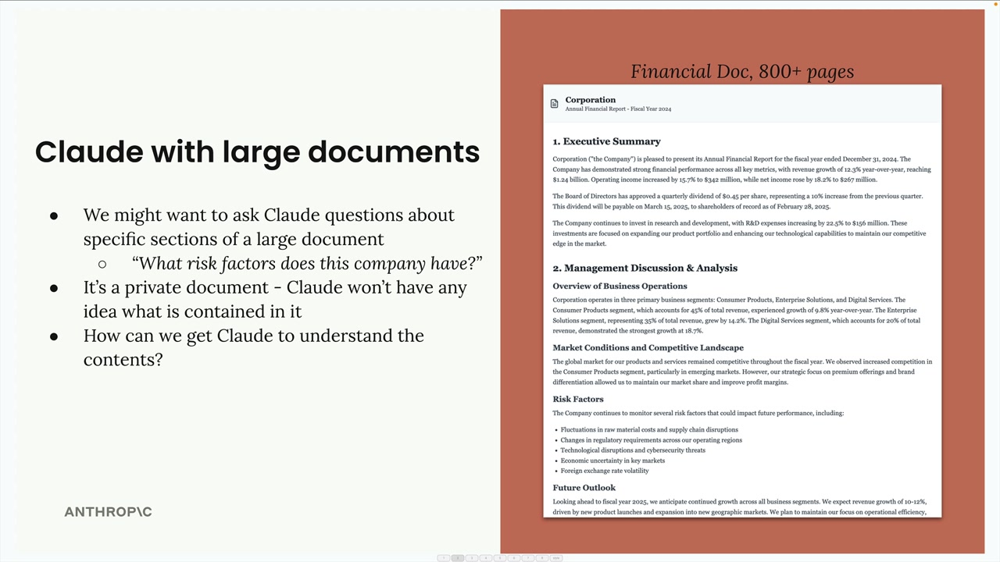
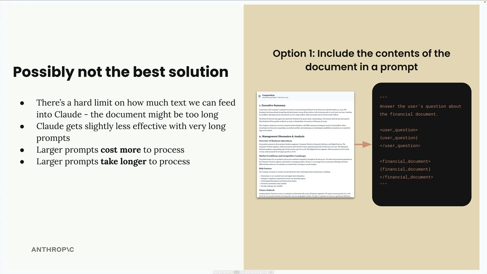
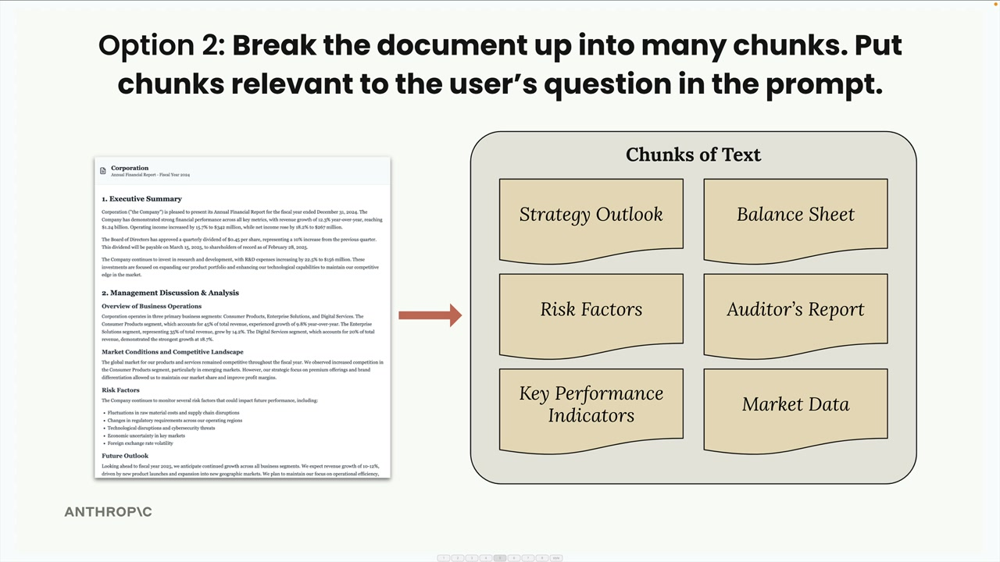
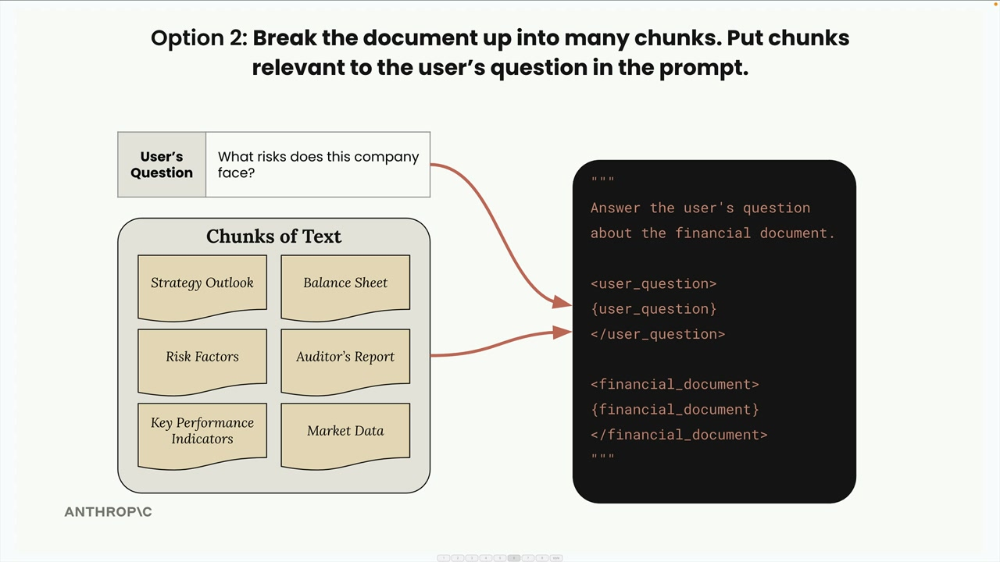

# Introducing Retrieval Augmented Generation

> Source: https://anthropic.skilljar.com/claude-with-the-anthropic-api/287763

#### Summary


                            
                                

Retrieval Augmented Generation (RAG) is a technique that helps you work with large documents that are too big to fit into a single prompt. Instead of cramming everything into one massive prompt, RAG breaks documents into chunks and only includes the most relevant pieces when answering questions.


## The Problem with Large Documents


Imagine you have an 800-page financial document and want to ask Claude specific questions about it, like "What risk factors does this company have?" You need to get the relevant information from the document to Claude somehow, but there are limits to how much text you can include in a prompt.





## Option 1: Include Everything in the Prompt


The first approach is straightforward - extract all text from the document and stuff it into your prompt along with the user's question. Your prompt might look like this:


```
Answer the user's question about the financial document.

<user_question>
{user_question}
</user_question>

<financial_document>
{financial_document}
</financial_document>
```





This approach has serious limitations:


- There's a hard limit on prompt length - your document might be too long

- Claude becomes less effective with very long prompts

- Larger prompts cost more to process

- Larger prompts take longer to process


## Option 2: Break Documents into Chunks


RAG takes a smarter approach. First, you break the document into smaller chunks during a preprocessing step. Then, when a user asks a question, you find the chunks most relevant to their question and only include those in your prompt.





Here's how it works: if someone asks "What risks does this company face?" you'd search through your chunks, find the "Risk Factors" section, and include just that relevant chunk in your prompt.





## Benefits of RAG


- Claude can focus on only the most relevant content

- Scales up to very large documents

- Works with multiple documents

- Smaller prompts cost less and run faster


## Challenges with RAG


- Requires a preprocessing step to chunk documents

- Need a search mechanism to find "relevant" chunks

- Included chunks might not contain all the context Claude needs

- Many ways to chunk text - which approach is best?


For example, you could split documents into equal-sized portions, or you could create chunks based on document structure like headers and sections. Each approach has trade-offs you'll need to evaluate for your specific use case.


## When to Use RAG


RAG involves many technical decisions and requires more work than simply including everything in a prompt. You'll need to analyze whether the benefits outweigh the complexity for your particular application. It's especially valuable when working with very large documents, multiple documents, or when you need to optimize for cost and performance.


The key insight is that RAG trades simplicity for scalability and efficiency. While it requires more upfront work to implement properly, it enables you to work with document collections that would be impossible to handle with simple prompt stuffing.