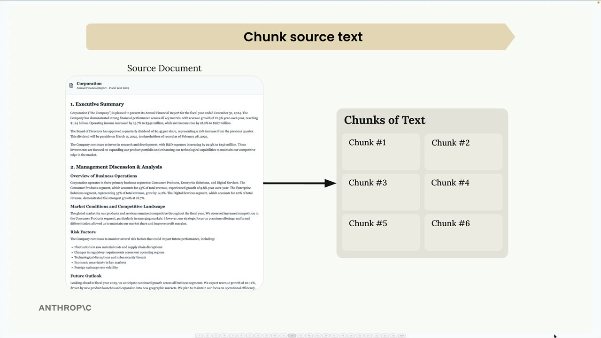
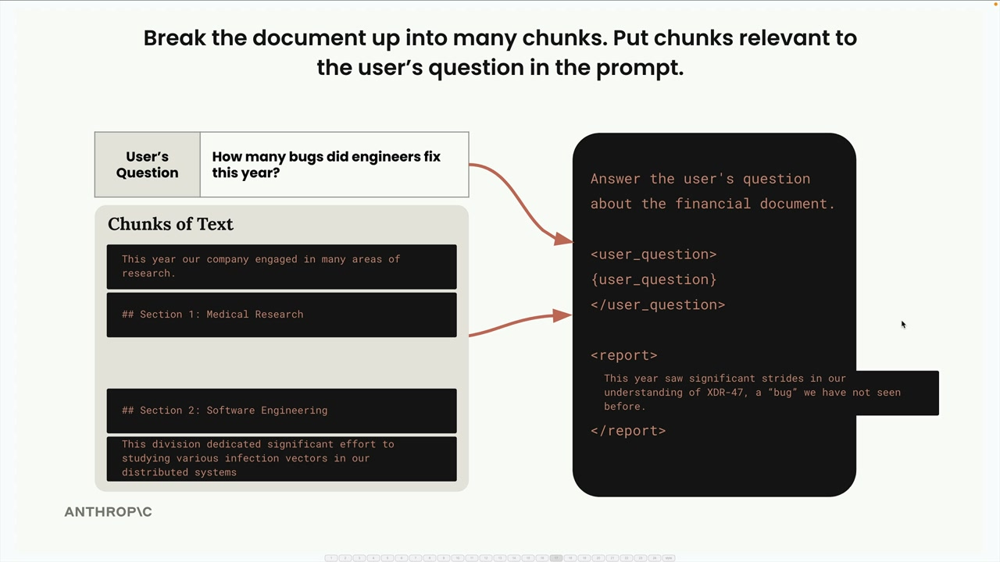
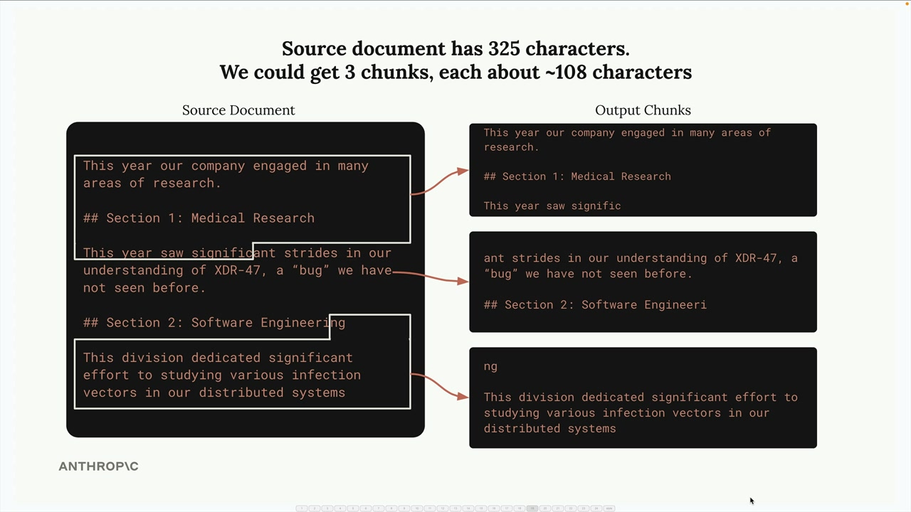
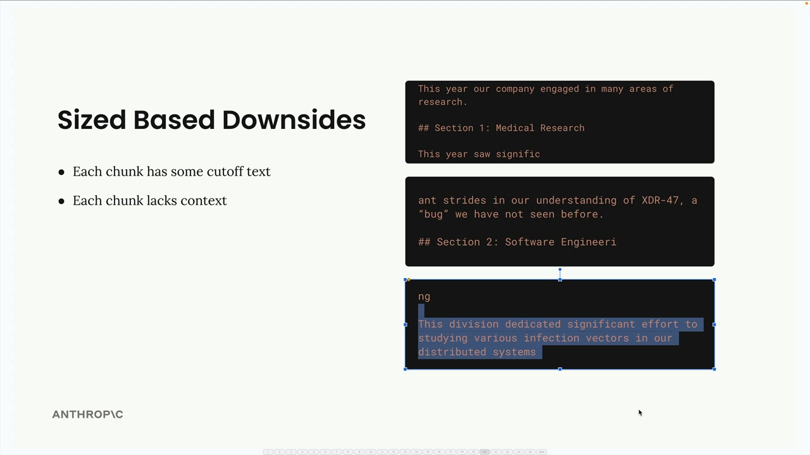
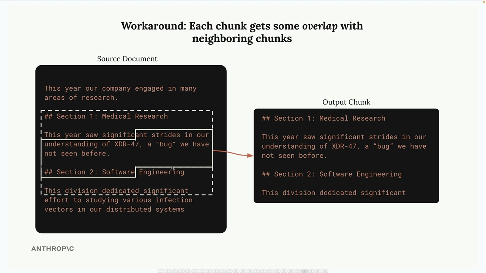
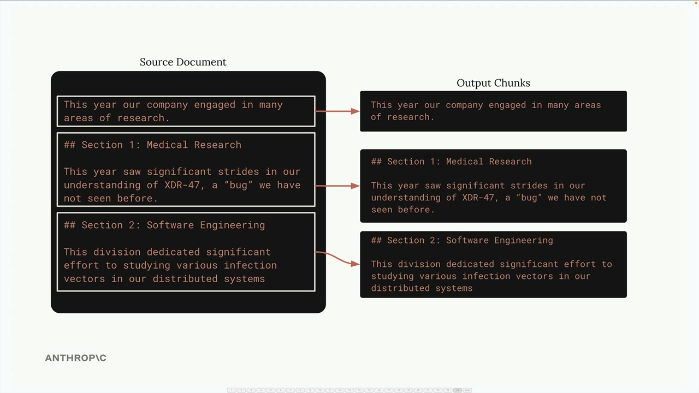

# Text chunking strategies

> Source: https://anthropic.skilljar.com/claude-with-the-anthropic-api/287776

#### Summary


                            
                                

Text chunking is one of the most critical steps in building a RAG (Retrieval Augmented Generation) pipeline. How you break up your documents directly impacts the quality of your entire system. A poor chunking strategy can lead to irrelevant context being inserted into your prompts, causing your AI to give completely wrong answers.





Consider this example: you have a document with sections on medical research and software engineering. If you chunk poorly, a user asking "How many bugs did engineers fix this year?" might get information about medical research instead of software engineering, simply because the medical section happened to contain the word "bug" in a different context.





This is why choosing the right chunking strategy matters so much. Let's explore three main approaches.


## Size-Based Chunking


Size-based chunking is the simplest approach - you divide your text into strings of equal length. If you have a 325-character document, you might split it into three chunks of roughly 108 characters each.





This method is easy to implement and works with any type of document, but it has clear downsides:


- Words get cut off mid-sentence

- Chunks lose important context from surrounding text

- Section headers might be separated from their content





To address these issues, you can add overlap between chunks. This means each chunk includes some characters from the neighboring chunks, providing better context and ensuring complete words and sentences.





Here's a basic implementation:


```
def chunk_by_char(text, chunk_size=150, chunk_overlap=20):
    chunks = []
    start_idx = 0
    
    while start_idx < len(text):
        end_idx = min(start_idx + chunk_size, len(text))
        chunk_text = text[start_idx:end_idx]
        chunks.append(chunk_text)
        
        start_idx = (
            end_idx - chunk_overlap if end_idx < len(text) else len(text)
        )
    
    return chunks
```


## Structure-Based Chunking


Structure-based chunking divides text based on the document's natural structure - headers, paragraphs, and sections. This works great when you have well-formatted documents like Markdown files.





For a Markdown document, you can split on header markers:


```
def chunk_by_section(document_text):
    pattern = r"\n## "
    return re.split(pattern, document_text)
```


This approach gives you the cleanest, most meaningful chunks because each one represents a complete section. However, it only works when you have guarantees about your document structure. Many real-world documents are plain text or PDFs without clear structural markers.


## Semantic-Based Chunking


Semantic-based chunking is the most sophisticated approach. You divide text into sentences, then use natural language processing to determine how related consecutive sentences are. You build chunks from groups of related sentences.


This method is computationally expensive but produces the most relevant chunks. It requires understanding the meaning of individual sentences and is more complex to implement than the other strategies.


## Sentence-Based Chunking


A practical middle ground is chunking by sentences. You split the text into individual sentences using regular expressions, then group them into chunks with optional overlap:


```
def chunk_by_sentence(text, max_sentences_per_chunk=5, overlap_sentences=1):
    sentences = re.split(r"(?<=[.!?])\s+", text)
    
    chunks = []
    start_idx = 0
    
    while start_idx < len(sentences):
        end_idx = min(start_idx + max_sentences_per_chunk, len(sentences))
        current_chunk = sentences[start_idx:end_idx]
        chunks.append(" ".join(current_chunk))
        
        start_idx += max_sentences_per_chunk - overlap_sentences
        
        if start_idx < 0:
            start_idx = 0
    
    return chunks
```


## Choosing Your Strategy


Your choice depends entirely on your use case and document guarantees:


- **Structure-based**: Best results when you control document formatting (like internal company reports)

- **Sentence-based**: Good middle ground for most text documents

- **Size-based**: Most reliable fallback that works with any content type, including code


Size-based chunking with overlap is often the go-to choice in production because it's simple, reliable, and works with any document type. While it may not give perfect results, it consistently produces reasonable chunks that won't break your pipeline.


Remember: there's no single "best" chunking strategy. The right approach depends on your specific documents, use cases, and the trade-offs you're willing to make between implementation complexity and chunk quality.


                            
                        
                    

                    
                        
                            

#### Downloads


                            


                                
                                    
                                        - [**001_chunking.ipynb](https://cc.sj-cdn.net/instructor/4hdejjwplbrm-anthropic-poc/assets/1748558508/001_chunking.ipynb?response-content-disposition=attachment&Expires=1774882062&Signature=WUs4juav9KUw38BxaAQVfCPG0~VbGI6d-hLWcxmvfFh89SepjPqOKy2nsZr8lI~uyYSvNDmk~TaqfKaOjxDXB0QPXMbYFhQQMTnRcBlNvQ9t8cprQN9Oyhk4x67YK0zoWRvgH6iXhtRf9Lsr-WOOFv8LbGs8Vv-5QPRe58tqrs6Y1BsGWcOTnJ72Br47m0Wfm92Qcg82xv81eQdnK9BURa9FUkDpsEIN9-8roztUDF~mmu3AlhHfsrBEH~l5sgy2vz-N0KOoDEZXHAWsK2Hclb2Wfuo36H71HEr7Glr49E~Idme-u1wQHFCpNX~qqGjgy59b572vTk4~OKDTI1OPqg__&Key-Pair-Id=APKAI3B7HFD2VYJQK4MQ)

                                    
                                
                                    
                                        - [**report.md](https://cc.sj-cdn.net/instructor/4hdejjwplbrm-anthropic-poc/assets/1748558508/report.md?response-content-disposition=attachment&Expires=1774882062&Signature=BsR4phPin~mob7f8vrozAffhhjlPGu52cebfKNOW5yK4MB-q2mb6sOrX056P-jlRSlQ10KXY7sMdqjK~itMn2echGvZLcayGrzFrzYam0Sgl5r081xo9NCNAFTcadpfGhFK78eGyhZMZg9oSPRRLHnZ58wNG14n6ivYqoJoH~s9YSdNTo8VuRLYfkM~UyMwLEAJav6DH5SlyS70KI8GM-Uim8xZxZiNLQ0bqleO0ax017fBopfuC4eTIrHvhrgXzKsDOkOyW~RqjkgnKorNuBNqj72o~n7xN6L9PCJmT3r-Adm-jOFJQcZxA3VsuBg0jDRom5Y1eZnmjf7SJH3TXYA__&Key-Pair-Id=APKAI3B7HFD2VYJQK4MQ)