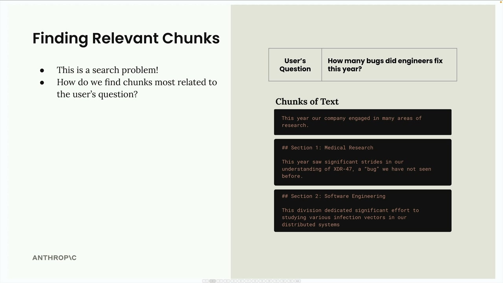
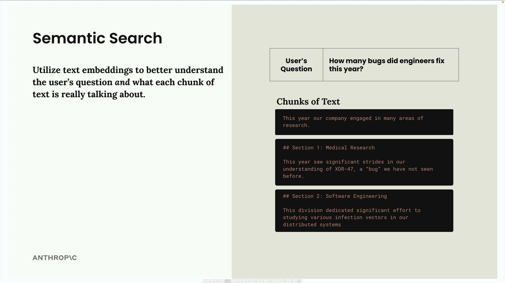
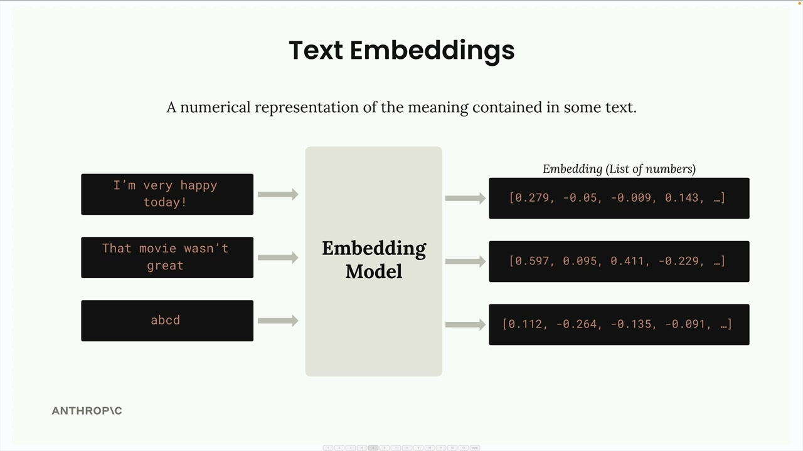
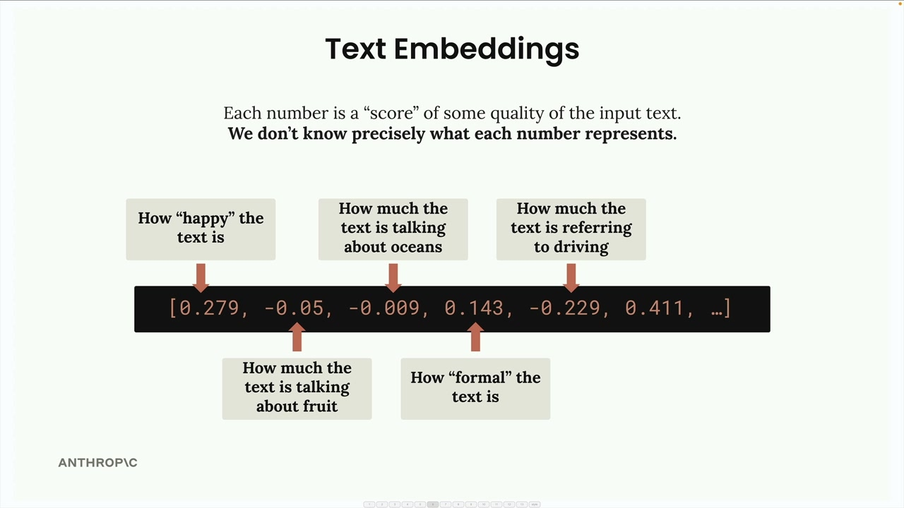
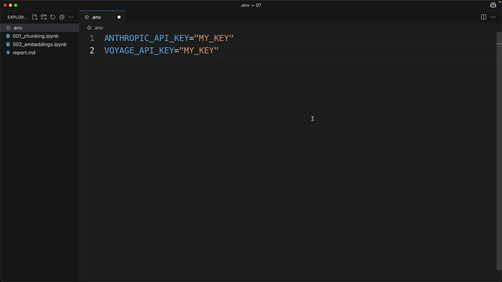
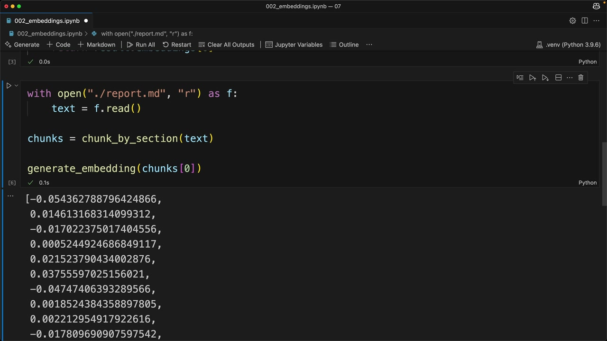
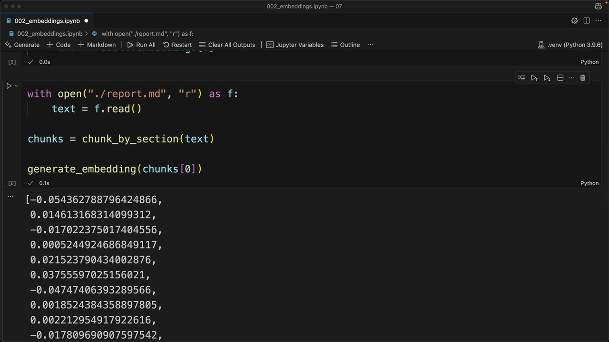

# Text embeddings

> Source: https://anthropic.skilljar.com/claude-with-the-anthropic-api/287759

#### Summary


                            
                                

After breaking a document into chunks, the next step in a RAG pipeline is finding which chunks are most relevant to a user's question. This is essentially a search problem - you need to look through all your text chunks and identify the ones that relate to what the user is asking about.





## Semantic Search


The most common approach for finding relevant chunks is semantic search. Unlike keyword-based search that looks for exact word matches, semantic search uses text embeddings to understand the meaning and context of both the user's question and each text chunk.





## Text Embeddings


A text embedding is a numerical representation of the meaning contained in some text. Think of it as converting words and sentences into a format that computers can work with mathematically.





Here's how the process works:


- You feed text into an embedding model

- The model outputs a long list of numbers (the embedding)

- Each number ranges from -1 to +1

- These numbers represent different qualities or features of the input text


## Understanding the Numbers


Each number in an embedding is essentially a "score" for some quality of the input text. However, here's the important caveat: we don't know precisely what each number represents.





While it's helpful to imagine that one number might represent "how happy the text is" or "how much the text talks about oceans," these are just conceptual examples. The actual meaning of each dimension is learned by the model during training and isn't directly interpretable by humans.


## VoyageAI for Embeddings


Since Anthropic doesn't currently provide embedding generation, the recommended provider is VoyageAI. You'll need to:


- Sign up for a separate VoyageAI account

- Get an API key (free to get started)

- Add the key to your environment variables





In your `.env` file, add:


```
VOYAGE_API_KEY="your_key_here"
```


## Implementation


First, install the VoyageAI library:


```
%pip install voyageai
```


Then set up the client and create a function to generate embeddings:


```
from dotenv import load_dotenv
import voyageai

load_dotenv()
client = voyageai.Client()

def generate_embedding(text, model="voyage-3-large", input_type="query"):
    result = client.embed([text], model=model, input_type=input_type)
    return result.embeddings[0]
```





When you run this function on a text chunk, you'll get back a list of floating-point numbers representing the embedding. The process is quick and straightforward - the real challenge is understanding how to use these embeddings effectively in your RAG pipeline for finding the most relevant content.





The next step is learning how to compare embeddings to determine which chunks are most similar to a user's question, which forms the core of the semantic search process.


                            
                        
                    

                    
                        
                            

#### Downloads


                            


                                
                                    
                                        - [**002_embeddings.ipynb](https://cc.sj-cdn.net/instructor/4hdejjwplbrm-anthropic-poc/assets/1748558530/002_embeddings.ipynb?response-content-disposition=attachment&Expires=1774882067&Signature=dcg1Fs1qQ88YqrJd215gFCK8kHCKb8zd3CCq3yXzdl6WJ2UedMwqmfFXUtKopf94V0qd5i8kZ~Tlx6eHSkk95vWzSyH1~soJ1WDrcAGIkTMmnYLFONtcAPROOcvxtK2qaxrlpDTiEy1ibjpEU1Yy85L1VU~Cparq2II18-jAVvYdB~24FFarX0bVTwryBYIyLZBc-kF2IX65jbxFiQY37lj9aHq~zaXoHFnOsGqfdXulCFmOhFGbj6LUSGAxN3bVvpf16Jxh1NNep81msImYsv70tIzMOcETcZcPd6KENrLSYxHGlWEaIKbVSpslLGjq2~NjGTGfNOp5IAzRA7Zbuw__&Key-Pair-Id=APKAI3B7HFD2VYJQK4MQ)

                                    
                                
                                    
                                        - [**VoyageAI API Key Directions.pdf](https://cc.sj-cdn.net/instructor/4hdejjwplbrm-anthropic-poc/assets/1748558581/VoyageAI_API_Key_Directions.pdf?response-content-disposition=attachment&Expires=1774882067&Signature=cwuPC~4-EZ56uBV~FqIbiXXb34No8z0sOm5DVfTr0f0MWCusMycVlW4yWrz3suFg39QEJPCXhKHBUBMmkukaFLRvJWzK3wgEvnnolFCh9t9ysTllN8Jj4qQu~4AVrmbSJxZ3720z1-2jc~ucmh0Rf3A6xVwP1s3r6BbZ57MZ5zbYcSG7258n8lVSBU-ZnnIcvUl3XzqZg-VDO~cd4Zk78gT78v-qMWLCYU54Rksis~0SE2xtiLGcXwEp8xiO2eS5jygya~KlK8CT7Eb94jkxUb83nUVCN~XYLoe5zGKe7eqTO5wS21dGliT7e15~EOrvrhLNDDzkkQNIOc3jjeB2Lg__&Key-Pair-Id=APKAI3B7HFD2VYJQK4MQ)