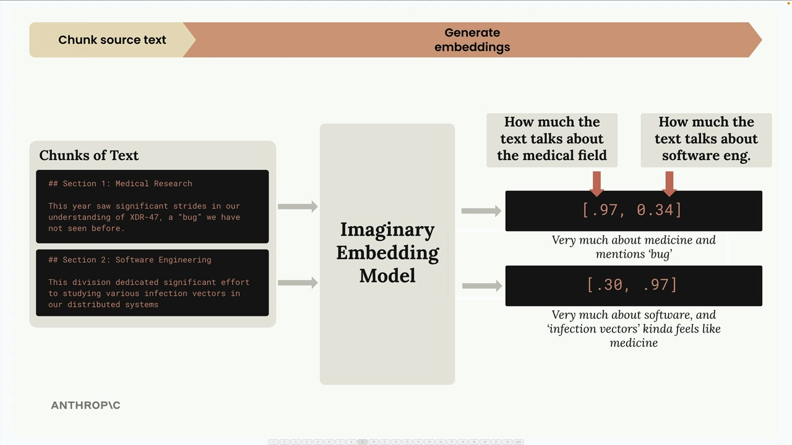
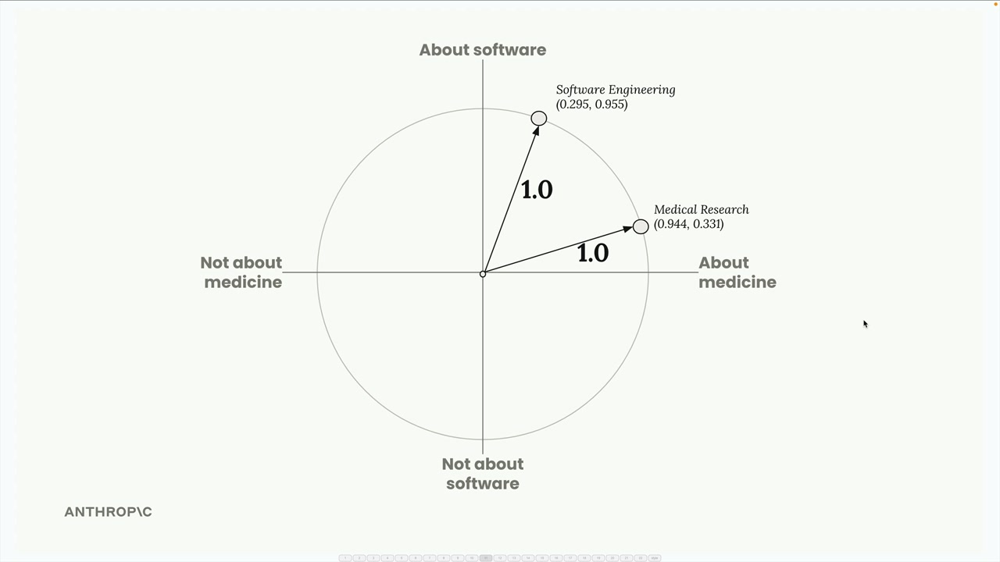
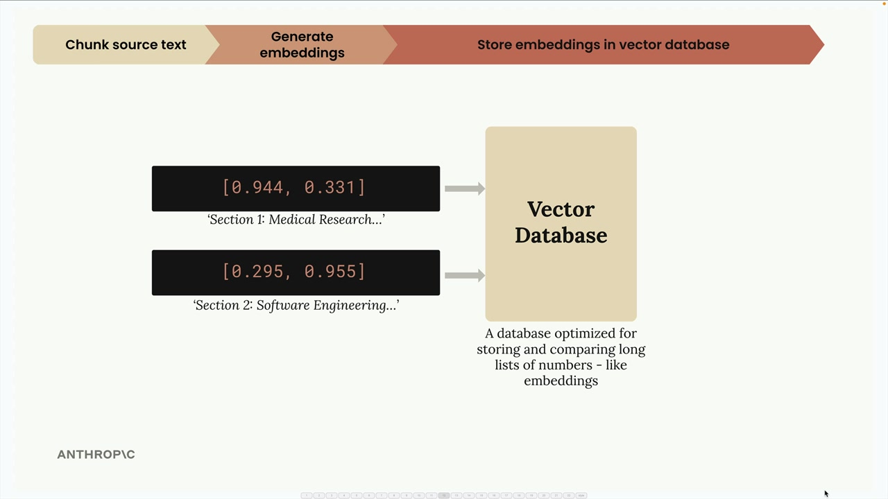
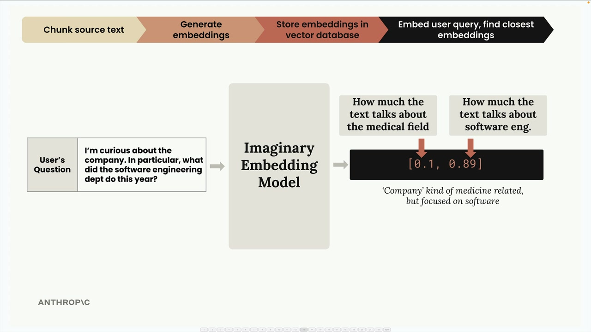
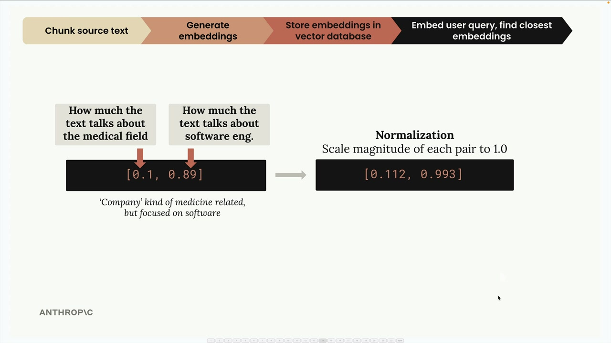
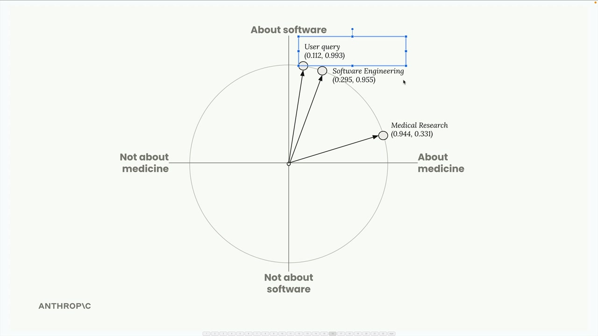
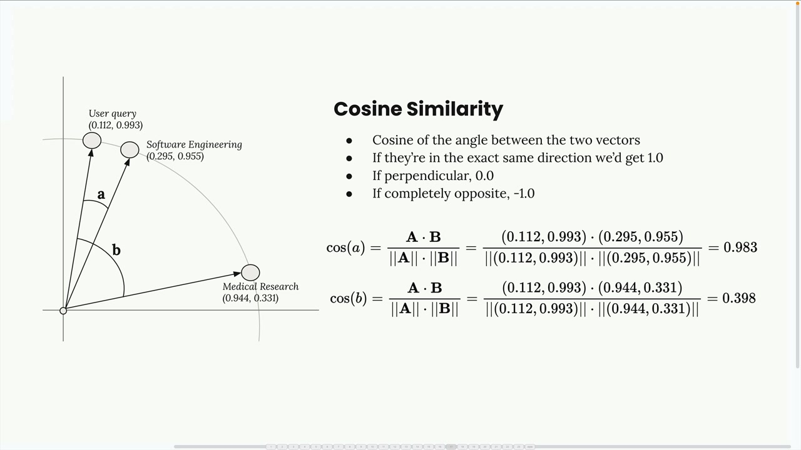
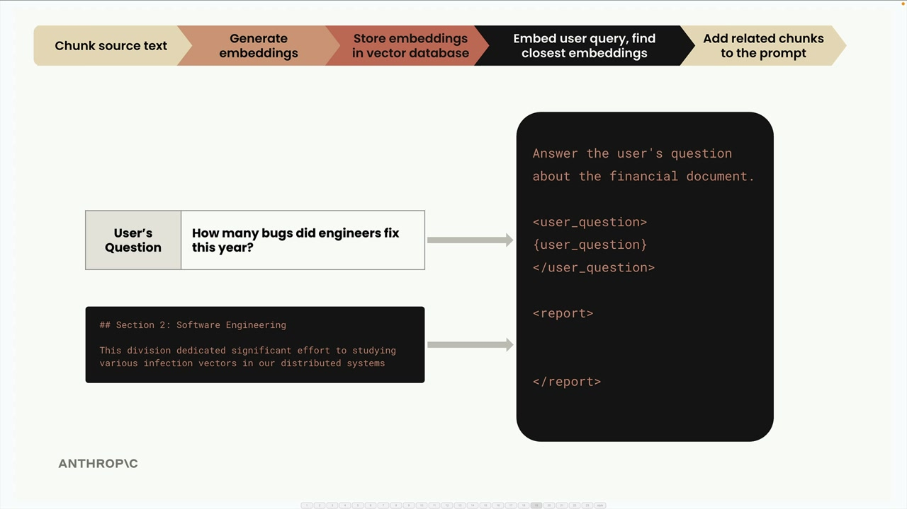

# The full RAG flow

> Source: https://anthropic.skilljar.com/claude-with-the-anthropic-api/287764

#### Summary


                            
                                

Now that we've covered the basics of RAG, text chunking, and embeddings, let's walk through the complete RAG pipeline step by step. This example will show you exactly how all these pieces work together to retrieve relevant information and generate responses.


## Step 1: Chunk Your Source Text


First, we take our source document and break it into manageable chunks. For this example, we'll use two simple text sections:


- Section 1: Medical Research - "This year saw significant strides in our understanding of XDR-47, a 'bug' we have not seen before."

- Section 2: Software Engineering - "This division dedicated significant effort to studying various infection vectors in our distributed systems"


## Step 2: Generate Embeddings


Next, we convert each text chunk into numerical embeddings using an embedding model. To make this easier to understand, let's imagine we have a perfect embedding model that always returns exactly two numbers, and we know what each number represents.





In our imaginary model:


- The first number represents how much the text talks about the medical field

- The second number represents how much the text talks about software engineering


For the medical research section, we might get `[0.97, 0.34]` - very medical-focused but with some software elements due to the word "bug". For the software engineering section, we get `[0.30, 0.97]` - heavily software-focused but with medical undertones from "infection vectors".


## Normalization


The embedding API typically performs a normalization step that scales each vector to have a magnitude of 1.0. You don't need to worry about the math here - it's handled automatically. This gives us normalized vectors like `[0.944, 0.331]` and `[0.295, 0.955]`.





We can visualize these embeddings on a unit circle, where each point represents one of our text chunks.





## Step 3: Store in Vector Database


We store these embeddings in a vector database - a specialized database optimized for storing, comparing, and searching through long lists of numbers like our embeddings.





At this point, we pause. All the work so far has been preprocessing that happens ahead of time. Now we wait for a user to submit a query.


## Step 4: Process User Query


When a user asks a question like "I'm curious about the company. In particular, what did the software engineering dept do this year?", we run their query through the same embedding model.





This query gets embedded as something like `[0.1, 0.89]` - low medical score, high software engineering score. After normalization, we get `[0.112, 0.993]`.


## Step 5: Find Similar Embeddings


We send the user's query embedding to our vector database and ask it to find the most similar stored embeddings.





The database returns the software engineering section because it's the closest match to what the user asked about.


## How Similarity Works: Cosine Similarity


The vector database uses cosine similarity to determine which embeddings are most similar. This measures the cosine of the angle between two vectors.





Key points about cosine similarity:


- Results range from -1 to 1

- Values close to 1 mean high similarity

- Values close to -1 mean very different

- 0 means perpendicular (no relationship)


In our example, the cosine similarity between the user query and the software engineering chunk is 0.983 - very high similarity. The similarity with the medical research chunk is only 0.398 - much lower.


## Cosine Distance


You'll often see "cosine distance" in vector database documentation. This is simply calculated as `(1 - cosine similarity)`. With cosine distance:


- Values close to 0 mean high similarity

- Larger values mean less similarity


This adjustment makes the numbers easier to interpret in many contexts.


## Step 6: Create the Final Prompt


Finally, we take the user's question and the most relevant text chunk we found, combine them into a prompt, and send it to Claude for a response.





The prompt might look like:


```
Answer the user's question about the financial document.

<user_question>
How many bugs did engineers fix this year?
</user_question>

<report>
## Section 2: Software Engineering
This division dedicated significant effort to studying various infection vectors in our distributed systems
</report>
```


And that's the complete RAG pipeline! The system successfully retrieved the most relevant information based on semantic similarity and provided it as context for generating an accurate response.