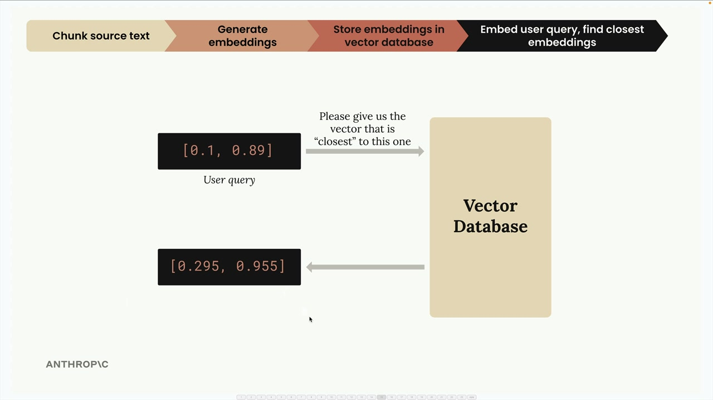
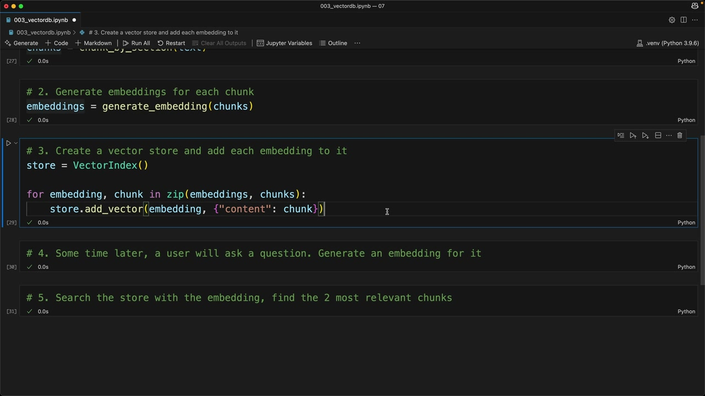

# Implementing the RAG flow

> Source: https://anthropic.skilljar.com/claude-with-the-anthropic-api/287761

#### Summary


                            
                                

Now that we understand the RAG flow conceptually, let's implement it step by step. We'll walk through a complete example that demonstrates how to chunk text, generate embeddings, store them in a vector database, and perform similarity searches.


## The Five-Step RAG Implementation


Our implementation follows the same five steps we discussed previously:


1. Chunk the text by section

1. Generate embeddings for each chunk

1. Create a vector store and add each embedding to it

1. Generate an embedding for the user's question

1. Search the store to find the most relevant chunks





This diagram shows how we transform user queries into embeddings and search our vector database to find the most relevant content.


## Step 1: Chunking the Text


First, we load our document and split it into manageable sections:


```
with open("./report.md", "r") as f:
    text = f.read()

chunks = chunk_by_section(text)
chunks[2]  # Test to see the table of contents
```


We use the same `chunk_by_section` function from earlier to split our document into logical sections.


## Step 2: Generate Embeddings


Next, we create embeddings for all our chunks at once:


```
embeddings = generate_embedding(chunks)
```


The embedding function has been updated to handle both single strings and lists of strings, making it more efficient for batch processing.


## Step 3: Store in Vector Database


Now we create our vector store and populate it with embeddings and their associated text:


```
store = VectorIndex()

for embedding, chunk in zip(embeddings, chunks):
    store.add_vector(embedding, {"content": chunk})
```


Notice that we store both the embedding and the original text content. This is crucial because when we search later, we need to return the actual text, not just the numerical embedding values.


## Why Store the Original Text?


When we query our vector database, getting back just the embedding numbers isn't useful. We need the actual text that was used to generate those embeddings. That's why we include the original chunk text (or at least a reference to it) alongside each embedding in our database.


## Step 4: Process User Queries


When a user asks a question, we generate an embedding for their query:


```
user_embedding = generate_embedding("What did the software engineering dept do last year?")
```


## Step 5: Find Relevant Content


Finally, we search our vector store to find the most similar chunks:


```
results = store.search(user_embedding, 2)

for doc, distance in results:
    print(distance, "\n", doc["content"][0:200], "\n")
```


This search returns the two most relevant chunks along with their similarity scores (cosine distances).





The search results show us which sections of our document are most relevant to the user's question, along with similarity scores.


## Understanding the Results


When we run our example query about the software engineering department, we get back:


- **Section 2: Software Engineering** with a distance of 0.71 (closest match)

- **Methodology section** with a distance of 0.72 (second closest)


Lower distance values indicate higher similarity, so Section 2 is the most relevant to our query.


## What's Next?


This implementation works well for basic cases, but there are scenarios where it doesn't perform as expected. In the next sections, we'll explore improvements to make our RAG system more robust and accurate.


The key takeaway is that RAG is fundamentally about converting text to numbers (embeddings), storing those numbers efficiently, and then using mathematical similarity to find relevant content when users ask questions.


                            
                        
                    

                    
                        
                            

#### Downloads


                            


                                
                                    
                                        - [**003_vectordb.ipynb](https://cc.sj-cdn.net/instructor/4hdejjwplbrm-anthropic-poc/assets/1748558819/003_vectordb.ipynb?response-content-disposition=attachment&Expires=1774882077&Signature=pBrQZ66Cbmse5ZYWmbqLBipw-oI6sJ6JmyPODXEjlB2omTMW0J8bQ2cQqi7slyMsxST3jHz6nXyS0tyJwYx7X0Cyice95kOFaZdUD4hcFloSgcaSld-6i5POYwy56a2rDpnX9Qkw9xyLDiuNOd2hRBYH0EjSa6oO57vCUgbvquh-JlDd3N9Kbjd~8I2GJ1QTzpjiGwF8A64GVXuxCT4UWDbEyF0jkSxxlaeXr~lqAAeLpclbV0K9GsYpSPBTUrnfF4fya8xqLgfdNgrJaC3sKcoGSYyz5l8tqXaGVP9S-Eh67rdQWVImdoSzCRcivVeqVHDFp33Welxag32dORY9oQ__&Key-Pair-Id=APKAI3B7HFD2VYJQK4MQ)