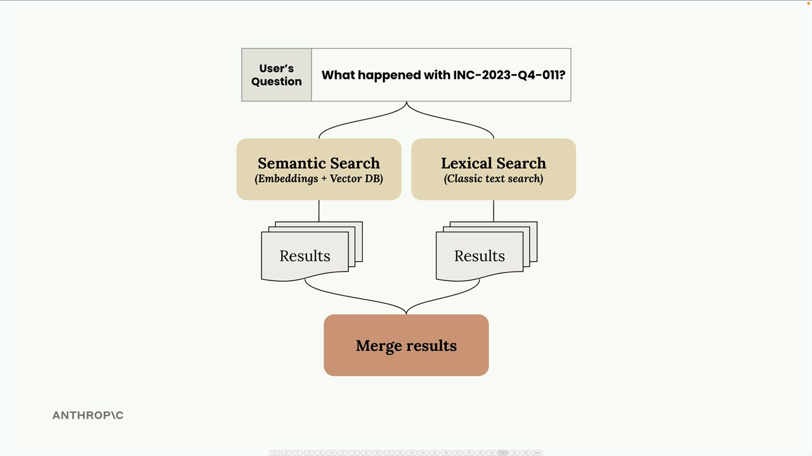
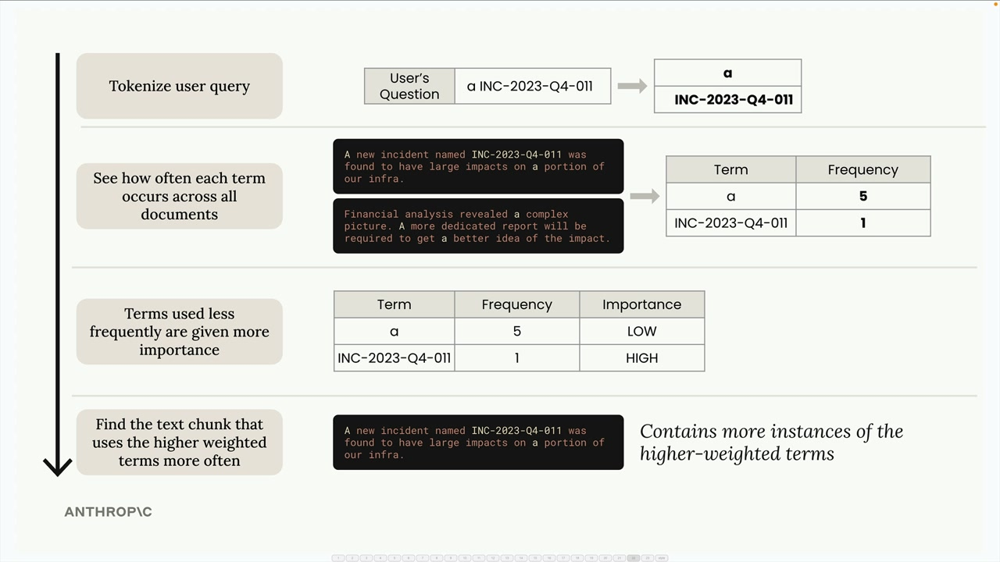
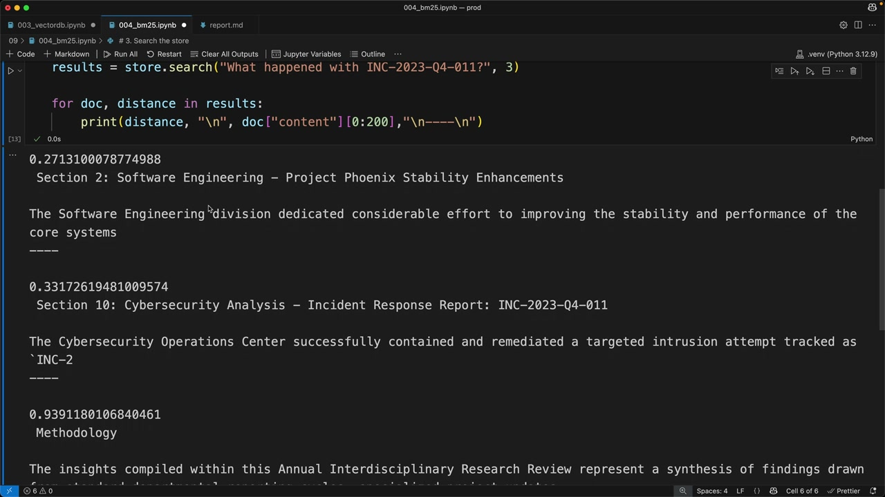

# BM25 lexical search

> Source: https://anthropic.skilljar.com/claude-with-the-anthropic-api/287767

#### Summary


                            
                                

When building RAG pipelines, you'll quickly discover that semantic search alone doesn't always return the best results. Sometimes you need exact term matches that semantic search might miss. The solution is to combine semantic search with lexical search using a technique called BM25.


## The Problem with Semantic Search Alone


Let's say you're searching for a specific incident ID like "INC-2023-Q4-011" in a document. While semantic search excels at understanding context and meaning, it might return sections that are semantically related but don't actually contain the exact term you're looking for.


In the example above, semantic search returned the cybersecurity section (which does contain the incident ID) but also returned a financial analysis section that doesn't mention the incident at all. This happens because semantic search focuses on conceptual similarity rather than exact term matching.


## Hybrid Search Strategy


The solution is to run both semantic and lexical searches in parallel, then merge the results. This gives you the best of both worlds:





- **Semantic search** finds conceptually related content using embeddings

- **Lexical search** finds exact term matches using classic text search

- **Merged results** combine both approaches for better accuracy


## How BM25 Works


BM25 (Best Match 25) is a popular algorithm for lexical search in RAG systems. Here's how it processes a search query:





**Step 1: Tokenize the query**

Break the user's question into individual terms. For example, "a INC-2023-Q4-011" becomes ["a", "INC-2023-Q4-011"].


**Step 2: Count term frequency**

See how often each term appears across all your documents. Common words like "a" might appear 5 times, while specific terms like "INC-2023-Q4-011" might appear only once.


**Step 3: Weight terms by importance**

Terms that appear less frequently get higher importance scores. The word "a" gets low importance because it's common, while "INC-2023-Q4-011" gets high importance because it's rare.


**Step 4: Find best matches**

Return documents that contain more instances of the higher-weighted terms.


## Implementing BM25 Search


Here's how to set up a basic BM25 search system:


```
# 1. Chunk your text by sections
chunks = chunk_by_section(text)

# 2. Create a BM25 store and add documents
store = BM25Index()
for chunk in chunks:
    store.add_document({"content": chunk})

# 3. Search the store
results = store.search("What happened with INC-2023-Q4-011?", 3)

# Print results
for doc, distance in results:
    print(distance, "\n", doc["content"][:200], "\n----\n")
```


When you run this search, you'll get much better results than semantic search alone. The BM25 algorithm prioritizes sections that actually contain your specific search terms, especially rare terms like incident IDs.





Notice how the results now properly prioritize the Software Engineering section and Cybersecurity section - both of which actually contain the incident ID you're searching for.


## Why This Works Better


BM25 excels at finding exact matches because it:


- Gives higher weight to rare, specific terms

- Ignores common words that don't add search value

- Focuses on term frequency rather than semantic meaning

- Works especially well for technical terms, IDs, and specific phrases


The key insight is that both search methods have complementary strengths. Semantic search understands context and meaning, while lexical search ensures you don't miss exact term matches. By combining them, you create a more robust search system that handles both conceptual queries and specific lookups effectively.


In the next step, you'll learn how to merge results from both search systems to create a unified hybrid search experience.


                            
                        
                    

                    
                        
                            

#### Downloads


                            


                                
                                    
                                        - [**004_bm25.ipynb](https://cc.sj-cdn.net/instructor/4hdejjwplbrm-anthropic-poc/assets/1748558831/004_bm25.ipynb?response-content-disposition=attachment&Expires=1774882082&Signature=PLJ98diipUhb7yjkjcAbiypUXuPvN2O-BSqgmjQp-aMnFQJzr3Rc0NwmD~kYAuGD4ueudMvUC3nnEP~-pPcXbsqN00bvkHKR-Xu6Q4OWIfx7jghTr4U-thCWyDJfAPaxol5iWM70X6y7TnMy8TX6yGHlEga7hiT3uMPomFxUIY8RdAmR6x6OA8qzrHemmMqJOBIfWvlkpjMRhBzEvAgy~ruqWWHCy04gyjhUDi2PSppZUEQvTFJ0-brF6O3EeLMVVGnh-kzv~EiE-8oYtRzDYutnJx6fptvQqahv4THvUtNHEpHSZQyi0OSzqVtes02OIs2QCAcVg-rfZtmkznSXEg__&Key-Pair-Id=APKAI3B7HFD2VYJQK4MQ)