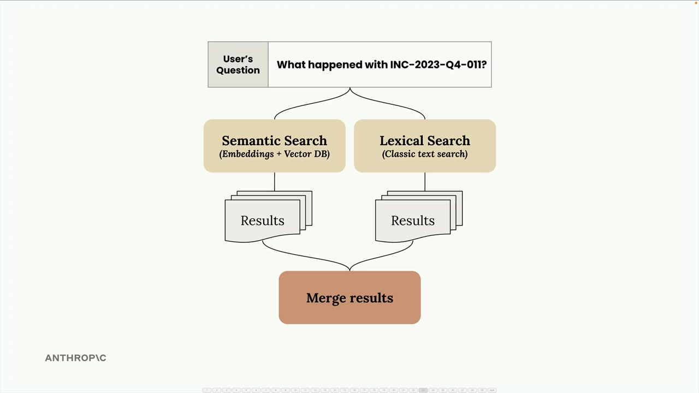
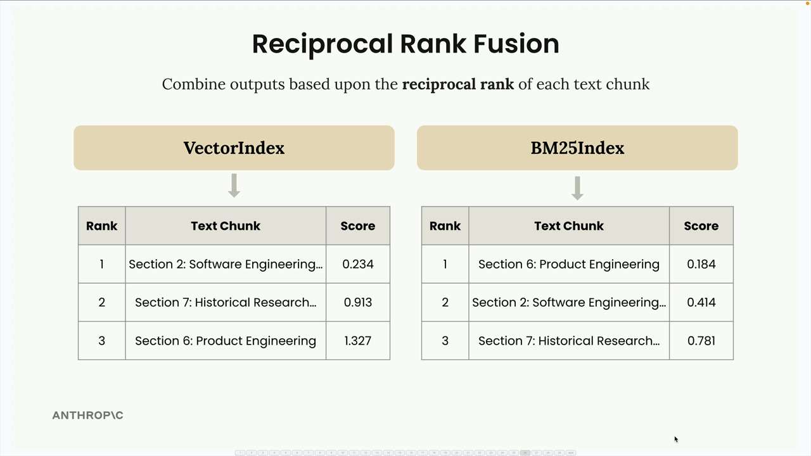
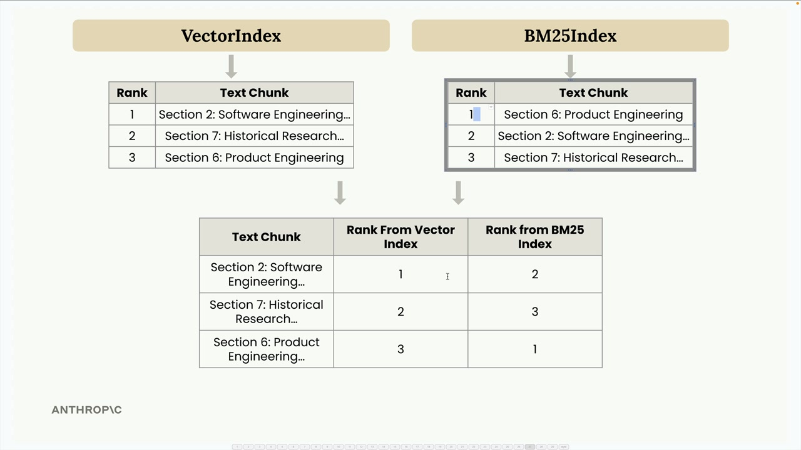
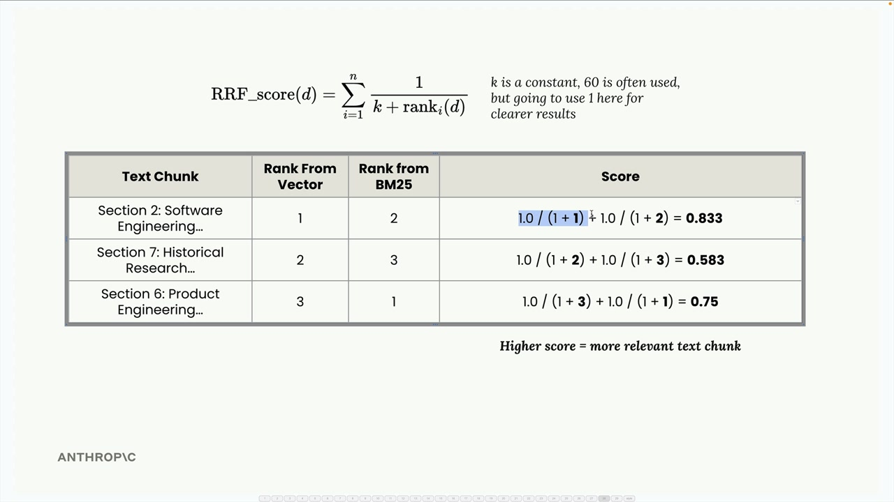
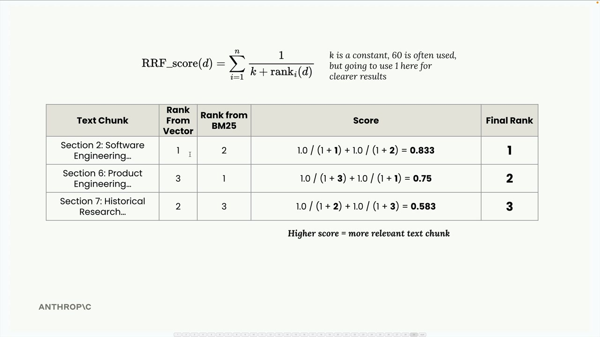
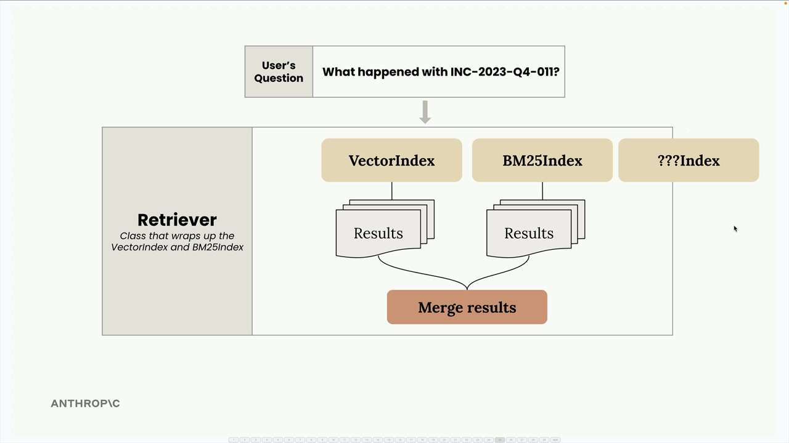
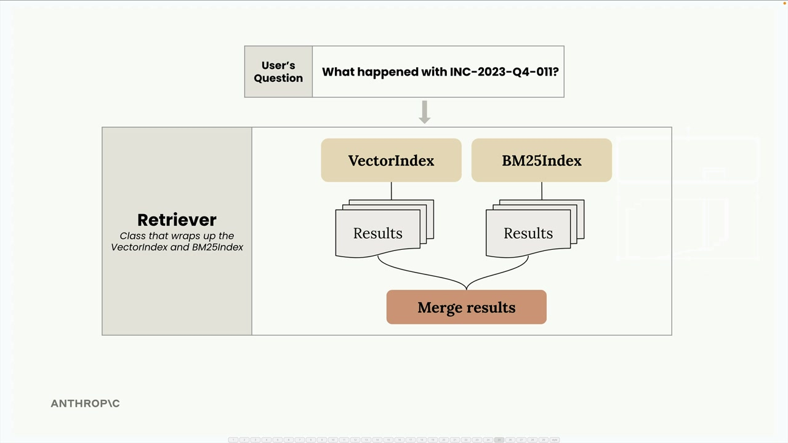

# A Multi-Index RAG pipeline

> Source: https://anthropic.skilljar.com/claude-with-the-anthropic-api/287766

#### Summary


                            
                                

We've built separate implementations for semantic search (using vector embeddings) and lexical search (using BM25). Now it's time to combine them into a unified search pipeline that leverages the strengths of both approaches.


## The Multi-Index Architecture


Both our VectorIndex and BM25Index classes share nearly identical APIs - they both have `add_document()` and `search()` methods. This consistency makes it straightforward to wrap them together in a new class called Retriever.





The Retriever acts as a coordinator that forwards user queries to both indexes, collects their results, and merges them using a technique called reciprocal rank fusion.


## Understanding Reciprocal Rank Fusion


Merging results from different search methods isn't as simple as just concatenating lists. Each method uses different scoring systems, so we need a way to normalize and combine their rankings fairly.





Here's how reciprocal rank fusion works with an example. Let's say we search for information about "INC-2023-Q4-011" and get these results:


- VectorIndex returns: Section 2 (rank 1), Section 7 (rank 2), Section 6 (rank 3)

- BM25Index returns: Section 6 (rank 1), Section 2 (rank 2), Section 7 (rank 3)





We combine these into a single table showing each text chunk's rank from both indexes, then apply the RRF formula:


```
RRF_score(d) = Σ(1 / (k + rank_i(d)))
```


Where k is a constant (often 60, but we'll use 1 for clearer results) and rank_i(d) is the rank of document d in the i-th ranking.





For our example:


- Section 2: 1.0/(1+1) + 1.0/(1+2) = 0.833

- Section 7: 1.0/(1+2) + 1.0/(1+3) = 0.583

- Section 6: 1.0/(1+3) + 1.0/(1+1) = 0.75





The final ranking becomes: Section 2 (0.833), Section 6 (0.75), Section 7 (0.583). This makes intuitive sense - Section 2 performed well in both indexes, so it rises to the top.


## Implementation Details


The Retriever class wraps multiple search indexes and provides a unified interface:


```
class Retriever:
    def __init__(self, *indexes: SearchIndex):
        if len(indexes) == 0:
            raise ValueError("At least one index must be provided")
        self._indexes = list(indexes)
    
    def add_document(self, document: Dict[str, Any]):
        for index in self._indexes:
            index.add_document(document)
    
    def search(self, query_text: str, k: int = 1, k_rrf: int = 60):
        # Get results from all indexes
        all_results = []
        for idx, results in enumerate(all_results):
            for rank, (doc, _) in enumerate(results):
                # Track document ranks across indexes
                # Apply RRF scoring formula
        # Return merged and sorted results
```


The key insight is that by maintaining consistent APIs across different search implementations, we can easily combine them without tight coupling.


## Testing the Hybrid Approach


Remember our earlier problem where searching for "what happened with INC-2023-Q4-011?" returned unexpected results from the vector-only approach? The cybersecurity incident (Section 10) came first, but financial analysis (Section 3) came second instead of the more relevant software engineering section.


With our hybrid retriever, we now get much better results:


- Section 10: Cybersecurity Analysis - Incident Response Report (most relevant)

- Section 2: Software Engineering - Project Phoenix Stability Enhancements (second most relevant)

- Section 5: Legal Developments (third)


This demonstrates how combining semantic and lexical search can overcome the limitations of either approach used alone.


## Extensibility





The beauty of this architecture is its extensibility. Since all indexes implement the same SearchIndex protocol with `add_document()` and `search()` methods, you can easily add new search methodologies:





Want to add a keyword-based index? A graph-based search? A specialized domain index? Just implement the same interface and the Retriever will automatically incorporate it into the fusion process.


This modular approach keeps each search implementation focused and testable while providing a clean way to combine their strengths in the final system.


                            
                        
                    

                    
                        
                            

#### Downloads


                            


                                
                                    
                                        - [**005_hybrid.ipynb](https://cc.sj-cdn.net/instructor/4hdejjwplbrm-anthropic-poc/assets/1748558852/005_hybrid.ipynb?response-content-disposition=attachment&Expires=1774882088&Signature=ZNS8XsesDI8NRPYr8X13zjEF2a3fay-ldbBy99IA5DqsDnsNsADDRFyUSAyHzFjZi6S1LX4L9xUsdQaDKL83DgSGLGjhoo0yOddsDeWB338~bvWlonXRxQZN2vvKiVny244TvQPf06FkEwhC1VzX1fWG2o8Z-I4KYoKXSG7O3R2Kx3D7MvH1OWpwNOxsGz8y-BJeVt0wfUI5y8fh6F9SRuEf5Btujcs-dDh9Ub1YUkqurSuCaUXb2zYIRK5Zax25YHzmPHbz1wLwXoT1-aihfpoB0ceWdxlNZMHBGia8TQEudHT6kmnCKvowrAzLjqNii5kaQ6RXehfJp5RjXwaYUg__&Key-Pair-Id=APKAI3B7HFD2VYJQK4MQ)