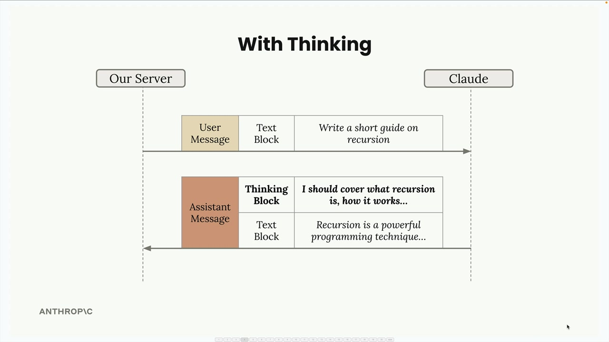
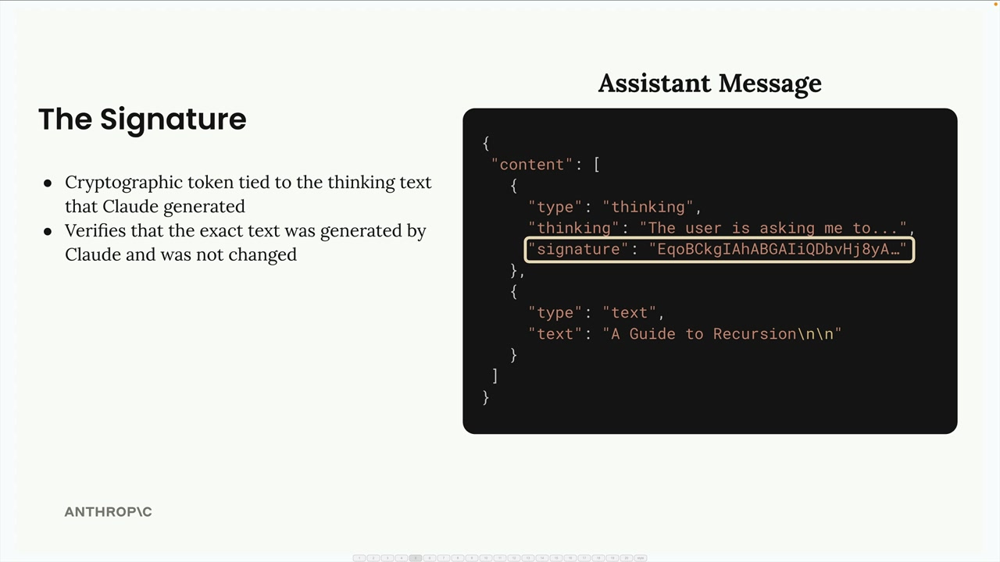
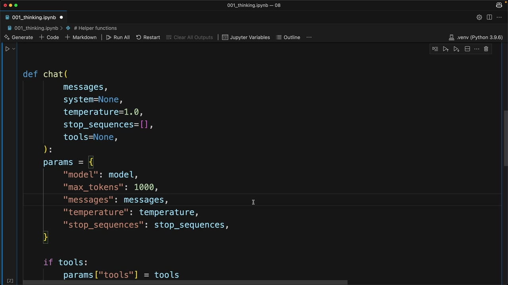

# Extended thinking

> Source: https://anthropic.skilljar.com/claude-with-the-anthropic-api/287773

#### Summary


                            
                                

**Important Note: Extended Thinking is not compatible with some other features, notable message pre-filling and temperature. See the full list of restrictions here:**[**https://docs.anthropic.com/en/docs/build-with-claude/extended-thinking#feature-compatibility**](https://docs.anthropic.com/en/docs/build-with-claude/extended-thinking#feature-compatibility)


Extended thinking is Claude's advanced reasoning feature that gives the model time to work through complex problems before generating a final response. Think of it as Claude's "scratch paper" - you can see the reasoning process that leads to the answer, which helps with transparency and often results in better quality responses.


## How Extended Thinking Works


When extended thinking is enabled, Claude's response changes from a simple text block to a structured response containing two parts:





With thinking enabled, you get both the reasoning process and the final answer:


The key benefits include:


- Better reasoning capabilities for complex tasks

- Increased accuracy on difficult problems

- Transparency into Claude's thought process


However, there are important trade-offs:


- Higher costs (you pay for thinking tokens)

- Increased latency (thinking takes time)

- More complex response handling in your code


## When to Use Extended Thinking


The decision is straightforward: use your prompt evaluations. Run your prompts without thinking first, and if the accuracy isn't meeting your requirements after you've already optimized your prompt, then consider enabling extended thinking. It's a tool for when standard prompting isn't quite getting you there.


## Response Structure and Security


Extended thinking responses include a special signature system for security:





The signature is a cryptographic token that ensures you haven't modified the thinking text. This prevents developers from tampering with Claude's reasoning process, which could potentially lead the model in unsafe directions.


## Redacted Thinking


Sometimes you'll receive a redacted thinking block instead of readable reasoning text:





This happens when Claude's thinking process gets flagged by internal safety systems. The redacted content contains the actual thinking in encrypted form, allowing you to pass the complete message back to Claude in future conversations without losing context.


## Implementation


To enable extended thinking in your code, you need to add two parameters to your chat function:


```
def chat(
    messages,
    system=None,
    temperature=1.0,
    stop_sequences=[],
    tools=None,
    thinking=False,
    thinking_budget=1024
):
```


The thinking budget sets the maximum tokens Claude can use for reasoning. The minimum value is 1024 tokens, and your `max_tokens` parameter must be greater than your thinking budget.


Add the thinking configuration to your API parameters:


```
if thinking:
    params["thinking"] = {
        "type": "enabled",
        "budget": thinking_budget
    }
```


Then call it with thinking enabled:


```
chat(messages, thinking=True)
```


## Testing Redacted Responses


For testing purposes, you can force Claude to return a redacted thinking block by sending a special trigger string. This helps ensure your application handles redacted responses gracefully without crashing.


Extended thinking is a powerful feature when you need Claude to tackle complex reasoning tasks, but use it judiciously given the cost and latency implications. Start with standard prompting, optimize thoroughly, then add thinking when you need that extra reasoning capability.


                            
                        
                    

                    
                        
                            

#### Downloads


                            


                                
                                    
                                        - [**001_thinking_complete.ipynb](https://cc.sj-cdn.net/instructor/4hdejjwplbrm-anthropic/assets/1762980359/001_thinking_complete.ipynb?response-content-disposition=attachment&Expires=1774882093&Signature=K2pxRwb-FvI2aKdHGPKaIUFGKgZvFngAEZhOP0zECNcwYvuCJkIfPnD732yfAHe8k15fKLcq~PChN5FxeWbTRtlX5hBsyhpuOiKbyuX5gqtQvhHIKsdSmLd2PmeRBs2-FqNhdjrWnjpDLEh~gHp8b2CPP~-5top6CiKXLbkFMf3p2B-wprk8hs9nXn1u11JDBFYnuAvvn98tx8-xjwy~JIj4oytGaAUxSeNfcG~rX75Y40nAZSImFCNAp5y5jOhUGj5q1jRtiV4SWtd7OedVBQPK--3ee7Oh8YJxcbktynUxZhiR56AhQRDyZI0J5~t1T62DMniY~od74W039rS6wQ__&Key-Pair-Id=APKAI3B7HFD2VYJQK4MQ)

                                    
                                
                                    
                                        - [**001_thinking.ipynb](https://cc.sj-cdn.net/instructor/4hdejjwplbrm-anthropic/assets/1762980359/001_thinking.ipynb?response-content-disposition=attachment&Expires=1774882093&Signature=O6yTsp0FkpPu5DEQiiwwtEu9ei3NFYssArPuZgxOQYGNJA4Ran27bDJWzZcI9UTnVMM3PLBbsnOjzaIzw1rLLJ0DhxaOYQbWfF~Opfrz0kE-sdKjxfTrAGDPZ-TPukewqjrFCYh6gcYSQJZUn~YAaj-9AecgJm0jC-gqvId-mq2B0j54BL3ArEpDDaCaigouwMxXrJjYhNAPjo6mQ-en5cSfBcKNpUDD9aXsbM90EIqKePcG2pQyKCtvC65AxfBC9fm6BhuSVc08Rf6B~ARg3uUFXiaJjkjG~FCEIiiaE-gTkfswi1avKq8RXH-Z-kWvNw~IDNDOVLNOHzuZlheMhQ__&Key-Pair-Id=APKAI3B7HFD2VYJQK4MQ)