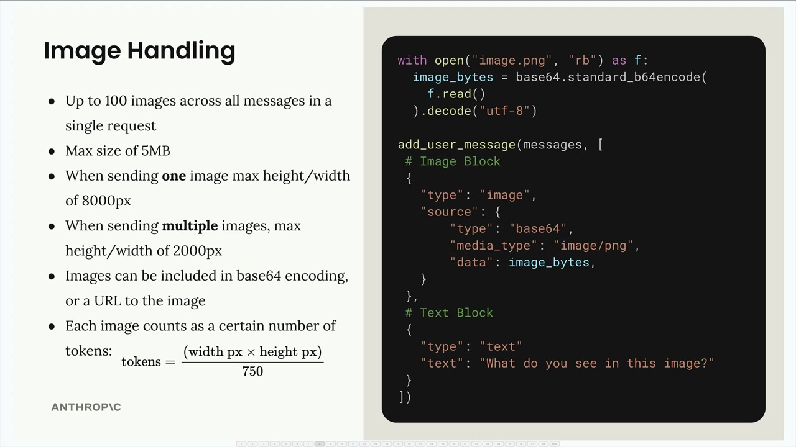
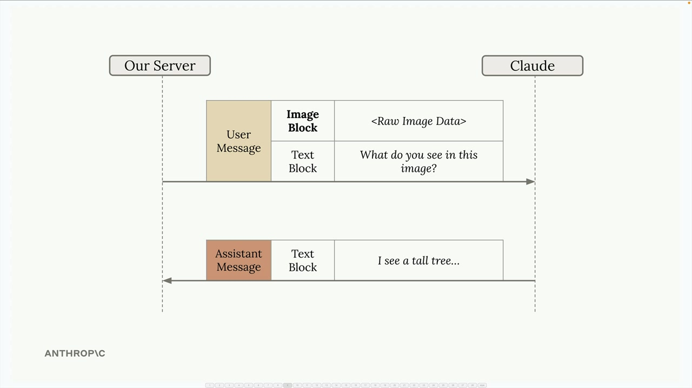
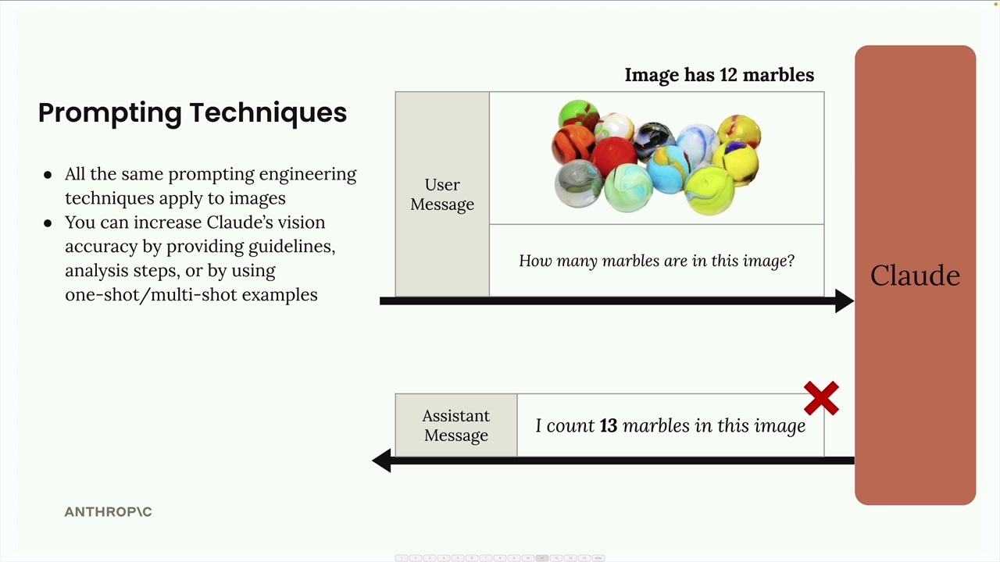
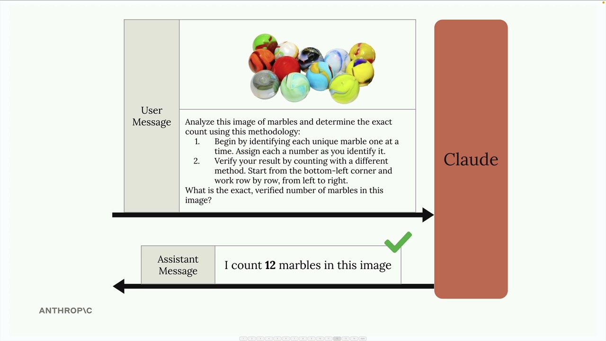
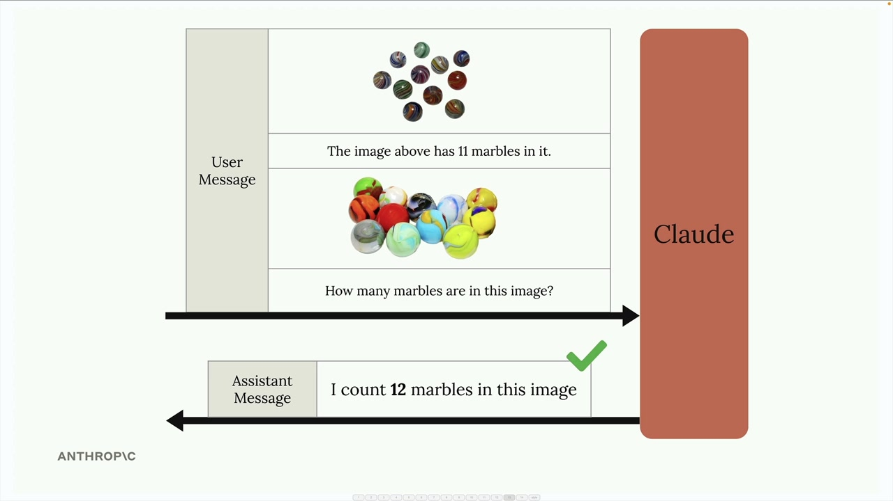
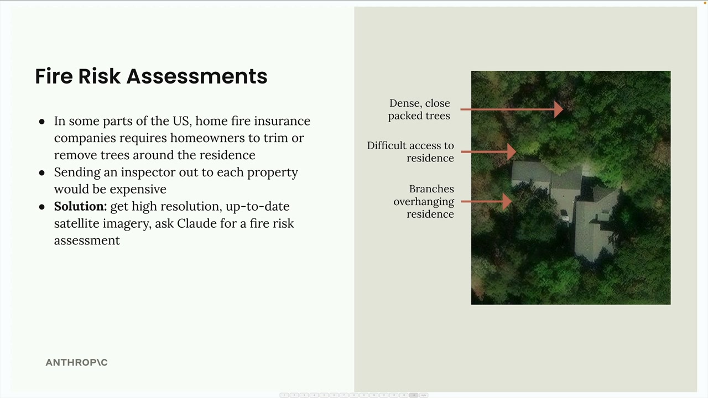

# Image support

> Source: https://anthropic.skilljar.com/claude-with-the-anthropic-api/287778

#### Summary


                            
                                

Claude's vision capabilities let you include images in your messages and ask Claude to analyze them in countless ways. You can ask Claude to describe what's in an image, compare multiple images, count objects, or perform complex visual analysis tasks.


## Image Handling Basics





There are several important limitations to keep in mind when working with images:


- Up to 100 images across all messages in a single request

- Max size of 5MB per image

- When sending one image: max height/width of 8000px

- When sending multiple images: max height/width of 2000px

- Images can be included as base64 encoding or a URL to the image

- Each image counts as tokens based on its dimensions: `tokens = (width px × height px) / 750`


To send an image to Claude, you include an image block in your user message alongside text blocks. Here's the structure:


```
with open("image.png", "rb") as f:
    image_bytes = base64.standard_b64encode(f.read()).decode("utf-8")

add_user_message(messages, [
    # Image Block
    {
        "type": "image",
        "source": {
            "type": "base64",
            "media_type": "image/png",
            "data": image_bytes,
        }
    },
    # Text Block
    {
        "type": "text",
        "text": "What do you see in this image?"
    }
])
```


## Message Flow





The conversation works just like text-only interactions. Your server sends a user message containing both image and text blocks to Claude, and Claude responds with a text block containing its analysis.


## Prompting Techniques





The key to getting good results with images is applying the same prompting engineering techniques you'd use with text. Simple prompts often lead to poor results. For example, asking "How many marbles are in this image?" might return an incorrect count.


You can dramatically improve Claude's accuracy by:


- Providing detailed guidelines and analysis steps

- Using one-shot or multi-shot examples

- Breaking down complex tasks into smaller steps


### Step-by-Step Analysis





Instead of a simple question, provide Claude with a methodology:


```
Analyze this image of marbles and determine the exact count using this methodology:
1. Begin by identifying each unique marble one at a time. Assign each a number as you identify it.
2. Verify your result by counting with a different method. Start from the bottom-left corner and work row by row, from left to right.

What is the exact, verified number of marbles in this image?
```


### One-Shot Examples





You can also improve accuracy by providing examples within your message. Include an image with a known count, state the correct answer, then ask about your target image. This gives Claude a reference point for the type of analysis you want.


## Real-World Example: Fire Risk Assessment





Here's a practical application: automating fire risk assessments for home insurance. Instead of sending inspectors to every property, insurance companies can use satellite imagery and Claude's analysis.


The system analyzes satellite images to identify:


- Dense, close-packed trees near the residence

- Difficult access routes for emergency services

- Branches overhanging the residence


Rather than a simple prompt like "provide a fire risk score," a well-structured prompt breaks down the analysis into specific steps:


```
Analyze the attached satellite image of a property with these specific steps:

1. Residence identification: Locate the primary residence on the property by looking for:
   - The largest roofed structure
   - Typical residential features (driveway connection, regular geometry)
   - Distinction from other structures (garages, sheds, pools)

2. Tree overhang analysis: Examine all trees near the primary residence:
   - Identify any trees whose canopy extends directly over any portion of the roof
   - Estimate the percentage of roof covered by overhanging branches (0-25%, 25-50%, 50-75%, 75%+)
   - Note particularly dense areas of overhang

3. Fire risk assessment: For any overhanging trees, evaluate:
   - Potential wildfire vulnerability (ember catch points, continuous fuel paths to structure)
   - Proximity to chimneys, vents, or other roof openings if visible
   - Areas where branches create a "bridge" between wildland vegetation and the structure

4. Defensible space identification: Assess the property's overall vegetative structure:
   - Identify if trees connect to form a continuous canopy over or near the home
   - Note any obvious fuel ladders (vegetation that can carry fire from ground to tree to roof)

5. Fire risk rating: Based on your analysis, assign a Fire Risk Rating from 1-4:
   - Rating 1 (Low Risk): No tree branches overhanging the roof, good defensible space around the home
   - Rating 2 (Moderate Risk): Minimal overhang (<25% of roof), some separation between tree canopies
   - Rating 3 (High Risk): Significant overhang (25-50% of roof), connected tree canopies, multiple vulnerability points
   - Rating 4 (Severe Risk): Extensive overhang (>50% of roof), dense vegetation against structure

For each item above (1-5), write one sentence summarizing your findings, with your final response being the numerical rating.
```


This detailed prompt guides Claude through a systematic analysis, resulting in much more accurate and useful assessments than a simple request would provide.


Remember: the same prompting techniques that work for text apply to images. Invest time in crafting detailed, structured prompts rather than relying on simple questions if you want reliable results.


                            
                        
                    

                    
                        
                            

#### Downloads


                            


                                
                                    
                                        - [**images.zip](https://cc.sj-cdn.net/instructor/4hdejjwplbrm-anthropic-poc/assets/1748558985/images.zip?response-content-disposition=attachment&Expires=1774882098&Signature=UHewcg4yGAaqMhwj3GJd0dwSKSrLd9TMpmmzHR5NbNyZUC0r4hzYlqLeZtuSpTSobdsXw6NiQvEU~degi~3lFiEFTEN7CyZAGlv8fF2VUflryZYk3LMaDYPnJpaTlxb9hliEsub4WTfVFVNHdNmv1deoSlsp5INa3b2kzP8koKr20inlAcwZZXzcHSqJRR7HnebJr41hErrzbhKoUdJHWsGfp6Szqj5N3Hg7IpWMA7PiNiW7jbPNRCZpEbh5FsHU083VnmJP1VW651J5CVGLXjT3m~HC-Eq8XDM32XVr0xty6jE6Wx651EexFJkavUCfKR-CeolMsbb4hAxrONJY4Q__&Key-Pair-Id=APKAI3B7HFD2VYJQK4MQ)

                                    
                                
                                    
                                        - [**002_images.ipynb](https://cc.sj-cdn.net/instructor/4hdejjwplbrm-anthropic/assets/1762980473/002_images.ipynb?response-content-disposition=attachment&Expires=1774882098&Signature=azBZbXG4kUV1oejBlZJJRJHgN8qLYrm9rrUjuy3bzQOCDR2ZuOUwrazh4Qm6puSnZlqXN6C4I70tslJ415CEzUvLOzBQGQg7zQWBb5rdDXsKeS2rmJurlqTfUyhbDfrlP8zKG4WsPpKEzi-IIjmsOQV-o45RB1PYLWDLBVMJ8vpemHC7h0RF6grVEcAUUSf7xE3MUK5QS4tYNkVRsWhBAjcLdiREwQO0mkZcXQMsSJYN1u1RDPzHTJ-AOm2cHbEsyB-PE3bHACjDLBIg0AaJyGYRJmzpIjmpnzMCiEy2eqp7bG34k-6moANpSKlApVetRK4IA8LBZQZtlFRCiiSg4g__&Key-Pair-Id=APKAI3B7HFD2VYJQK4MQ)