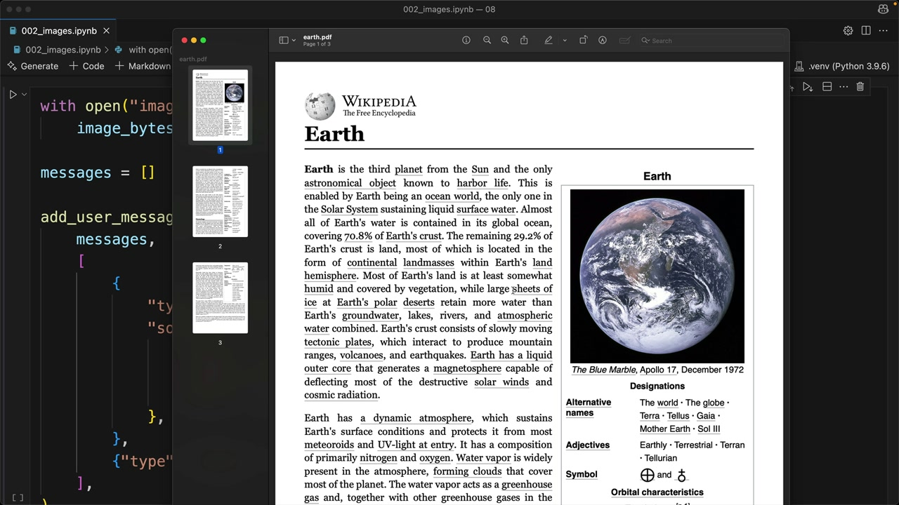

# PDF support

> Source: https://anthropic.skilljar.com/claude-with-the-anthropic-api/287768

#### Summary


                            
                                

Claude can read and analyze PDF files directly, making it a powerful tool for document processing. This capability works similarly to image processing, but with a few key differences in how you structure your code.


## Setting Up PDF Processing


To process a PDF file with Claude, you'll use nearly identical code to what you'd use for images. The main differences are in the file type specifications and variable names for clarity.


Here's how to modify your existing image processing code for PDFs:


```
with open("earth.pdf", "rb") as f:
    file_bytes = base64.standard_b64encode(f.read()).decode("utf-8")

messages = []

add_user_message(
    messages,
    [
        {
            "type": "document",
            "source": {
                "type": "base64",
                "media_type": "application/pdf",
                "data": file_bytes,
            },
        },
        {"type": "text", "text": "Summarize the document in one sentence"},
    ],
)

chat(messages)
```


## Key Changes from Image Processing


When adapting your image processing code for PDFs, you need to update several elements:


- Change the file extension from `.png` to `.pdf`

- Update the variable name from `image_bytes` to `file_bytes` for clarity

- Set the type to `"document"` instead of `"image"`

- Change the media type to `"application/pdf"` instead of `"image/png"`


## What Claude Can Extract from PDFs


Claude's PDF processing capabilities go beyond simple text extraction. It can analyze and understand:


- Text content throughout the document

- Images and charts embedded in the PDF

- Tables and their data relationships

- Document structure and formatting


This makes Claude essentially a one-stop solution for extracting any type of information from PDF documents, whether you need summaries, data analysis, or specific content extraction.





The example above shows Claude successfully processing a Wikipedia article about Earth that was saved as a PDF, demonstrating how it can understand and summarize complex document content in a single sentence.


                            
                        
                    

                    
                        
                            

#### Downloads


                            


                                
                                    
                                        - [**earth.pdf](https://cc.sj-cdn.net/instructor/4hdejjwplbrm-anthropic-poc/assets/1748559008/earth.pdf?response-content-disposition=attachment&Expires=1774882103&Signature=Q1mF2c~eLwpMPBvhPkUvcCwDeRvaEXBNAH6uXq6SXVqQulGvDM7VKSdI-jkyWCRdlF0qB7QQ3W1VEXB0dBIcoIj8wkWJ96ZqvOh0cQmgROqxG-L9gt-3jvLt1RrSlb9fGYeumBjk39gSJK4Tvtxufz0wBg9U~JI~L7SkW76QnDhQH4a7a~k~SySgWdjk6Eva3U0HyaVU41LcNCxMkNNvwcPWfDa49cBME18P~4Xdp~WiXZz9n29j76mVCzSLINBMLbBzZ1lC8b6zi3YfH55ciA7DWDa2tQXDD2WYJAxYQmlkuWfMVh6lZwkA7mCOv8zxrWVtO-rujnbzxIVqOgAA4Q__&Key-Pair-Id=APKAI3B7HFD2VYJQK4MQ)