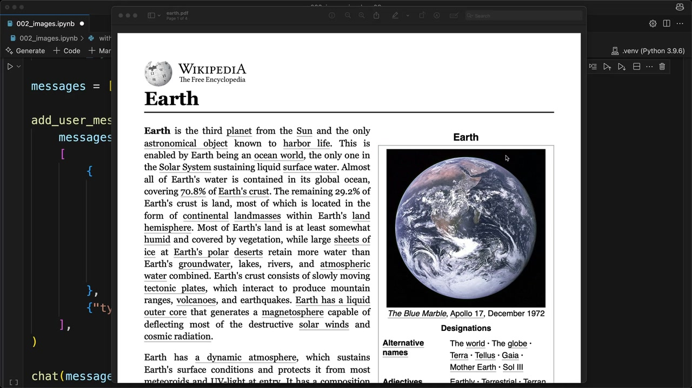
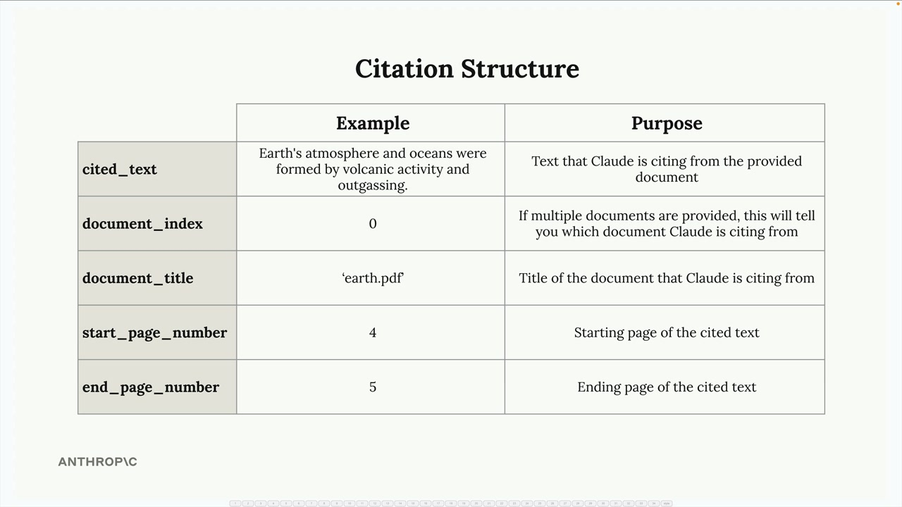
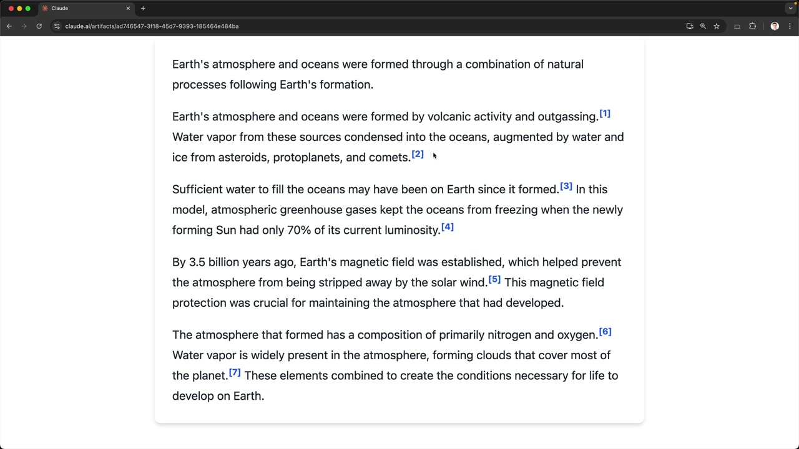

# Citations

> Source: https://anthropic.skilljar.com/claude-with-the-anthropic-api/287771

#### Summary


                            
                                

When Claude answers questions based on documents you provide, users might assume it's just drawing from its training data. But what if Claude could show exactly where it found specific information? That's where citations come in - a powerful feature that lets Claude reference specific parts of your source documents and show users exactly where each piece of information comes from.


## Why Citations Matter


Imagine asking Claude about how Earth's atmosphere formed and getting a detailed answer. Without citations, users have no way to verify the information or understand that Claude is actually referencing a specific document you provided. Citations solve this transparency problem by creating a clear trail from Claude's response back to your source material.





## Enabling Citations


To enable citations, you need to modify your document message structure. Add two new fields to your document block:


```
{
    "type": "document",
    "source": {
        "type": "base64",
        "media_type": "application/pdf",
        "data": file_bytes,
    },
    "title": "earth.pdf",
    "citations": { "enabled": True }
}
```


The `title` field gives your document a readable name, while `citations: {"enabled": True}` tells Claude to track where it finds information.


## Understanding Citation Structure


When citations are enabled, Claude's response becomes more complex. Instead of simple text, you get structured data that includes citation information for each claim.





Each citation contains several key pieces of information:


- **cited_text** - The exact text from your document that supports Claude's statement

- **document_index** - Which document Claude is referencing (useful when you provide multiple documents)

- **document_title** - The title you assigned to the document

- **start_page_number** - Where the cited text begins

- **end_page_number** - Where the cited text ends


## Building User Interfaces with Citations


The real power of citations comes from building user interfaces that make this information accessible. You can create interactive elements where users can hover over citation markers to see exactly where information came from.





This creates a transparent experience where users can:


- See that Claude's answers are grounded in actual source material

- Verify the information by checking the original document

- Understand the context around each cited piece of information


## Citations with Plain Text


Citations aren't limited to PDF documents. You can also use them with plain text sources. When working with text, modify your document structure like this:


```
{
    "type": "document", 
    "source": {
        "type": "text",
        "media_type": "text/plain",
        "data": article_text,
    },
    "title": "earth_article",
    "citations": { "enabled": True }
}
```


With plain text sources, instead of page numbers, you'll get character positions that pinpoint exactly where in the text Claude found each piece of information.


## When to Use Citations


Citations are particularly valuable when:


- Users need to verify information for accuracy

- You're working with authoritative documents that users should be able to reference

- Transparency about information sources is critical for your application

- Users might want to explore the broader context around specific facts


By implementing citations, you transform Claude from a "black box" that provides answers into a transparent research assistant that shows its work. This builds user trust and enables them to dive deeper into your source materials when needed.


                            
                        
                    

                    
                        
                            

#### Downloads


                            


                                
                                    
                                        - [**002_citations_complete.ipynb](https://cc.sj-cdn.net/instructor/4hdejjwplbrm-anthropic/assets/1762980791/002_citations_complete.ipynb?response-content-disposition=attachment&Expires=1774882109&Signature=CVEKe-1NFWsh8pZ~88tk0DOvoX-rUeFdFxaMDK3AXig204iGyeKWzQOKS0mM7CsPKNzFb4HMlaGOe~YHLfJrrPk7hszXQt~EKFz5QSOKqhG1Dxhv88jMaxw3jQ-rqdK0OwnUFbnIZc-YNniUVlYFULMWs7sfS2VKff~7a67yiW0-z7788vrp1fUT6mQFl6x3ljHobbNHhJDvVu8Asyc~QDHLvnTBEPLK7Y0Dy9aJDPItsancT9VYIYnCanJCd~srMI0KYVNCsF16O-IrJX58x0hlK4yg~cmuQGUcj1nWfJRvRxTUb7LQSKMrCu8giEUdYeLnHc2dZpv-Hp08EAasvA__&Key-Pair-Id=APKAI3B7HFD2VYJQK4MQ)

                                    
                                
                                    
                                        - [**earth.pdf](https://cc.sj-cdn.net/instructor/4hdejjwplbrm-anthropic/assets/1762980798/earth.pdf?response-content-disposition=attachment&Expires=1774882109&Signature=OE20Bt-Ob5dBnXMEI5QaeA-NYrfLq-OQzgcmn510G0uwtmoqiYtTzj9NllcxXeNswGiUpqk1spQw1qCDFYy1sPygIZs-jrbEkvhMGI65aBWtMsgcac~kjAzkneJL~ltOdZc~xk7wB3wmwZcmk11ZvFBJIowoOgPXmpdwQ1LOls1x8VpF2JX7zk6g3HDo-BJUHwbgodCF-OLM7G9REIF~hcaPKC3ldNt8JXqQH0D-fDzPGRUhjR~rqrm4p0oB9GAyxTAEX0itR0SOqY~j9YxCXoDdBLa29ZRWHR51TuXySA51PmERvRhLK24-dV6MExBOe5mJt9gtw-GsQ6z7b3D8Og__&Key-Pair-Id=APKAI3B7HFD2VYJQK4MQ)