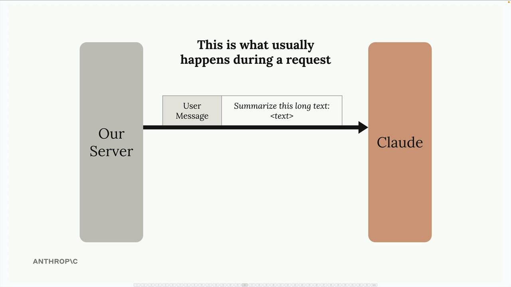
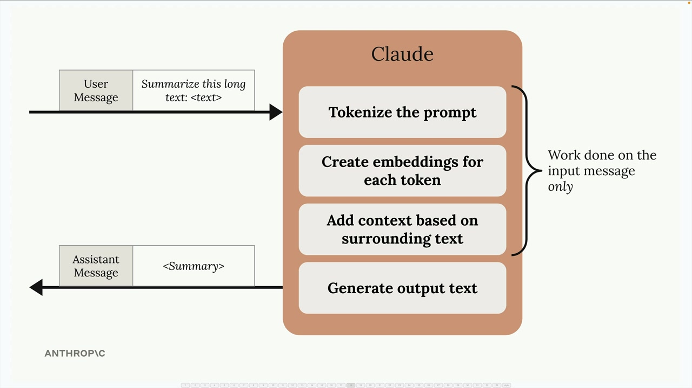
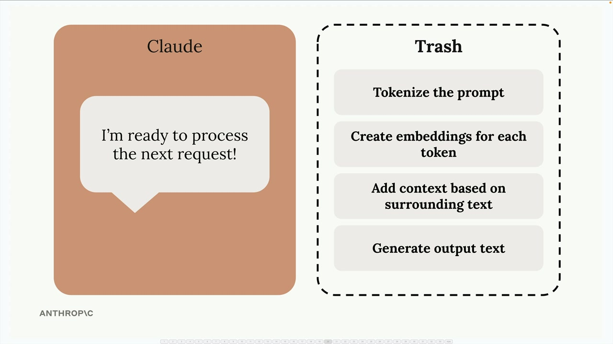
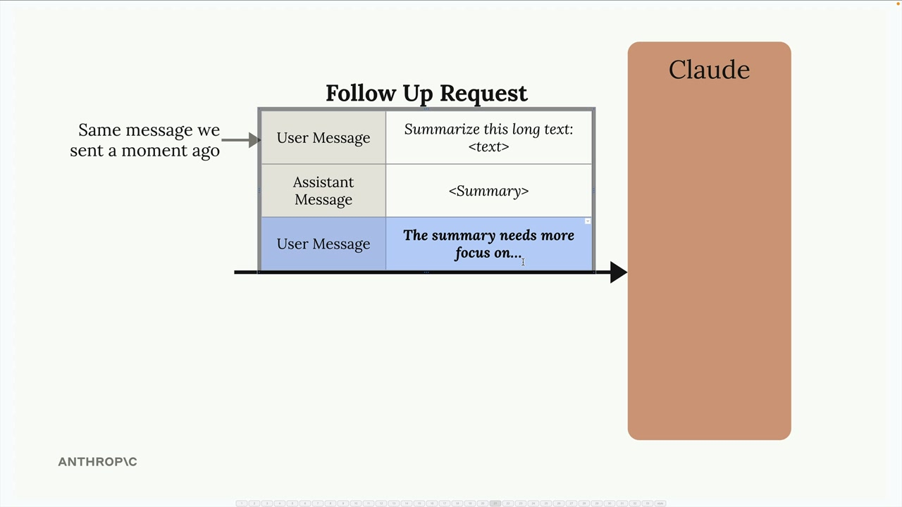
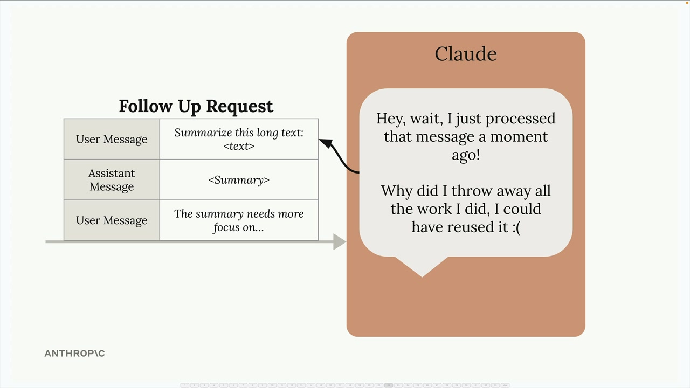
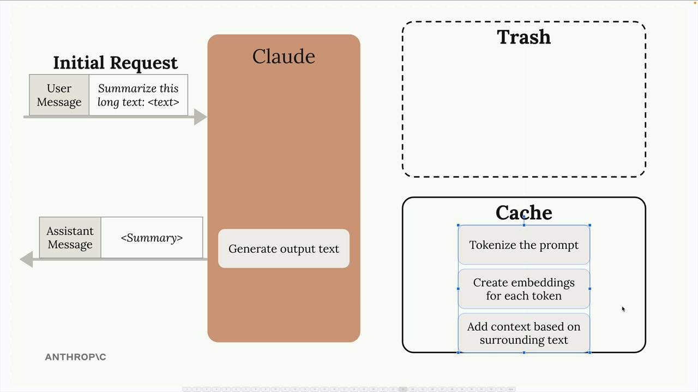
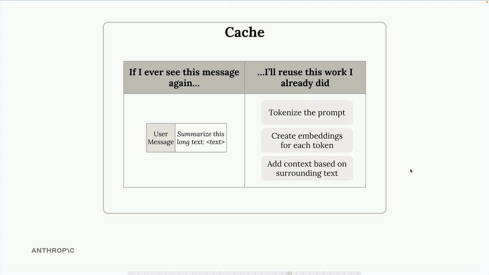
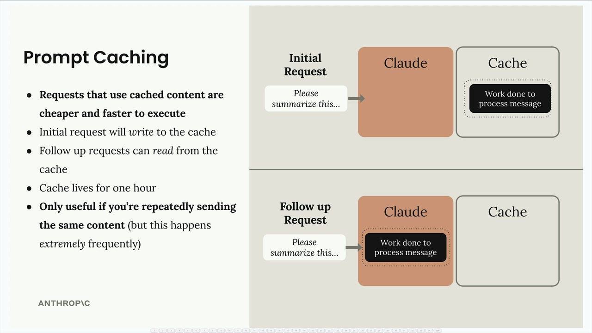

# Prompt caching

> Source: https://anthropic.skilljar.com/claude-with-the-anthropic-api/287772

#### Summary

                            
                                

Prompt caching is a feature that speeds up Claude's responses and reduces the cost of text generation by reusing computational work from previous requests. Instead of throwing away all the processing work after each request, Claude can save and reuse it when you send similar content again.

## How Claude Normally Processes Requests

To understand prompt caching, let's first look at what happens during a typical request without caching enabled.

When you send a message to Claude, it doesn't immediately start generating a response. Instead, Claude does a tremendous amount of preprocessing work on your input:

- Tokenizes the prompt into smaller pieces

- Creates embeddings for each token

- Adds context based on surrounding text

- Only then generates the actual output text

After sending you the response, Claude throws away all this computational work - the tokenization, embeddings, and context analysis all get discarded.

## The Problem with Discarding Work

This becomes inefficient when you make follow-up requests that include the same content. For example, in a conversation where you're asking Claude to refine a summary of the same long text:

Claude has to repeat all the same preprocessing work on content it just analyzed moments ago. As Claude might think to itself: "I just processed that message and threw away all the work I did - I could have reused it!"

## How Prompt Caching Solves This

Prompt caching changes this workflow by saving the preprocessing work instead of discarding it:

When you make an initial request, Claude performs all the usual preprocessing but stores the results in a cache instead of throwing them away. The cache acts like a lookup table that says "If I ever see this message again, I'll reuse this work I already did."

## Key Benefits and Limitations

Prompt caching offers several advantages:

- **Faster responses:** Requests using cached content execute more quickly

- **Lower costs:** You pay less for the cached portions of your requests

- **Automatic optimization:** The initial request writes to the cache, follow-up requests read from it

However, there are important limitations to keep in mind:

- **Cache duration:** Cached content only lives for one hour

- **Limited use cases:** Only beneficial when you're repeatedly sending the same content

- **High frequency requirement:** Most effective when the same content appears extremely frequently in your requests

Prompt caching works best for scenarios like document analysis workflows, where you're asking multiple questions about the same large document, or iterative editing tasks where the base content remains constant while you refine specific aspects.