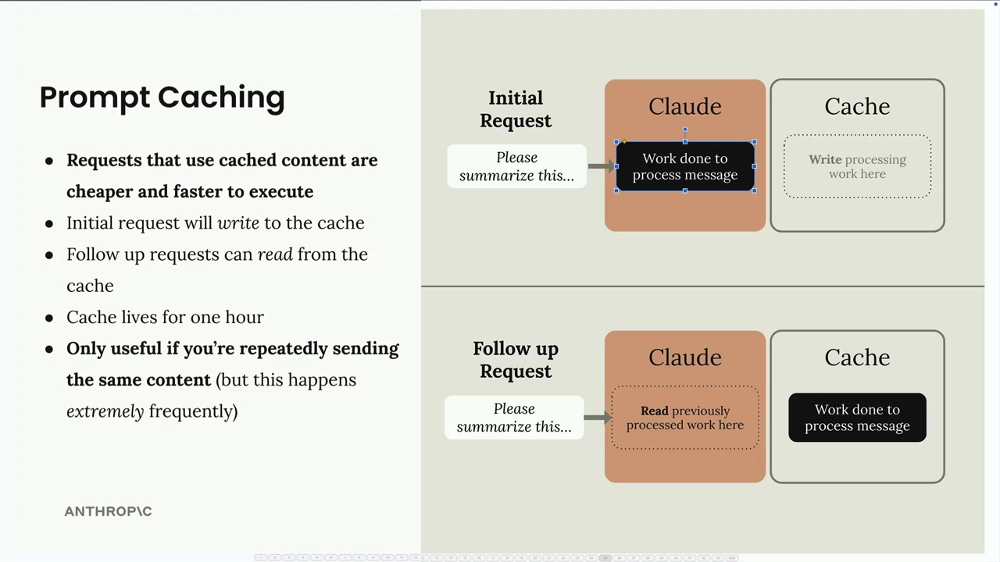
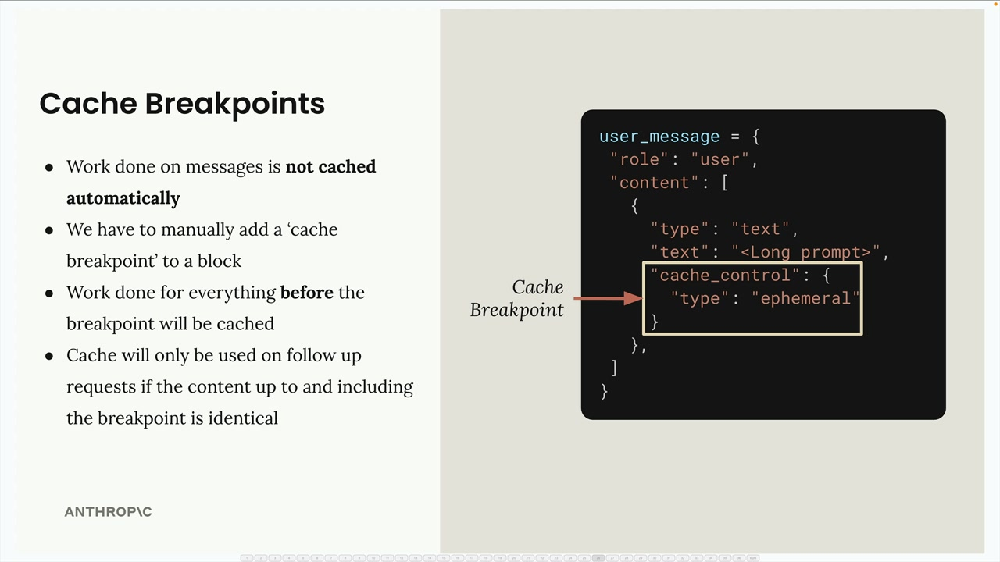
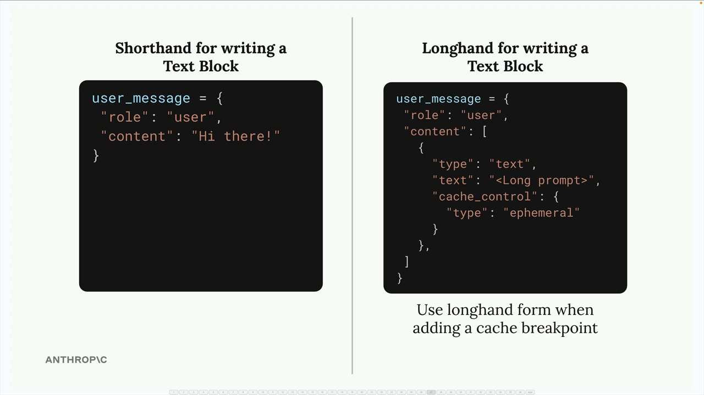
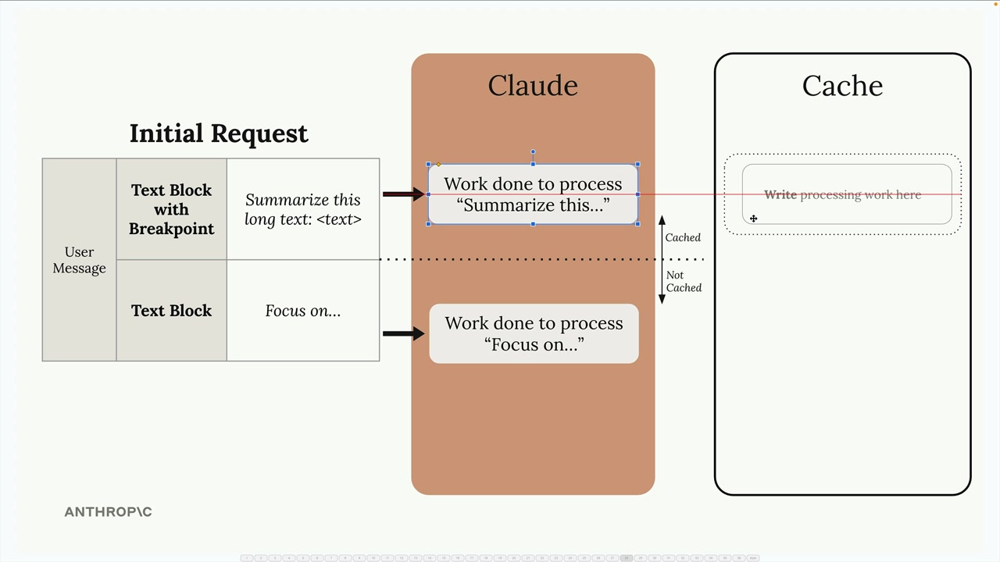
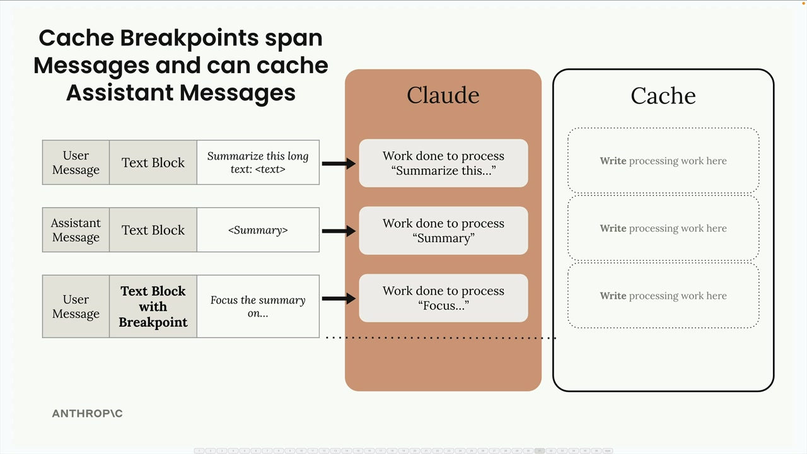
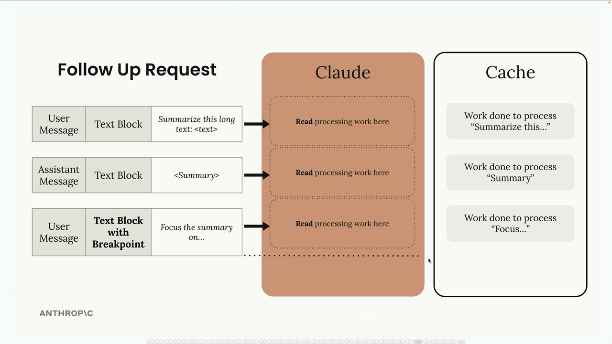
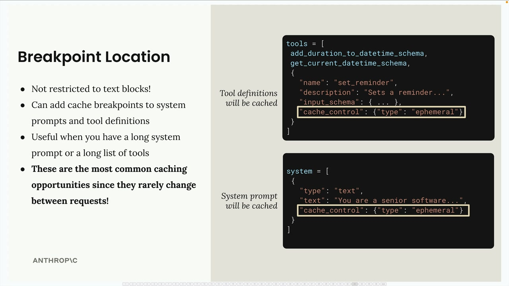
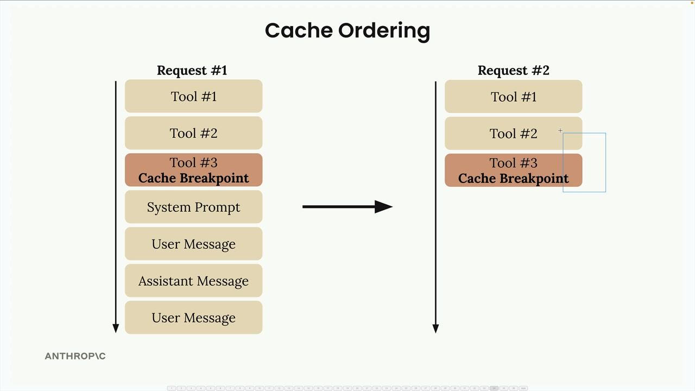
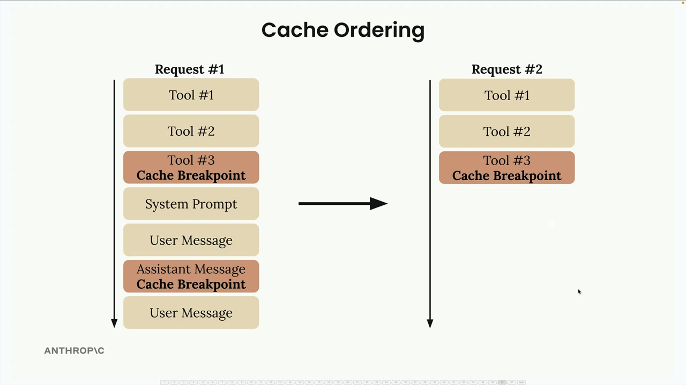
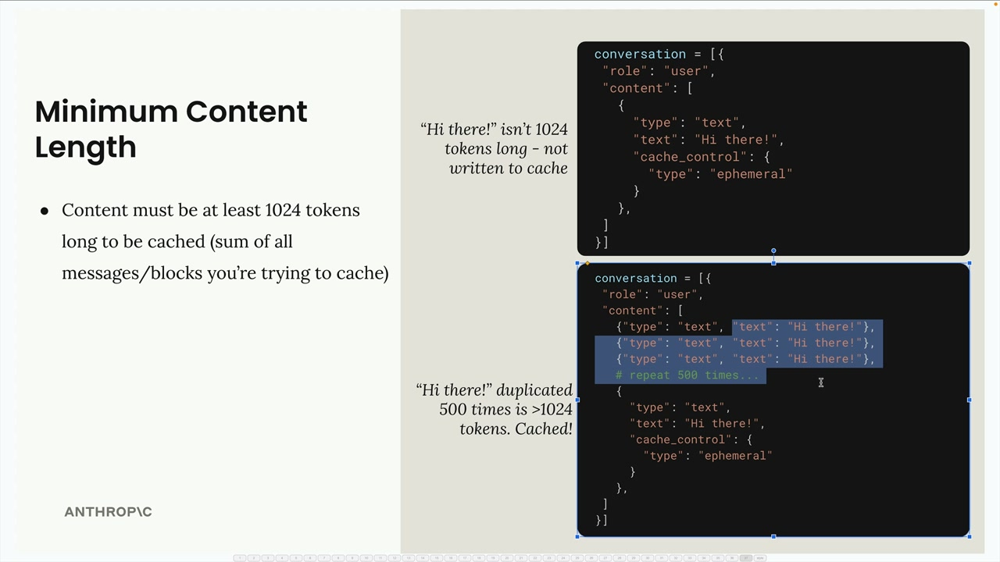

# Rules of prompt caching

> Source: https://anthropic.skilljar.com/claude-with-the-anthropic-api/287770

#### Summary

                            
                                

Prompt caching in Claude works by storing the computational work done on your messages so it can be reused in follow-up requests. This makes subsequent requests both faster and cheaper to execute, but only when you're repeatedly sending identical content.

The process is straightforward: your initial request writes processing work to the cache, and follow-up requests can read from that cache instead of reprocessing the same content. The cache lives for one hour, so this feature is only useful if you're repeatedly sending the same content within that timeframe.

## Cache Breakpoints

Caching isn't enabled automatically - you need to manually add cache breakpoints to specific blocks in your messages. Here's how it works:

- Work done on messages is **not cached automatically**

- You must manually add a 'cache breakpoint' to a block

- Work done for everything **before** the breakpoint will be cached

- Cache will only be used on follow-up requests if the content up to and including the breakpoint is identical

To add a cache breakpoint, you need to use the longhand form for writing text blocks instead of the shorthand:

The shorthand form doesn't provide a place to add the cache control field, so you must use the expanded format with the `cache_control` field set to `{"type": "ephemeral"}`.

## How Cache Breakpoints Work

When you place a cache breakpoint in a message, Claude caches all the processing work up to and including that breakpoint. Content after the breakpoint is processed normally without caching.

For the cache to be useful in follow-up requests, the content must be identical up to the breakpoint. Even small changes like adding the word "please" will invalidate the cache and force Claude to reprocess everything.

## Cross-Message Caching

Cache breakpoints can span across multiple messages and message types. If you place a breakpoint in a later message, all previous messages (user, assistant, etc.) will be included in the cached content.

This is particularly useful for conversations where you want to cache the entire context up to a certain point.

## System Prompts and Tools

You're not limited to text blocks - cache breakpoints can be added to:

- System prompts

- Tool definitions

- Image blocks

- Tool use and tool result blocks

System prompts and tool definitions are excellent candidates for caching since they rarely change between requests. This is often where you'll get the most benefit from prompt caching.

## Cache Ordering

Behind the scenes, Claude processes your request components in a specific order: tools first, then system prompt, then messages. Understanding this order helps you place breakpoints effectively.

You can add up to four cache breakpoints total. For example, you might cache your tools, then add another breakpoint partway through your conversation history. This gives you flexibility in what gets cached when different parts of your request change.

## Minimum Content Length

There's a minimum threshold for caching: content must be at least 1024 tokens long to be cached. This is the sum of all messages and blocks you're trying to cache, not individual blocks.

A simple "Hi there!" message won't meet this threshold, but if you duplicate that content 500 times (or have a genuinely long prompt), it will exceed 1024 tokens and be eligible for caching.

The key to effective prompt caching is identifying which parts of your requests stay consistent across multiple calls and placing breakpoints strategically to maximize reuse while minimizing cache invalidation.