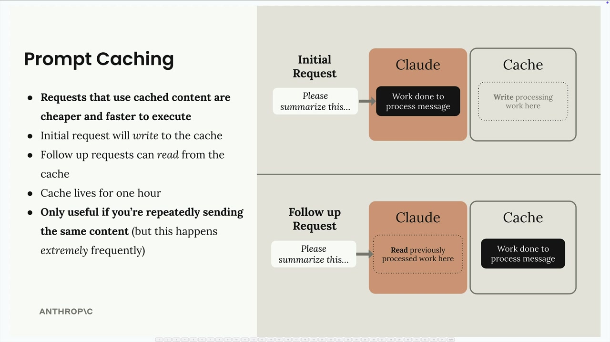

# Prompt caching in action

> Source: https://anthropic.skilljar.com/claude-with-the-anthropic-api/287774

#### Summary


                            
                                

Prompt caching is a powerful optimization feature that makes your API requests both faster and cheaper when you're repeatedly sending the same content to Claude. Let's explore how to implement it effectively in your applications.





## How Prompt Caching Works


When you enable prompt caching, the first request writes content to a cache that lives for one hour. Follow-up requests can then read from this cache instead of processing the same content again. This is particularly valuable when you're sending:


- Large system prompts (like a 6K token coding assistant prompt)

- Complex tool schemas (around 1.7K tokens for multiple tools)

- Repeated message content


The key insight is that caching only helps if you're repeatedly sending identical content - but in many applications, this happens extremely frequently.


## Setting Up Tool Schema Caching


To cache your tool schemas, you need to add a cache control field to the last tool in your list. Here's the proper way to do it without modifying your original tool definitions:


```
if tools:
    tools_clone = tools.copy()
    last_tool = tools_clone[-1].copy()
    last_tool["cache_control"] = {"type": "ephemeral"}
    tools_clone[-1] = last_tool
    params["tools"] = tools_clone
```


This approach creates copies of both the tools list and the last tool schema before adding the cache control field. While you could directly modify `tools[-1]["cache_control"]`, the copying approach prevents issues if you later reorder your tools.


## System Prompt Caching


For system prompts, you need to structure them as a text block with cache control:


```
if system:
    params["system"] = [
        {
            "type": "text",
            "text": system,
            "cache_control": {"type": "ephemeral"}
        }
    ]
```


This converts your system prompt from a simple string into a structured format that supports caching.


## Understanding Cache Behavior


When you run requests with caching enabled, you'll see different usage patterns in the response:


- **First request:** `cache_creation_input_tokens=1772` - Claude writes to cache

- **Follow-up requests:** `cache_read_input_tokens=1772` - Claude reads from cache

- **Changed content:** New cache creation tokens appear


The cache is extremely sensitive - changing even a single character in your tools or system prompt invalidates the entire cache for that component.


## Cache Ordering and Breakpoints


You can set multiple cache breakpoints in a single request. The order matters:


1. Tools (if provided)

1. System prompt (if provided)

1. Messages


If you change your system prompt but keep the same tools, you'll see a partial cache read (for tools) and a cache write (for the new system prompt). This granular caching means you only pay for processing the parts that actually changed.


## Practical Considerations


Prompt caching is most effective when you have:


- Consistent tool schemas across requests

- Stable system prompts

- Applications that make multiple requests with similar context


Remember that the cache only lasts for one hour, so it's designed for applications with relatively frequent API usage rather than long-term storage.


                            
                        
                    

                    
                        
                            

#### Downloads


                            


                                
                                    
                                        - [**003_caching.ipynb](https://cc.sj-cdn.net/instructor/4hdejjwplbrm-anthropic/assets/1762980904/003_caching.ipynb?response-content-disposition=attachment&Expires=1774882123&Signature=GxCBoQB1zGRLjRRllskk3VN6WdjFJi8VKK2vRvURETXSqKAXY2acwWfcod0J7nsWrvuyjhF2xXY-TGoAEe0a2Arnfu0Hg5jhcirVK2hV1WRIn6WBb-ujhAMHVoS9EM5ADn3uoHeZK7HXrsIw-dPlobABAQ1pJSXN4SNoXdVGml5q-iJ1OBhJyJvB2u2UjXvdsF-H~xgGO59hZQdHTPWUAAuZPfIf-DfM3jgGOeNH4J-fZHWL5Bjq~k4jcKFmHG~HYfnNAtqq1n8xgBUi1C0z5PQ1aMWHlFzVAI7EPpJwz1g7VLFzDhgGPSBiEs7LpqNs74b5CxWOWZCh3v1~dtZjeg__&Key-Pair-Id=APKAI3B7HFD2VYJQK4MQ)