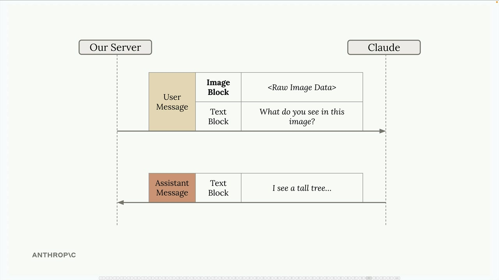
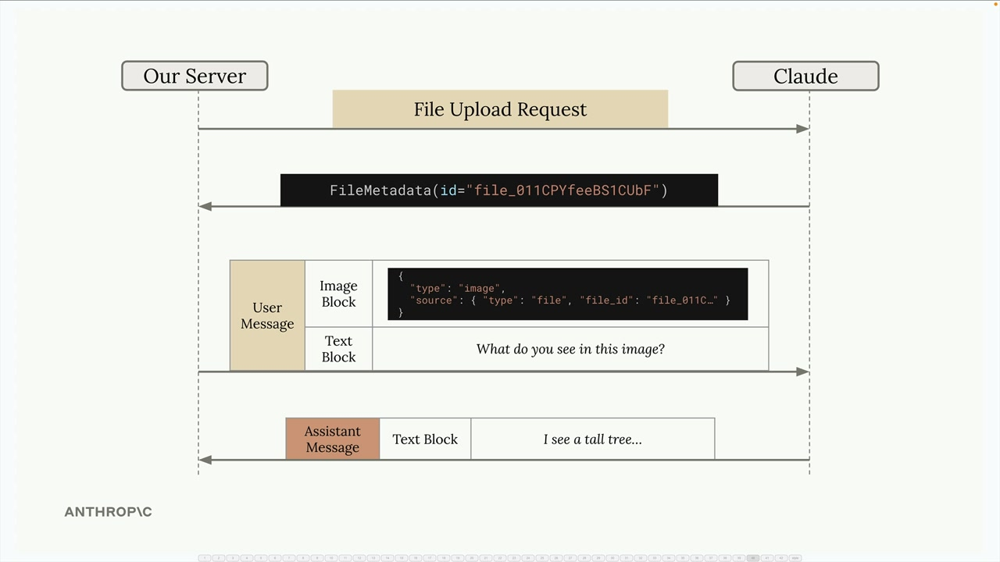
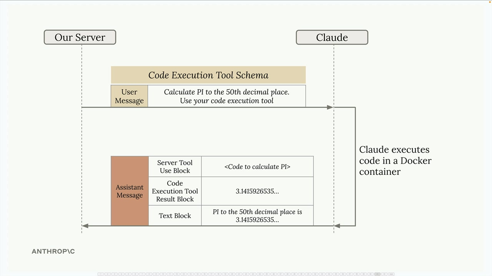
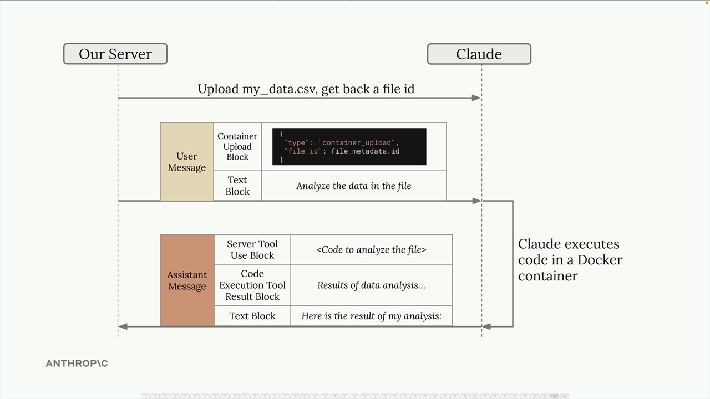
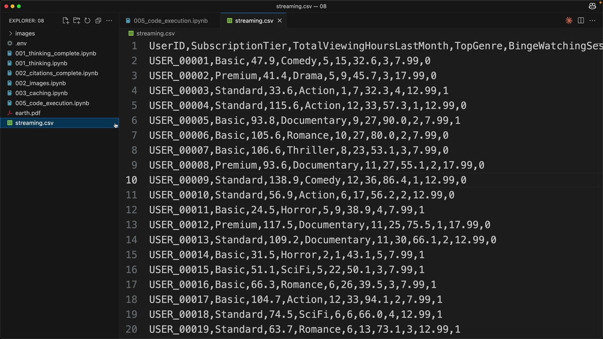
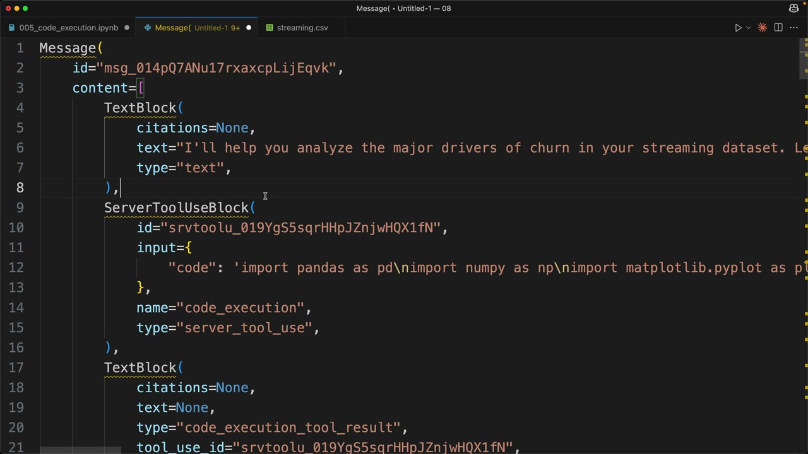
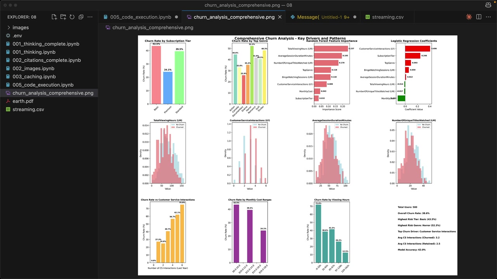

# Code execution and the Files API

> Source: https://anthropic.skilljar.com/claude-with-the-anthropic-api/287777

#### Summary


                            
                                

The Anthropic API offers two powerful features that work exceptionally well together: the Files API and Code Execution. While they might seem separate at first, combining them opens up some really interesting possibilities for delegating complex tasks to Claude.


## Files API


The Files API provides an alternative way to handle file uploads. Instead of encoding images or PDFs directly in your messages as base64 data, you can upload files ahead of time and reference them later.





Here's how it works:


- Upload your file (image, PDF, text, etc.) to Claude using a separate API call

- Receive a file metadata object containing a unique file ID

- Reference that file ID in future messages instead of including raw file data





This approach is particularly useful when you want to reference the same file multiple times or when working with larger files that would be cumbersome to include in every request.


## Code Execution Tool


Code execution is a server-based tool that doesn't require you to provide an implementation. You simply include a predefined tool schema in your request, and Claude can optionally execute Python code in an isolated Docker container.





Key characteristics of the code execution environment:


- Runs in an isolated Docker container

- No network access (can't make external API calls)

- Claude can execute code multiple times during a single conversation

- Results are captured and interpreted by Claude for the final response


## Combining Files API and Code Execution


The real power comes from using these features together. Since the Docker containers have no network access, the Files API becomes the primary way to get data in and out of the execution environment.





Here's a typical workflow:


1. Upload your data file (like a CSV) using the Files API

1. Include a container upload block in your message with the file ID

1. Ask Claude to analyze the data

1. Claude writes and executes code to process your file

1. Claude can generate outputs (like plots) that you can download


## Practical Example


Let's look at a real example using streaming service data. The CSV file contains user information including subscription tiers, viewing habits, and whether they've churned (canceled their subscription).





First, upload the file using a helper function:


```
file_metadata = upload('streaming.csv')
```


Then create a message that includes both the uploaded file and a request for analysis:


```
messages = []
add_user_message(
    messages,
    [
        {
            "type": "text",
            "text": """Run a detailed analysis to determine major drivers of churn.
            Your final output should include at least one detailed plot summarizing your findings."""
        },
        {"type": "container_upload", "file_id": file_metadata.id},
    ],
)

chat(
    messages,
    tools=[{"type": "code_execution_20250522", "name": "code_execution"}]
)
```


## Understanding the Response


When Claude uses code execution, the response contains multiple types of blocks:


- **Text blocks** - Claude's analysis and explanations

- **Server tool use blocks** - The actual code Claude decided to run

- **Code execution tool result blocks** - Output from running the code





Claude might execute code multiple times during a single response, iteratively building up its analysis. Each execution cycle includes the code and its results.


## Downloading Generated Files


One of the most powerful features is Claude's ability to generate files (like plots or reports) and make them available for download. When Claude creates a visualization, it gets stored in the container and you can download it using the Files API.


Look for blocks with `type: "code_execution_output"` in the response - these contain file IDs for generated content:


```
download_file("file_id_from_response")
```





The result is a comprehensive analysis with professional visualizations that would have taken significant manual coding to produce.


## Beyond Data Analysis


While data analysis is a natural fit, the combination of Files API and code execution opens up many possibilities:


- Image processing and manipulation

- Document parsing and transformation

- Mathematical computations and modeling

- Report generation with custom formatting


The key is that you can delegate complex, computational tasks to Claude while maintaining control over the inputs and outputs through the Files API. This creates a powerful workflow where Claude becomes your coding assistant that can actually execute and iterate on solutions.


                            
                        
                    

                    
                        
                            

#### Downloads


                            


                                
                                    
                                        - [**streaming.csv](https://cc.sj-cdn.net/instructor/4hdejjwplbrm-anthropic-poc/assets/1748559110/streaming.csv?response-content-disposition=attachment&Expires=1774882128&Signature=t1mCbvuXnON5XeZB7OC9-HsCkorZ3Njx3wRqfK5ws8F0ZvYaVuOmlISU8YwqOqXZLjFvcKAK~h17bcynn38tjzFhw3x2kM3O0c8cHMPAojWeaFnxVCB3~KOtCNr5sYDhP1b3p62CEQvvcaaHa2Qfa49bbshEq3dQFt~fiFmmy27PVvYflhz3W10-26zhBML53tIIcbwo~mSvl8qMeMEbhYsDUZiIYU35T6H1Njiop9netucSCMOsQ0si1SXgP4NXOpyYoVcARAJOZkYNjBQVajd5aGwL6bmPsSkxIfFqlvPDFU~LxonIjyvs7sColPK~M5ppKD0iHa0dsEdBbl~N5g__&Key-Pair-Id=APKAI3B7HFD2VYJQK4MQ)

                                    
                                
                                    
                                        - [**005_code_execution.ipynb](https://cc.sj-cdn.net/instructor/4hdejjwplbrm-anthropic/assets/1762981347/005_code_execution.ipynb?response-content-disposition=attachment&Expires=1774882128&Signature=PGEvREOCNBbJWt5M~QpGqv847ohVHyRDXQPeD488451zTpnIdKZqRgeUyMFuHfnVk8Oqu6fLhTJq4esqcIbe2ooqBT0CPX6bojZYx1cJR7jRC4Fzfgj3OKY2MAqDga3HMJuwo5Aq6NJ2pxghpJMAjc4ry4rH~LGXrsxjplmJV2Q~NMbeurnKsi8ipnV6EzSn1W7uhixhV1yggblLFSLFAp1ICfi~CcFhLKSIyfnQzWegdqTh-tvQECOKAmWa6-xkq71rZhjIWrBaazDRgBaN74V58V7kB6oqqehJ6bJ24irfXbjGRDJyUmMXXDwlhNYw6Sm2eF1Dl7-oZeiy9bgjKg__&Key-Pair-Id=APKAI3B7HFD2VYJQK4MQ)