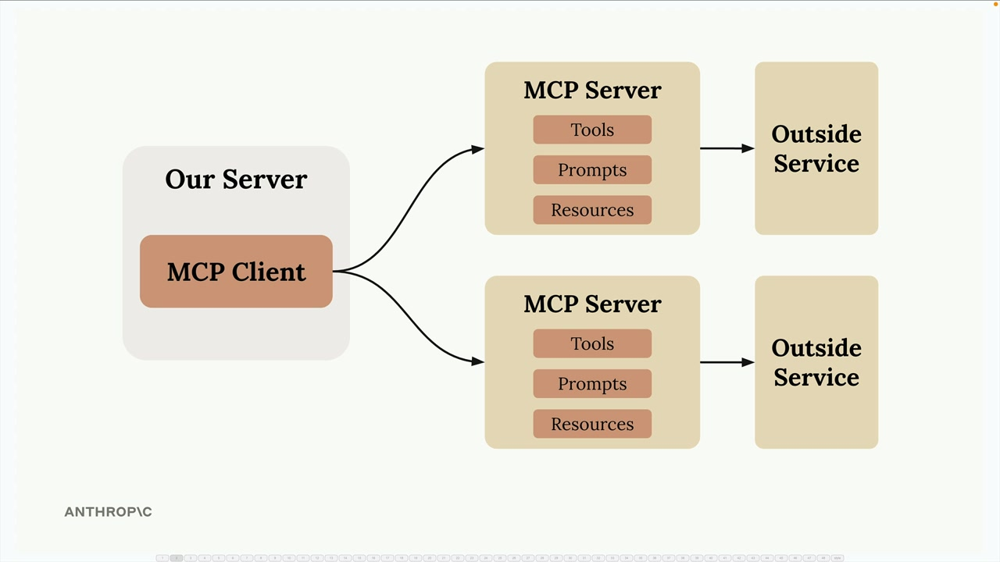
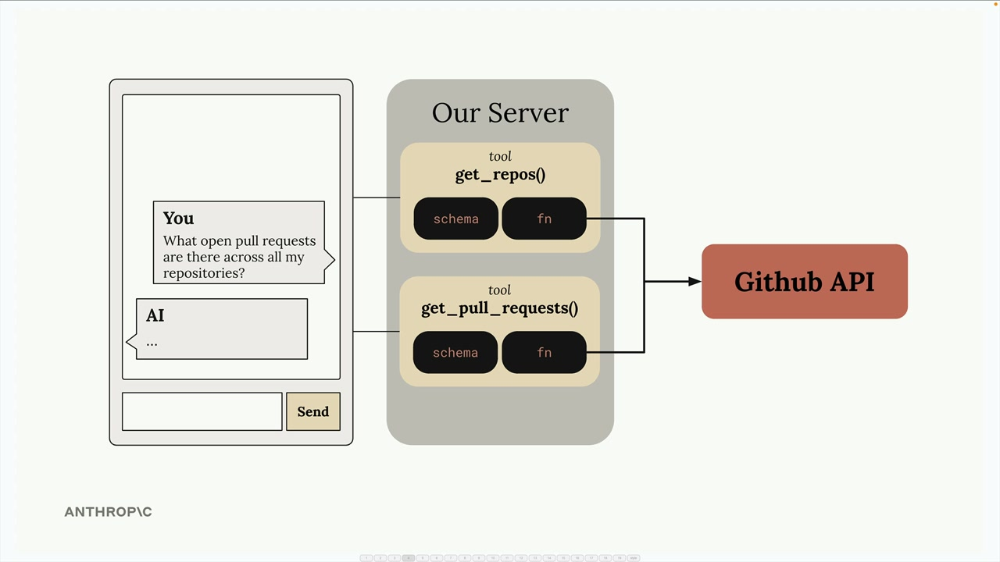
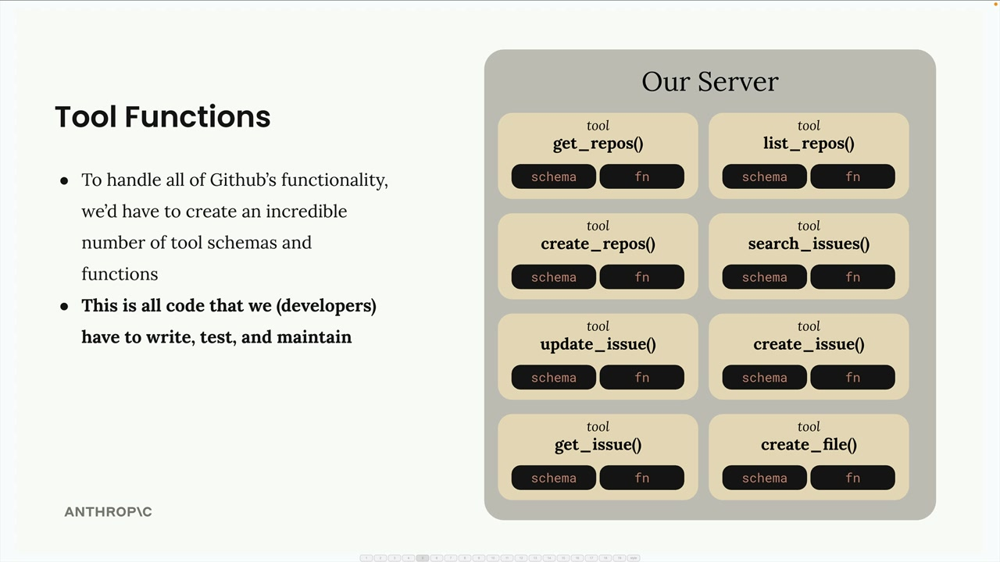
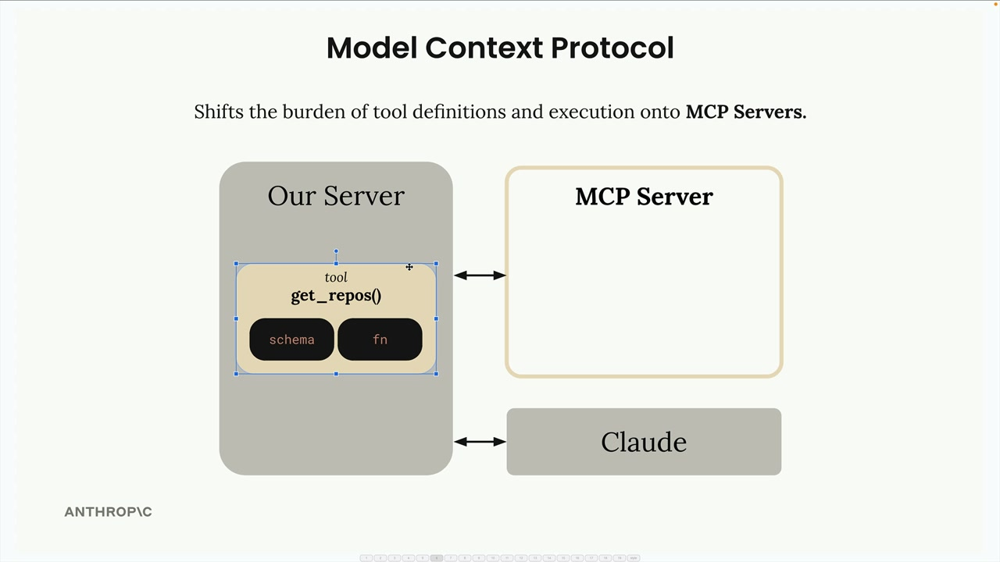
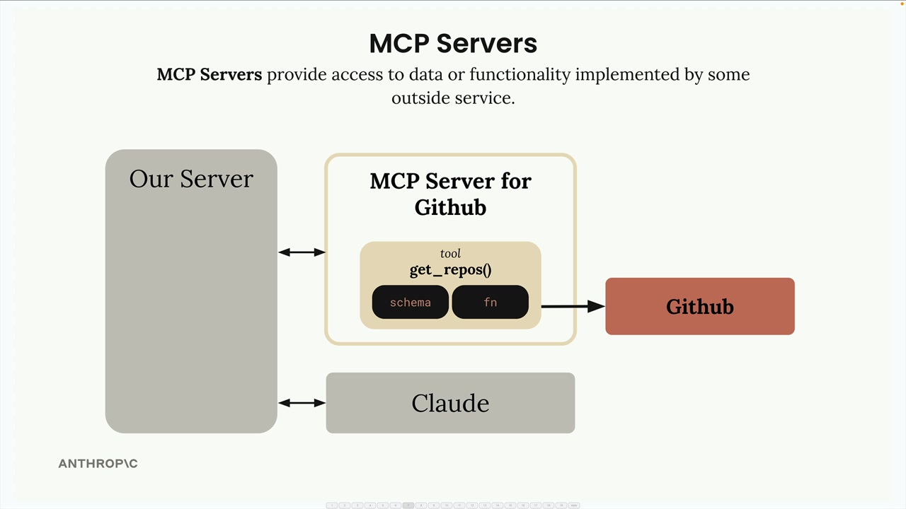
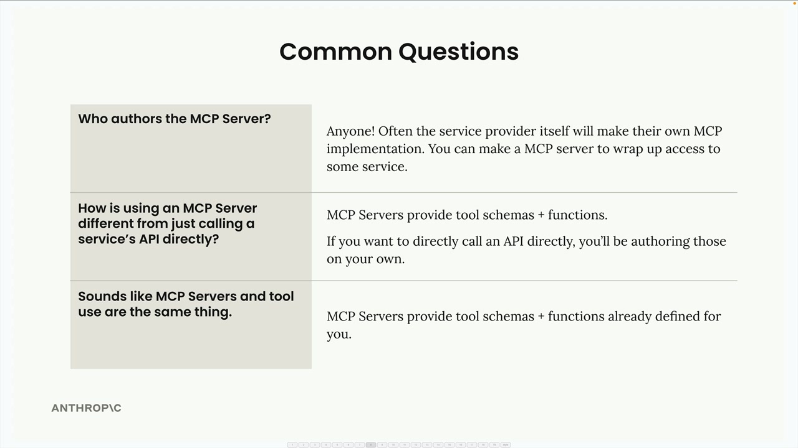

# Introducing MCP

> Source: https://anthropic.skilljar.com/claude-with-the-anthropic-api/287780

#### Summary

                            
                                

Model Context Protocol (MCP) is a communication layer that provides Claude with context and tools without requiring you to write a bunch of tedious integration code. Think of it as a way to shift the burden of tool definitions and execution away from your server to specialized MCP servers.

When you first encounter MCP, you'll see diagrams showing the basic architecture: an MCP Client (your server) connecting to MCP Servers that contain tools, prompts, and resources. Each MCP server acts as an interface to some outside service.

## Understanding MCP Through a Real Example

Let's say you're building a chat interface where users can ask Claude about their GitHub data. A user might ask "What open pull requests are there across all my repositories?" To answer this, Claude needs tools to access GitHub's API.

Without MCP, you'd need to create all the GitHub integration tools yourself. This means writing schemas and functions for every piece of GitHub functionality you want to support.

## The Tool Function Problem

GitHub has massive functionality - repositories, pull requests, issues, projects, and much more. To build a complete GitHub chatbot, you'd need to author an incredible number of tools:

Each tool requires both a schema definition and a function implementation. This represents a lot of code that you have to write, test, and maintain as a developer.

## How MCP Solves This

MCP shifts the burden of tool definitions and execution from your server to MCP servers. Instead of you writing all those GitHub tools, they're authored and executed inside a dedicated MCP server.

The MCP server acts as a wrapper around GitHub's functionality, providing pre-built tools that you can use without having to implement them yourself.

MCP servers provide access to data or functionality implemented by outside services. They package up complex integrations into reusable components that any application can connect to.

## Common Questions About MCP

### Who Authors MCP Servers?

Anyone can create an MCP server implementation. Often, service providers themselves will make their own official MCP implementations. For example, AWS might release an official MCP server with tools for their various services.

### How is MCP Different from Direct API Calls?

MCP servers provide tool schemas and functions already defined for you. If you call an API directly, you're responsible for authoring those tool definitions yourself. MCP saves you that implementation work.

### Isn't MCP Just Tool Use?

This is a common misconception. MCP servers and tool use are complementary but different concepts. MCP is about who does the work of creating and maintaining the tools. With MCP, someone else has already written the tool functions and schemas for you - they're packaged inside the MCP server.

The key insight is that MCP servers provide tool schemas and functions already defined for you, eliminating the need to build and maintain complex integrations yourself.