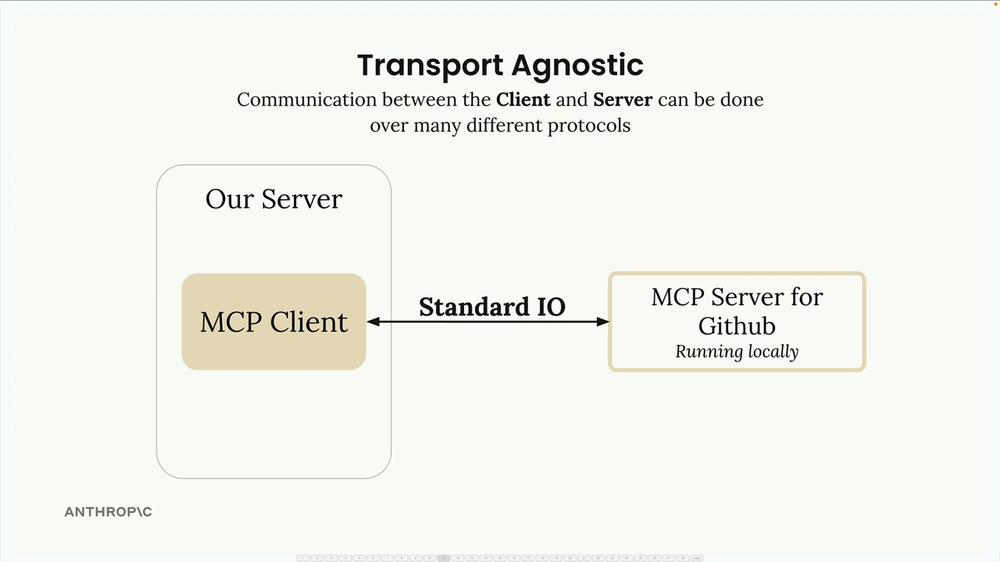
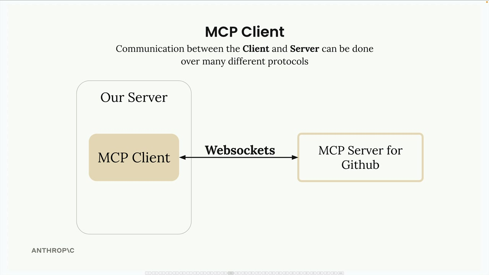
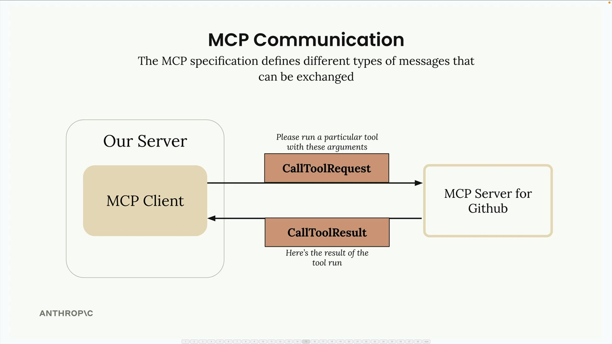
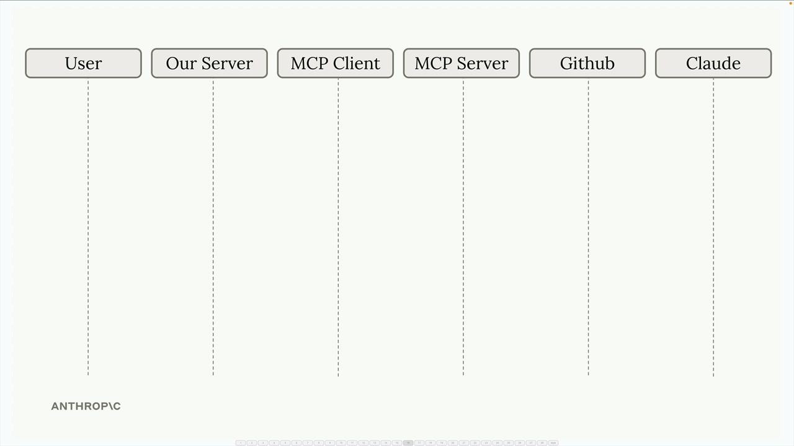
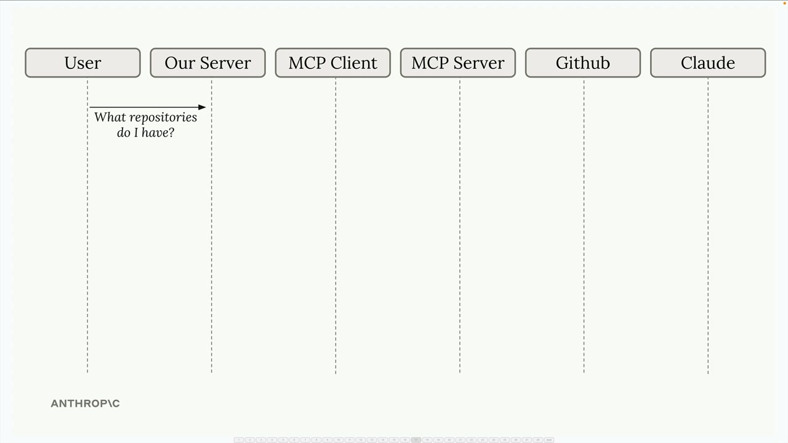
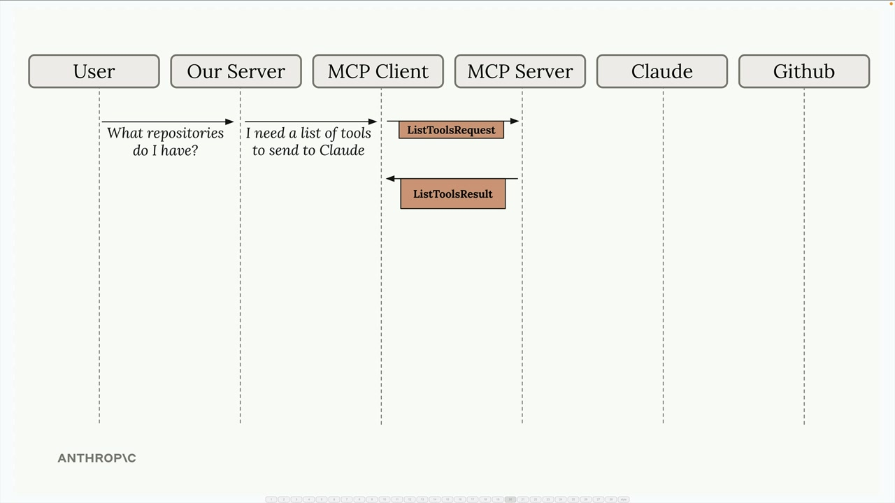
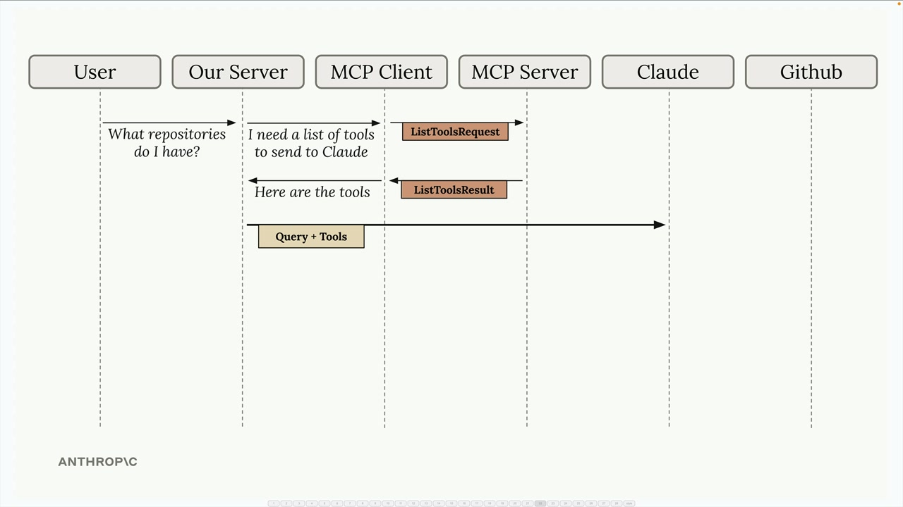
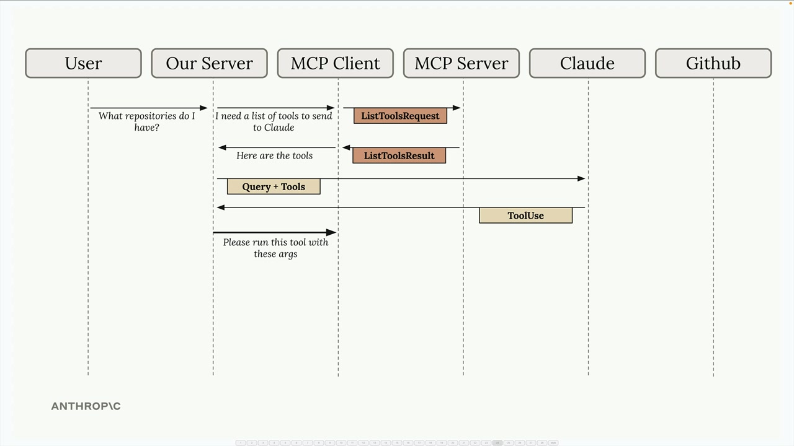
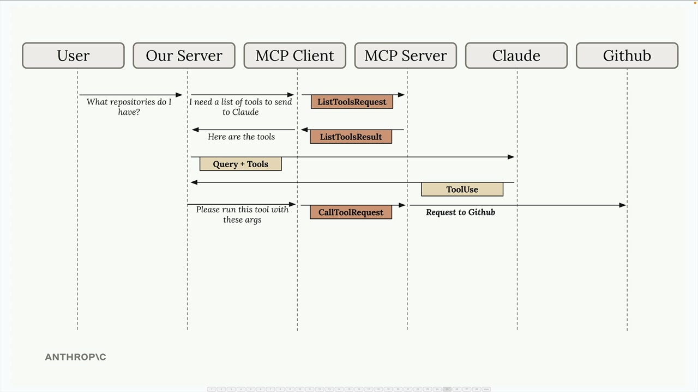
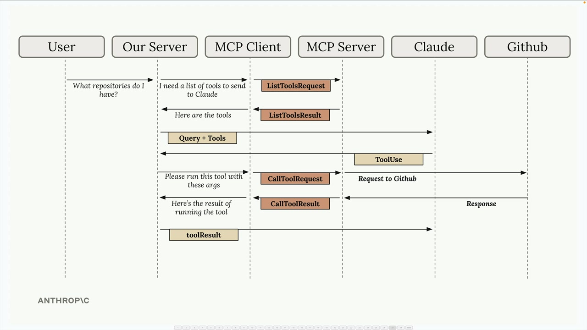

# MCP clients

> Source: https://anthropic.skilljar.com/claude-with-the-anthropic-api/287775

#### Summary

                            
                                

The MCP client serves as the communication bridge between your server and MCP servers. Think of it as your access point to all the tools that an MCP server provides. When you need to use external tools or services, the client handles all the message passing and protocol details for you.

## Transport Agnostic Communication

One of MCP's key strengths is being transport agnostic - a fancy way of saying the client and server can talk to each other using different communication methods. The most common setup runs both the MCP client and server on the same machine, where they communicate through standard input/output.

But you're not limited to that approach. MCP clients and servers can also connect over:

- HTTP

- WebSockets

- Various other network protocols

## Message Types

Once connected, the client and server exchange specific message types defined in the MCP specification. The main message types you'll work with are:

**ListToolsRequest/ListToolsResult:** The client asks the server "what tools do you provide?" and gets back a list of available tools.

**CallToolRequest/CallToolResult:** The client asks the server to run a specific tool with certain arguments, then receives the results.

## Complete Flow Example

Here's how all the pieces work together in a real scenario. Let's say a user asks "What repositories do I have?" - here's the complete communication flow:

The process starts when a user submits a query to your server. Your server realizes it needs to provide Claude with a list of available tools before making the request.

Your server asks the MCP client for tools, which sends a `ListToolsRequest` to the MCP server and receives a `ListToolsResult` back.

Now your server has everything needed to make the initial request to Claude - both the user's question and the available tools.

Claude examines the tools and decides it needs to call one to answer the question. It responds with a tool use request.

Your server asks the MCP client to execute the tool Claude requested. The MCP client sends a `CallToolRequest` to the MCP server, which then makes the actual request to GitHub.

GitHub returns the repository data, which flows back through the MCP server as a `CallToolResult`, then to the MCP client, and finally to your server.

Your server sends the tool results back to Claude in a follow-up message. Claude now has all the information it needs to formulate a complete response.

Finally, Claude responds with the formatted answer, which your server passes back to the user.

Yes, this flow involves many steps, but each component has a clear responsibility. The MCP client abstracts away the complexity of server communication, letting you focus on building your application logic. As we implement our own MCP client and server, you'll see how each piece fits together in practice.