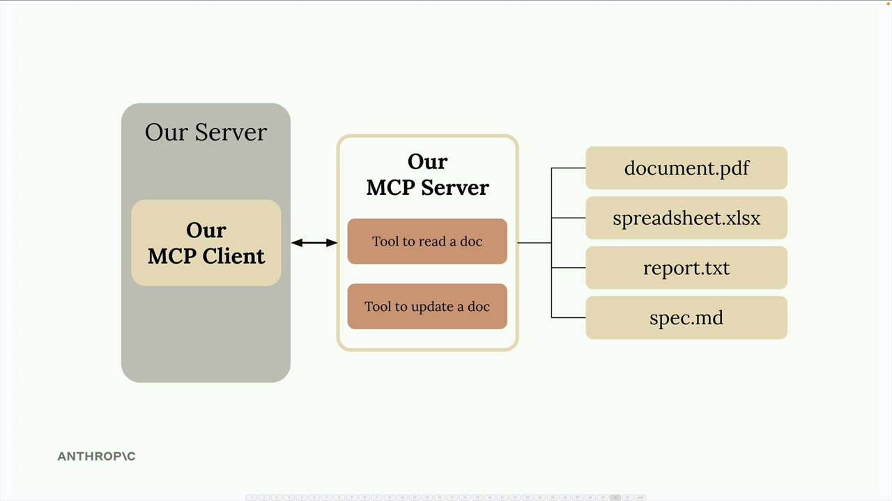
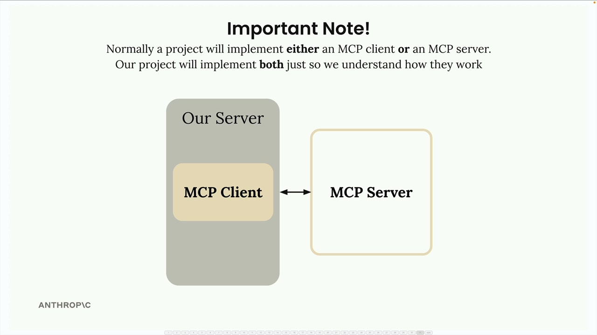

# Project setup

> Source: https://anthropic.skilljar.com/claude-with-the-anthropic-api/287785

#### Summary


                            
                                

We're going to build a CLI-based chatbot to better understand how MCP clients and servers work together. This hands-on project will give you practical experience with both sides of the MCP architecture.


## What We're Building


Our chatbot will allow users to interact with a collection of documents through a command-line interface. The system consists of two main components:


- An MCP client that handles user interactions

- A custom MCP server that manages document operations





The server will provide two essential tools: one for reading document contents and another for updating them. All documents will be stored in memory for simplicity - no database required.


## Important Architecture Note


In real-world projects, you typically implement either an MCP client or an MCP server, not both. You might create:


- An MCP server to expose your service to other developers

- An MCP client to connect to existing MCP servers





We're building both components in this project purely for educational purposes - to understand how they communicate and work together.


## Project Setup


Download the `cli_project.zip` file attached to this lesson and extract it to your preferred development directory. Open your code editor in the project folder.


The project includes a comprehensive README file with setup instructions. Follow these steps:


1. Add your Anthropic API key to the `.env` file

1. Install dependencies using either UV (recommended) or pip

1. Run the starter application to verify everything works


## Running the Application


Navigate to your project directory in the terminal. You'll see the main project files including `main.py`, `mcp_client.py`, and `mcp_server.py`.


To start the application, use one of these commands:


```
# If using UV (recommended)
uv run main.py

# If using standard Python
python main.py
```


When the application starts successfully, you'll see a chat prompt. Test it by asking a simple question like "what's 1+1?" - you should get a quick response from Claude.


With the basic setup complete, we're ready to start implementing MCP features and exploring how clients and servers communicate through the Model Control Protocol.


                            
                        
                    

                    
                        
                            

#### Downloads


                            


                                
                                    
                                        - [**cli_project.zip](https://cc.sj-cdn.net/instructor/4hdejjwplbrm-anthropic/assets/1762981524/cli_project.zip?response-content-disposition=attachment&Expires=1774882148&Signature=nPyGKhowjNUHEGvcgHAYEqHwC2wmFj5~vbY9OmYf2jDZr2jSLtPURvlBVOREJpDOIv-Oy40cFl39k4aV7hoZFtWnxwpflEOtssUxBhJvbKjU9T~LzPq~LEz~8UgZpgP4ejf5nG4N2uqLJ4azvljeWY6d1oPBFC~1yLHgHW0Kzm~F1hVf-pSpwGa1hr93M4CYXL-pbHCkhMqBsqlKP4MW4To4mVbHjhjmjlZKykMEP3J52Yl0sPocLtvmRcnhEWR9kDxvBkuM0fxP76SC9J4vETuibovCH0ARs7~Hcm8SaAgI7-NUkjD7rGEtopvZCJz4-MYPqo02IUKRg8gQthRdkw__&Key-Pair-Id=APKAI3B7HFD2VYJQK4MQ)

                                    
                                
                                    
                                        - [**cli_project_COMPLETE.zip](https://cc.sj-cdn.net/instructor/4hdejjwplbrm-anthropic/assets/1762981524/cli_project_COMPLETE.zip?response-content-disposition=attachment&Expires=1774882148&Signature=KlNBAjmghPw0Riu2dwcXinv4EsOugt3x8atNK~U73jmnmZaWS4~~q5ewYjYjGmdQo1o9eetP0RgQt6wtPUhY1OcoJ2jYsMU6G0igjSvS8eTNEuXBNMjsMe7lKsnyqs4~RYjwks9UmoDybcPRbVLrnZIlycsJdpbkMDIu3RruAdlOCh1ua3n0I7S6R3YcDk3tpBLPS57pj6s5Y5VkDM4qqUmg~0c4i-TuP7JritsOy1oY2wuG8WlAkICHNUZkLcFtKKjQmee51MVnA580hCfKqjJNutZJX4dWnNGo3mHHdI-XclkhGNXf0ZDk7MULzLHyY76B~QbQPiQaywprh61O9Q__&Key-Pair-Id=APKAI3B7HFD2VYJQK4MQ)