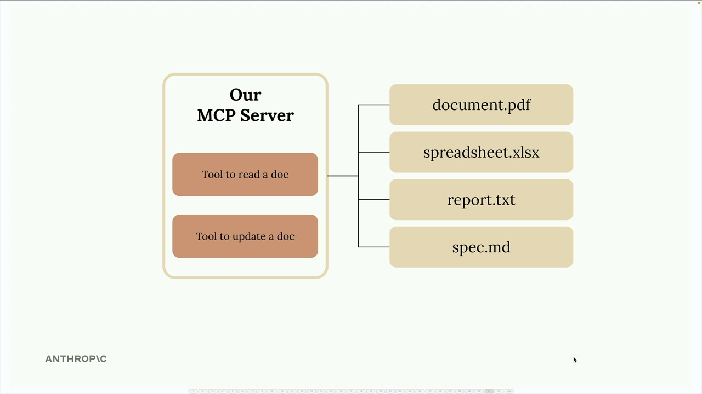

# Defining tools with MCP

> Source: https://anthropic.skilljar.com/claude-with-the-anthropic-api/287797

#### Summary


                            
                                

Building an MCP server becomes much simpler when you use the official Python SDK. Instead of manually writing complex JSON schemas for tools, the SDK handles all that complexity for you with decorators and type hints.


In this example, we're creating an MCP server that manages documents stored in memory. The server will provide two essential tools: one to read document contents and another to update them through find-and-replace operations.


## Setting Up the MCP Server


The Python MCP SDK makes server creation incredibly straightforward. You can initialize a complete MCP server with just one line:


```
from mcp.server.fastmcp import FastMCP

mcp = FastMCP("DocumentMCP", log_level="ERROR")
```


For this implementation, documents are stored in a simple Python dictionary where keys are document IDs and values contain the document content:


```
docs = {
    "deposition.md": "This deposition covers the testimony of Angela Smith, P.E.",
    "report.pdf": "The report details the state of a 20m condenser tower.",
    "financials.docx": "These financials outline the project's budget and expenditure",
    "outlook.pdf": "This document presents the projected future performance of the",
    "plan.md": "The plan outlines the steps for the project's implementation.",
    "spec.txt": "These specifications define the technical requirements for the equipment"
}
```


## Tool Definition with Decorators





The SDK transforms tool creation from a verbose process into something clean and readable. Instead of writing lengthy JSON schemas, you use Python decorators and type hints.


## Creating the Document Reader Tool


The first tool allows Claude to read any document by its ID. Here's the complete implementation:


```
@mcp.tool(
    name="read_doc_contents",
    description="Read the contents of a document and return it as a string."
)
def read_document(
    doc_id: str = Field(description="Id of the document to read")
):
    if doc_id not in docs:
        raise ValueError(f"Doc with id {doc_id} not found")
    
    return docs[doc_id]
```


The `@mcp.tool` decorator automatically generates the JSON schema that Claude needs. The `Field` class from Pydantic provides parameter descriptions that help Claude understand what each argument expects.


## Building the Document Editor Tool


The second tool performs simple find-and-replace operations on documents:


```
@mcp.tool(
    name="edit_document",
    description="Edit a document by replacing a string in the documents content with a new string."
)
def edit_document(
    doc_id: str = Field(description="Id of the document that will be edited"),
    old_str: str = Field(description="The text to replace. Must match exactly, including whitespace."),
    new_str: str = Field(description="The new text to insert in place of the old text.")
):
    if doc_id not in docs:
        raise ValueError(f"Doc with id {doc_id} not found")
    
    docs[doc_id] = docs[doc_id].replace(old_str, new_str)
```


This tool takes three parameters: the document ID, the text to find, and the replacement text. The implementation uses Python's built-in string `replace()` method for simplicity.


## Error Handling


Both tools include basic error handling to manage cases where Claude requests a document that doesn't exist. When an invalid document ID is provided, the tools raise a `ValueError` with a descriptive message that Claude can understand and potentially act upon.


## Key Benefits of the SDK Approach


- Automatic JSON schema generation from Python type hints

- Clean, readable code that's easy to maintain

- Built-in parameter validation through Pydantic

- Reduced boilerplate compared to manual schema writing

- Type safety and IDE support for development


The MCP Python SDK transforms what used to be a complex process of writing tool definitions into something that feels natural for Python developers. You focus on the business logic while the SDK handles the protocol details.