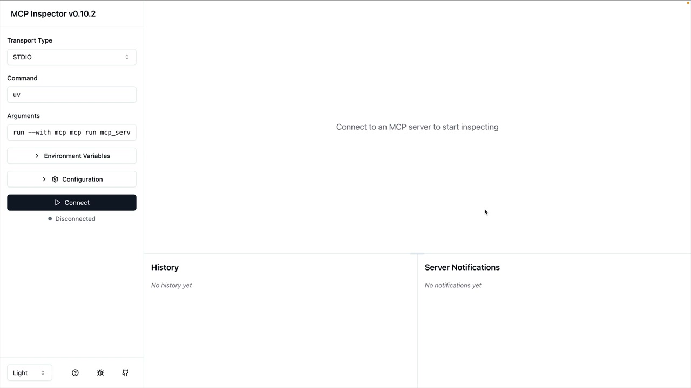
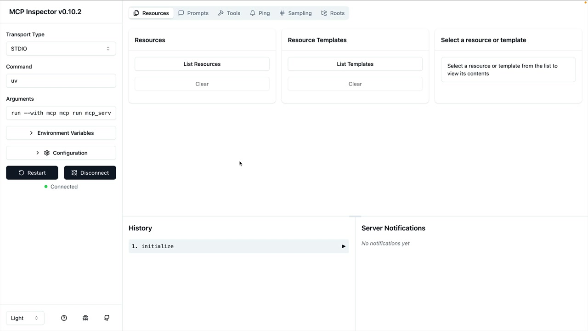
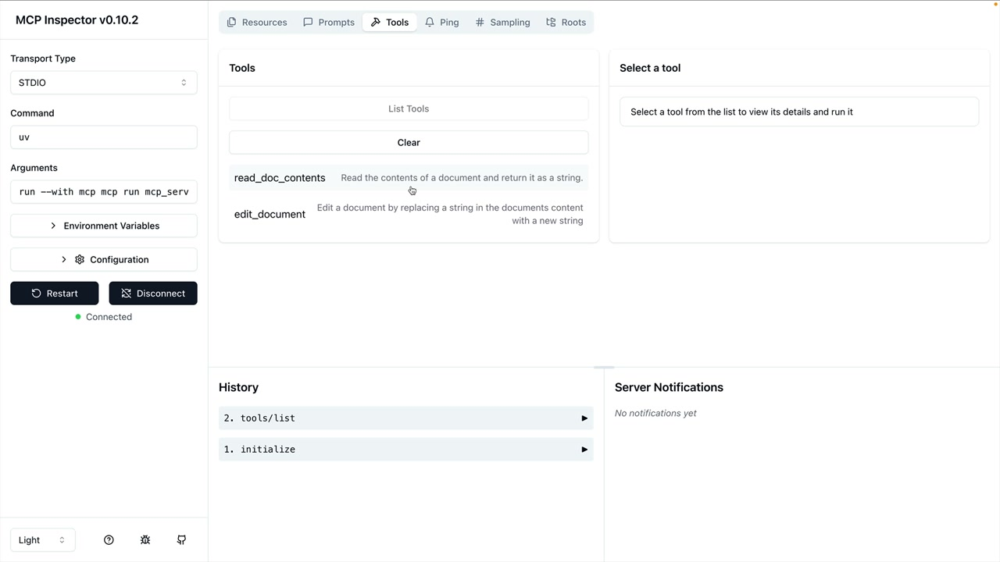
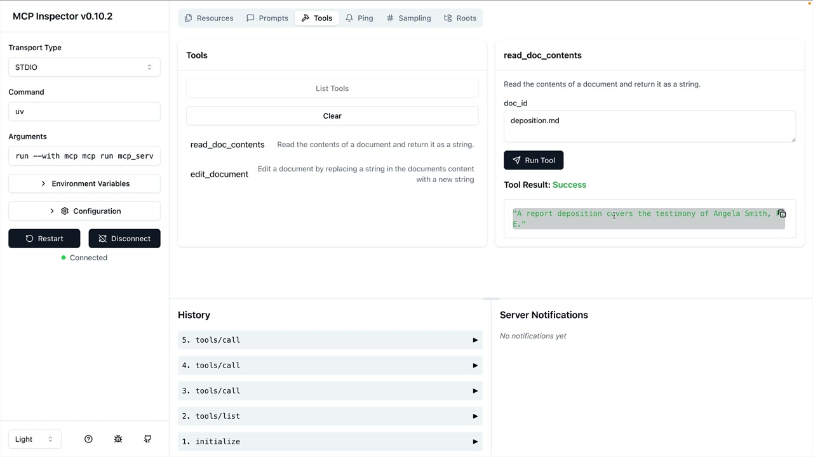

# The server inspector

> Source: https://anthropic.skilljar.com/claude-with-the-anthropic-api/287781

#### Summary


                            
                                

When building MCP servers, you need a way to test your functionality without connecting to a full application. The Python MCP SDK includes a built-in browser-based inspector that lets you debug and test your server in real-time.


## Starting the Inspector


First, make sure your Python environment is activated (check your project's README for the exact command). Then run the inspector with:


```
mcp dev mcp_server.py
```


This starts a development server on port 6277 and gives you a local URL to open in your browser. The inspector interface will load, showing the MCP Inspector dashboard.





## Important Note About the Interface


The MCP inspector is actively being developed, so the interface you see might look different from current screenshots. However, the core functionality for testing tools, resources, and prompts should remain similar.


## Connecting and Testing Tools


Click the "Connect" button on the left side to start your MCP server. Once connected, you'll see a navigation bar with sections for Resources, Prompts, Tools, and other features.





To test your tools:


- Navigate to the Tools section

- Click "List Tools" to see all available tools

- Select a tool to open its testing interface

- Fill in the required parameters

- Click "Run Tool" to execute and see results





## Testing Document Operations


For example, to test a document reading tool, you'd enter a document ID (like "deposition.md") and run the tool. The inspector shows the result, including any returned content or success messages.





You can chain operations to verify functionality. For instance, after editing a document by replacing text, you can immediately run the read tool again to confirm the changes were applied correctly.


## Development Workflow


The inspector creates an efficient development loop:


- Make changes to your MCP server code

- Test individual tools through the inspector

- Verify results without needing a full application setup

- Debug issues in isolation


This tool becomes essential as you build more complex MCP servers. It eliminates the need to wire up your server to Claude or another application just to test basic functionality, making development much faster and more focused.