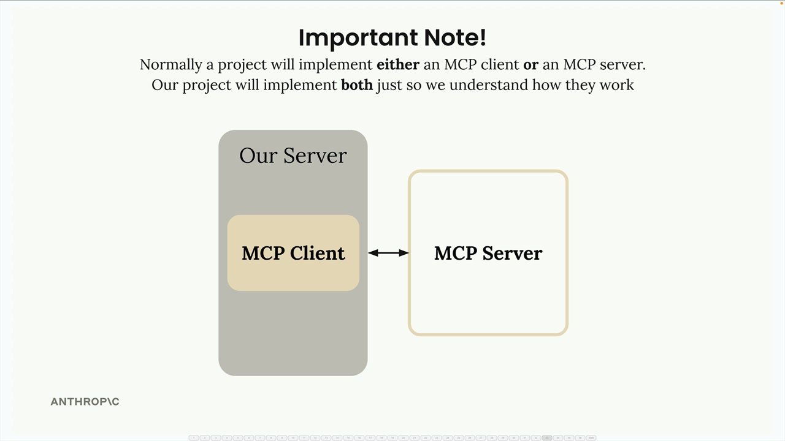
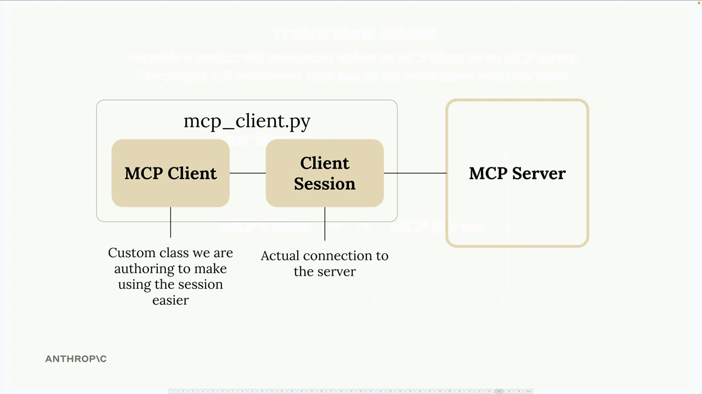
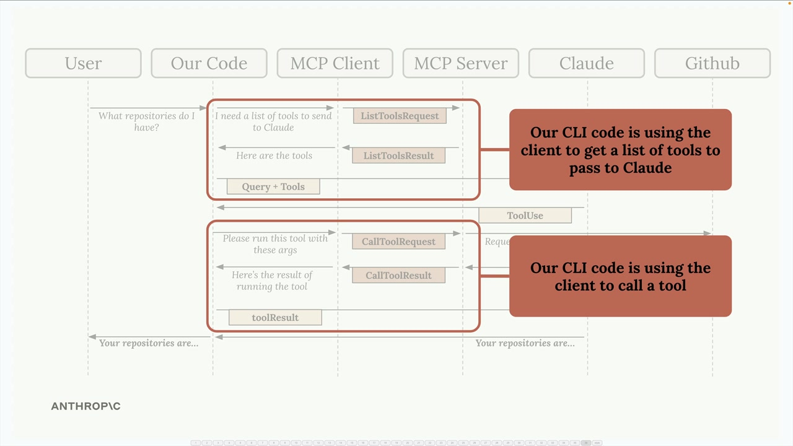

# Implementing a client

> Source: https://anthropic.skilljar.com/claude-with-the-anthropic-api/287793

#### Summary


                            
                                

Now that we have our MCP server working, it's time to build the client side. The client is what allows our application to communicate with the MCP server and access its functionality.


## Understanding the Client Architecture


In most real-world projects, you'll either implement an MCP client OR an MCP server - not both. We're building both in this project just so you can see how they work together.





The MCP client consists of two main components:


- **MCP Client** - A custom class we create to make using the session easier

- **Client Session** - The actual connection to the server (part of the MCP Python SDK)





The client session requires proper resource cleanup when we're done with it. That's why we wrap it in our custom MCP Client class - to handle all that cleanup automatically.


## How the Client Fits Into Our Application


Remember our application flow? Our CLI code needs to do two main things with the MCP server:





1. Get a list of available tools to send to Claude

1. Execute tools when Claude requests them


The MCP client provides these capabilities through simple method calls that our application code can use.


## Implementing the Core Methods


We need to implement two key methods in our client: `list_tools()` and `call_tool()`.


### List Tools Method


This method gets all available tools from the server:


```
async def list_tools(self) -> list[types.Tool]:
    result = await self.session().list_tools()
    return result.tools
```


It's straightforward - we access our session (the connection to the server), call the built-in `list_tools()` function, and return the tools from the result.


### Call Tool Method


This method executes a specific tool on the server:


```
async def call_tool(
    self, tool_name: str, tool_input: dict
) -> types.CallToolResult | None:
    return await self.session().call_tool(tool_name, tool_input)
```


We pass the tool name and input parameters (provided by Claude) to the server and return the result.


## Testing the Client


To test our implementation, we can run the client directly. The file includes a testing harness that connects to our MCP server and calls our methods:


```
async with MCPClient(
    command="uv", args=["run", "mcp_server.py"]
) as client:
    result = await client.list_tools()
    print(result)
```


When we run this test, we should see our tool definitions printed out, including the `read_doc_contents` and `edit_document` tools we created earlier.


## Putting It All Together


Now that our client can list tools and call them, we can test the complete flow. When we run our main application and ask Claude about a document:


1. Our code uses the client to get available tools

1. These tools are sent to Claude along with the user's question

1. Claude decides to use the `read_doc_contents` tool

1. Our code uses the client to execute that tool

1. The result is sent back to Claude, who then responds to the user


For example, asking "What is the contents of the report.pdf document?" will trigger Claude to use our document reading tool, and we'll get back information about the 20m condenser tower document we set up in our server.


The client acts as the bridge between our application logic and the MCP server, making it easy to access server functionality without worrying about the underlying connection details.